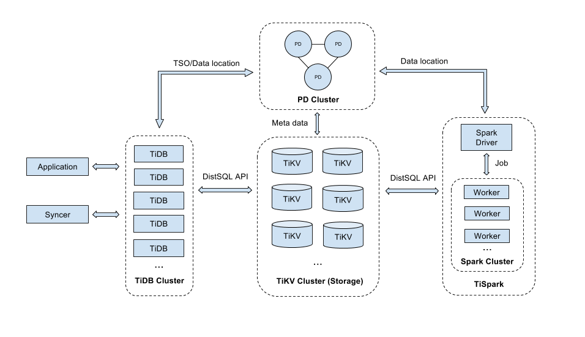

# TiDB Quick Start Guide

## About TiDB

TiDB (The pronunciation is: /’taɪdiːbi:/ tai-D-B, etymology: titanium) is a Hybrid Transactional/Analytical Processing (HTAP) database. Inspired by the design of Google F1 and Google Spanner, TiDB features infinite horizontal scalability, strong consistency, and high availability. The goal of TiDB is to serve as a one-stop solution for online transactions and analyses.

## About this guide

This guide outlines how to perform a quick deployment of a TiDB cluster using TiDB-Ansible and walks you through the basic TiDB operations and administrations.

## Deploy a TiDB cluster

This section describes how to deploy a TiDB cluster. A TiDB cluster consists of different components: TiDB servers, TiKV servers, and Placement Driver (PD) servers.

The architecture is as follows:



### Prepare the environment

Before you start, make sure that you have:

1. A Control Machine with the following requirements:

    - Python 2.6 or Python 2.7

    - Python Jinja2 2.7.2 and MarkupSafe 0.11 packages. You can use the following commands to install the packages:
    
        ```bash
        pip install Jinja2==2.7.2 MarkupSafe==0.11
        ```

    - Access to the managed nodes via SSH using password login or SSH authorized_key login.

2. Several managed nodes with the following requirements:

    - 4 or more machines. At least 3 instances for TiKV. Don’t deploy TiKV together with TiDB or PD on the same machine. See [deploying recommendations](/op-guide/recommendation.md).

    + Operating system:

      - CentOS 7.3 and later versions
      - X86_64 architecture (AMD64)
      - Kernel version 3.10 or later
      - Ext4 file system.

    - Network between machines. Turn off the firewalls and iptables when deploying and turn them on after the deployment.

    - The same time and time zone for all machines with the NTP service on to synchronize the correct time.

    - A remote user account which you can use to login from the Control Machine to connect to the managed nodes via SSH. It is a normal user account with sudo privileges.
    
    - Python 2.6 or Python 2.7

    > **Note:** The Control Machine can be one of the managed nodes with access to external network to download binary.

### Install Ansible in the Control Machine

Install Ansible 2.3 or later to your CentOS 7.3 platform:

```
yum install epel-release
yum update
yum install ansible
```

You can use the `ansible --version` command to see the version information.

For more information, see [Ansible Documentation](http://docs.ansible.com/ansible/intro_installation.html).


### Download TiDB-Ansible to the Control Machine

Download the latest master version of the ZIP package from GitHub [TiDB-Ansible project](https://github.com/pingcap/tidb-ansible) or [click to download]( https://github.com/pingcap/tidb-ansible/archive/master.zip).

You can then unzip the package and the default folder name is `tidb-ansible-master`. The `tidb-ansible-master` directory contains all the files you need to get started with TiDB-Ansible.

### Orchestrate the TiDB cluster

The standard Cluster has 6 machines:

- 2 TiDB instances
- 3 PD instances, one of the PD instances is used as the monitor.
- 3 TiKV instances

The cluster topology is as follows:

| Name | Host IP | Services |
| ---- | ------- | -------- |
| node1 | 172.16.10.1 | PD1, TiDB1 |
| node2 | 172.16.10.2 | PD2, TiDB2 |
| node3 | 172.16.10.3 | PD3, Monitor|
| node4 | 172.16.10.4 | TiKV1 |
| node5 | 172.16.10.5 | TiKV2 |
| node6 | 172.16.10.6 | TiKV3 |

Edit the `inventory.ini` file from the `tidb-ansible-master` directory as follows:

```ini
[tidb_servers]
172.16.10.1
172.16.10.2

[pd_servers]
172.16.10.1
172.16.10.2
172.16.10.3

[tikv_servers]
172.16.10.4
172.16.10.5
172.16.10.6

[monitored_servers:children]
tidb_servers
tikv_servers
pd_servers

[monitoring_servers]
172.16.10.3

[grafana_servers]
172.16.10.3

...

```

### Deploy the TiDB cluster

Use the normal user with the sudo privileges to deploy TiDB:

1. Edit the `inventory.ini` file as follows:

    ```ini
    ## Connection
    # ssh via root:
    # ansible_user = root
    # ansible_become = true
    # ansible_become_user = tidb
    
    # ssh via normal user
    ansible_user = tidb
    ```

2. Connect to the network and download the TiDB, TiKV, and PD binaries:

    ```
    ansible-playbook local_prepare.yml
    ```

3. Initialize the system environment of the target machines and adjust the kernel parameters:

    ```
    ansible-playbook bootstrap.yml -k -K
    ```

    > **Note:**
    > 
    > - Add the `-k` (lowercase) parameter if password is needed to connect to the managed node. This applies to other playbooks as well.
    > - Add the `-K` (uppercase) parameter if sudo needs password for root privileges.

4. Deploy the TiDB cluster:

    ```
    ansible-playbook deploy.yml -k
    ```

### Start the cluster

Start the TiDB cluster:

```
ansible-playbook start.yml -k
```

Use the MySQL client to connect to the TiDB cluster:

```sql
mysql -u root -h 172.16.10.1 -P 4000
```

> **Note:** The TiDB service default port is 4000.

## Try TiDB

This section describes some basic CRUD operations in TiDB.

### Create, show, and drop a database

You can use the `CREATE DATABASE` statement to create a database.

The Syntax is as follows:

```sql
CREATE DATABASE db_name [options];
```

For example, the following statement creates a database with the name `samp_db`:

```sql
CREATE DATABASE IF NOT EXISTS samp_db;
```
You can use the `SHOW DATABASES` statement to show the databases:

```sql
SHOW DATABASES;
```

You can use the `DROP DATABASE` statement to delete a database, for example:

```sql
DROP DATABASE samp_db;
```

### Create, show, and drop a table

Use the `CREATE TABLE` statement to create a table. The Syntax is as follows:

```sql
CREATE TABLE table_name column_name data_type constraint;
```

For example:

```sql
CREATE TABLE person (
 number INT(11),
 name VARCHAR(255),
 birthday DATE
);
```

Add `IF NOT EXISTS` to prevent an error if the table exists:

```sql
CREATE TABLE IF NOT EXISTS person (
 number INT(11),
 name VARCHAR(255),
 birthday DATE
);
```

Use the `SHOW CREATE` statement to see the statement that creates the table. For example:

```sql
SHOW CREATE table person;
```

Use the `SHOW FULL COLUMNS` statement to display the information about all the columns in a table. For example:

```sql
SHOW FULL COLUMNS FROM person;
```

Use the `DROP TABLE` statement to delete a table. For example:

```sql
DROP TABLE person;
```
or
```sql
DROP TABLE IF EXISTS person;
```
Use the `SHOW TABLES` statement to show all the tables in a database. For example:
```sql
SHOW TABLES FROM samp_db;
```

### Create, show, and drop an index

For the columns whose value is not unique, you can use the `CREATE INDEX` or `ALTER TABLE` statements. For example:

```sql
CREATE INDEX person_num ON person (number);
```

or

```sql
ALTER TABLE person ADD INDEX person_num (number)；
```
You can also create unique indexes for the columns whose value is unique. For example:

```sql
CREATE UNIQUE INDEX person_num ON person (number);
```

or

```sql
ALTER TABLE person ADD UNIQUE person_num  on (number);
```
Use the `SHOW INDEX` to display all the indexes in a table:
```sql
SHOW INDEX from person;
```

Use the `ALTER TABLE` or `DROP INDEX` to delete an index. Like the `CREATE INDEX` statement, `DROP INDEX` can also be embedded in the `ALTER TABLE` statement. For example:

```sql
DROP INDEX person_num ON person;
ALTER TABLE person DROP INDEX person_num;
```

### Insert, select, update, and delete data

Use the `INSERT` statement to insert data into a table. For example:

```sql
INSERT INTO person VALUES("1","tom","20170912");
```

Use the `SELECT` statement to see the data in a table. For example:

```sql
SELECT * FROM person;
+--------+------+------------+
| number | name | birthday   |
+--------+------+------------+
|      1 | tom  | 2017-09-12 |
+--------+------+------------+
```

Use the `UPDATE ` statement to update the data in a table. For example:

```sql
UPDATE person SET birthday='20171010' WHERE name='tom';

SELECT * FROM person;
+--------+------+------------+
| number | name | birthday   |
+--------+------+------------+
|      1 | tom  | 2017-10-10 |
+--------+------+------------+
```

Use the `DELETE` statement to delete the data in a table. For example:

```sql
DELETE FROM person WHERE number=1;
SELECT * FROM person;
Empty set (0.00 sec)
```

### Create, authorize, and delete a user

Use the `CREATE USER` statement to create a user named `tiuser` with the password `123456`:

```sql
CREATE USER 'tiuser'@'localhost' IDENTIFIED BY '123456';
```

Grant `tiuser` the privilege to retrieve the tables in the `samp_db` database:

```sql
GRANT SELECT ON samp_db .* TO 'tiuser'@'localhost';
```

Check the privileges of `tiuser`:

```sql
SHOW GRANTS for tiuser@localhost;
```

Delete `tiuser`:

```sql
DROP USER 'tiuser'@'localhost';
```

## Monitor a TiDB cluster

Open a browser to access the monitoring platform: `http://172.16.10.3:3000`.

The default account and password are: `admin`/`admin`.

### About the key metrics

Service | Panel Name | Description | Normal Range
---- | ---------------- | ---------------------------------- | --------------
PD | Storage Capacity | the total storage capacity of the TiDB cluster |
PD | Current Storage Size | the occupied storage capacity of the TiDB cluster |
PD | Store Status  -- up store | the number of TiKV nodes that are up |
PD | Store Status  -- down store | the number of TiKV nodes that are down | `0`. If the number is bigger than `0`, it means some node(s) are not down.
PD | Store Status  -- offline store | the number of TiKV nodes that are manually offline|
PD | Store Status  -- Tombstone store | the number of TiKV nodes that are Tombstone|
PD | Current storage usage | the storage occupancy rate of the TiKV cluster | If it exceeds 80%, you need to consider adding more TiKV nodes.
PD | 99% completed cmds duration seconds | the 99th percentile duration to complete a pd-server request| less than 5ms
PD | average completed cmds duration seconds | the average duration to complete a pd-server request | less than 50ms
PD | leader balance ratio | the leader ratio difference of the nodes with the biggest leader ratio and the smallest leader ratio | It is less than 5% for a balanced situation. It becomes bigger when a node is restarting.
PD | region balance ratio | the region ratio difference of the nodes with the biggest region ratio and the smallest region ratio | It is less than 5% for a balanced situation. It becomes bigger when adding or removing a node.
TiDB | handle requests duration seconds | the response time to get TSO from PD| less than 100ms
TiDB | tidb server QPS | the QPS of the cluster | application specific
TiDB | connection count | the number of connections from application servers to the database | Application specific. If the number of connections hops, you need to find out the reasons. If it drops to 0, you can check if the network is broken; if it surges, you need to check the application.
TiDB | statement count | the number of different types of statement within a given time | application specific
TiDB | Query Duration 99th percentile | the 99th percentile query time |
TiKV | 99%  & 99.99% scheduler command duration | the 99th percentile and 99.99th percentile scheduler command duration| For 99%, it is less than 50ms; for 99.99%, it is less than 100ms.
TiKV | 95%  & 99.99% storage async_request duration | the 95th percentile and 99.99th percentile Raft command duration | For 95%, it is less than 50ms; for 99.99%, it is less than 100ms.
TiKV | server report failure message | There might be an issue with the network or the message might not come from this cluster. | If there are large amount of messages which contains `unreachable`, there might be an issue with the network. If the message contains `store not match`, the message does not come from this cluster.
TiKV  | Vote |the frequency of the Raft vote | Usually, the value only changes when there is a split. If the value of Vote remains high for a long time, the system might have a severe issue and some nodes are not working.
TiKV | 95% and 99% coprocessor request duration | the 95th percentile and the 99th percentile coprocessor request duration | Application specific. Usually, the value does not remain high.
TiKV | Pending task | the number of pending tasks | Except for PD worker, it is not normal if the value is too high.
TiKV | stall | RocksDB stall time | If the value is bigger than 0, it means that RocksDB is too busy, and you need to pay attention to IO and CPU usage.
TiKV | channel full | The channel is full and the threads are too busy. | If the value is bigger than 0, the threads are too busy.
TiKV |  95% send message duration seconds | the 95th percentile message sending time | less than 50ms
TiKV | leader/region | the number of leader/region per TiKV server| application specific

## Scale the TiDB cluster

The capacity of a TiDB cluster can be increased or reduced without affecting the online services.

For example, if you want to add a TiDB node (node101) with the IP address: 172.16.10.101, you can use the following procedure:

1. Edit the `inventory.ini` file and append the node information:

    ```
    [tidb_servers]
    172.16.10.1
    172.16.10.2
    172.16.10.101

    [pd_servers]
    172.16.10.1
    172.16.10.2
    172.16.10.3
    
    [tikv_servers]
    172.16.10.4
    172.16.10.5
    172.16.10.6
    
    [monitored_servers:children]
    tidb_servers
    tikv_servers
    pd_servers
    
    [monitoring_servers]
    172.16.10.3
    
    [grafana_servers]
    172.16.10.3
    ```
  
    Now the topology is as follows:
  
    | Name | Host IP | Services |
    | ---- | ------- | -------- |
    | node1 | 172.16.10.1 | PD1, TiDB1 |
    | node2 | 172.16.10.2 | PD2, TiDB2 |
    | node3 | 172.16.10.3 | PD3, Monitor |
    | **node101** | **172.16.10.101**|**TiDB3** |
    | node4 | 172.16.10.4 | TiKV1 |
    | node5 | 172.16.10.5 | TiKV2 |
    | node6 | 172.16.10.6 | TiKV3 |
        
2. Initialize the newly added node:

    ```
    ansible-playbook bootstrap.yml -k -K
    ```

3. Deploy the cluster:

    ```
    ansible-playbook deploy.yml -k
    ```

4. Roll update the entire cluster:

    ```
    ansible-playbook rolling_update.yml -k
    ```

5. Monitor the status of the entire cluster and the newly added node by opening a browser to access the monitoring platform: `http://172.16.10.3:3000`

You can use the same procedure to add a TiKV node. But to add a PD node, some configuration files need to be manually updated.

To add a PD node (node102) with the IP address: 172.16.10.102, you can use the following procedure:

1. Edit the `inventory.ini` file and append the node information:

    ```
    [tidb_servers]
    172.16.10.1
    172.16.10.2
    
    [pd_servers]
    172.16.10.1
    172.16.10.2
    172.16.10.3
    172.16.10.102
    
    [tikv_servers]
    172.16.10.4
    172.16.10.5
    172.16.10.6
    
    [monitored_servers:children]
    tidb_servers
    tikv_servers
    pd_servers
    
    [monitoring_servers]
    172.16.10.3
    
    [grafana_servers]
    172.16.10.3
    ```
  
    Now the topology is as follows:
  
    | Name | Host IP | Services |
    | ---- | ------- | -------- |
    | node1 | 172.16.10.1 | PD1, TiDB1 |
    | node2 | 172.16.10.2 | PD2, TiDB2 |
    | node3 | 172.16.10.3 | PD3, Monitor |
    | **node102** | **172.16.10.102** | **PD4** |
    | node4 | 172.16.10.4 | TiKV1 |
    | node5 | 172.16.10.5 | TiKV2 |
    | node6 | 172.16.10.6 | TiKV3 |

2. Initialize the newly added node:

    ```
    ansible-playbook bootstrap.yml -k -K
    ```

3. Deploy the cluster:

    ```
    ansible-playbook deploy.yml -k
    ```

4. Login the newly added PD node and edit the starting script: 
  
    ```
    {deploy_dir}/scripts/run_pd.sh
    ```
  
    1. Remove the  `--initial-cluster="xxxx"` configuration.
    2. Add `join="http://172.16.10.1:2379"`. The IP address(`172.16.10.1`) can be any of the existing PD IP address in the cluster.
    3. Manually start the PD service in the newly added PD node:
      
        ```
        {deploy_dir}/scripts/start_pd.sh
        ```
      
    4. Use `pd-ctl` and see if the New node is added successfully:
    
        ```
        ./pd-ctl -u “http://172.16.10.1:2379”
        ```
    
        > **Note:** `pd-ctl` is a command to check the number of PD nodes.

5. Roll upgrade the entire cluster:
    
    ```
    ansible-playbook rolling_update.yml -k
    ```
   
6. Monitor the status of the entire cluster and the newly added node by opening a browser to access the monitoring platform: `http://172.16.10.3:3000`

## Destroy the cluster

Stop the cluster:

```
ansible-playbook stop.yml -k
```

Destroy the cluster:

```
ansible-playbook unsafe_cleanup.yml -k
```
