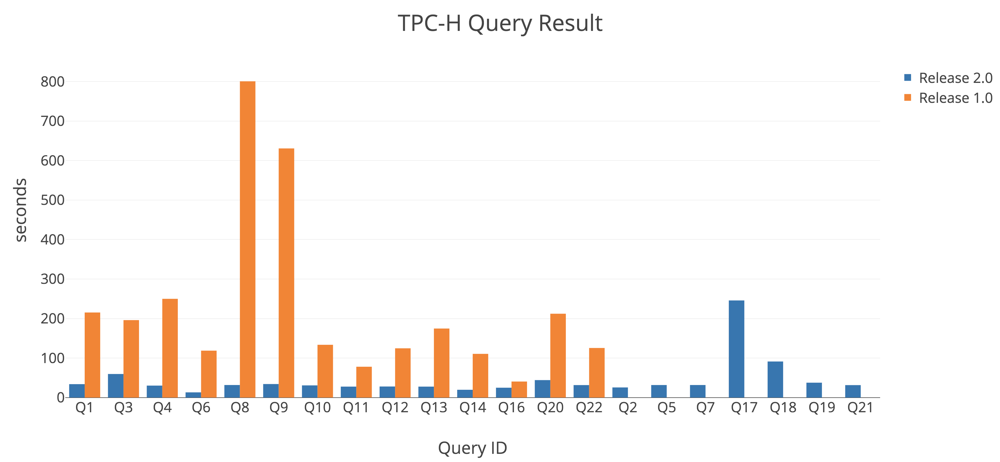

# TiDB TPC-H 50G Performance Test Report

## Test purpose

This test aims to compare the performances of TiDB 1.0 and TiDB 2.0 in the OLAP scenario.

> **Note:**
>
> Different test environments might lead to different test results.

## Test environment

### Machine information

System information:

| Machine IP      | Operation system              | Kernel version     | File system type |
|--------------|------------------------|------------------------------|--------------|
| 172.16.31.2  | Ubuntu 17.10 64bit     | 4.13.0-16-generic            | ext4         |
| 172.16.31.3  | Ubuntu 17.10 64bit     | 4.13.0-16-generic            | ext4         |
| 172.16.31.4  | Ubuntu 17.10 64bit     | 4.13.0-16-generic            | ext4         |
| 172.16.31.6  | CentOS 7.4.1708 64bit  | 3.10.0-693.11.6.el7.x86\_64  | ext4         |
| 172.16.31.8  | CentOS 7.4.1708 64bit  | 3.10.0-693.11.6.el7.x86\_64  | ext4         |
| 172.16.31.10 | CentOS 7.4.1708 64bit  | 3.10.0-693.11.6.el7.x86\_64  | ext4         |

Hardware information:

| Type       |  Name                                                |
|------------|------------------------------------------------------|
| CPU        | 40 vCPUs, Intel(R) Xeon(R) CPU E5-2630 v4 @ 2.20GHz  |
| RAM        | 128GB, 16GB RDIMM * 8, 2400MT/s, dual channel, x8 bitwidth        |
| DISK       | Intel P4500 4T SSD * 2      |
| Network Card  | 10 Gigabit Ethernet |

### TPC-H

[tidb-bench/tpch](https://github.com/pingcap/tidb-bench/tree/master/tpch)

### Cluster topology

| Machine IP   | Deployment Instance |
|--------------|---------------------|
| 172.16.31.2  | TiKV \* 2           |
| 172.16.31.3  | TiKV \* 2           |
| 172.16.31.6  | TiKV \* 2           |
| 172.16.31.8  | TiKV \* 2           |
| 172.16.31.10 | TiKV \* 2           |
| 172.16.31.10 | PD \* 1             |
| 172.16.31.4  | TiDB \* 1           |

### Corresponding TiDB version information

TiDB 1.0:

| Component | Version | Commit Hash                                 |
|--------|-------------|--------------------------------------------|
| TiDB   | v1.0.9      | 4c7ee3580cd0a69319b2c0c08abdc59900df7344   |
| TiKV   | v1.0.8      | 2bb923a4cd23dbf68f0d16169fd526dc5c1a9f4a   |
| PD     | v1.0.8      | 137fa734472a76c509fbfd9cb9bc6d0dc804a3b7   |

TiDB 2.0:

| Component | Version      | Commit Hash                            |
|--------|-------------|--------------------------------------------|
| TiDB   | v2.0.0-rc.6 | 82d35f1b7f9047c478f4e1e82aa0002abc8107e7   |
| TiKV   | v2.0.0-rc.6 | 8bd5c54966c6ef42578a27519bce4915c5b0c81f   |
| PD     | v2.0.0-rc.6 | 9b824d288126173a61ce7d51a71fc4cb12360201   |

## Test result

| Query ID  | TiDB 2.0           | TiDB 1.0         |
|-----------|--------------------|------------------|
| 1         | 33.915s            | 215.305s         |
| 2         | 25.575s            | Nan              |
| 3         | 59.631s            | 196.003s         |
| 4         | 30.234s            | 249.919s         |
| 5         | 31.666s            | OOM              |
| 6         | 13.111s            | 118.709s         |
| 7         | 31.710s            | OOM              |
| 8         | 31.734s            | 800.546s         |
| 9         | 34.211s            | 630.639s         |
| 10        | 30.774s            | 133.547s         |
| 11        | 27.692s            | 78.026s          |
| 12        | 27.962s            | 124.641s         |
| 13        | 27.676s            | 174.695s         |
| 14        | 19.676s            | 110.602s         |
| 15        | NaN                | Nan              |
| 16        | 24.890s            | 40.529s          |
| 17        | 245.796s           | NaN              |
| 18        | 91.256s            | OOM              |
| 19        | 37.615s            | NaN              |
| 20        | 44.167s            | 212.201s         |
| 21        | 31.466s            | OOM              |
| 22        | 31.539s            | 125.471s         |

It should be noted that:

- In the diagram above, the orange bars represent the query results of Release 1.0 and the blue bars represent the query results of Release 2.0. The y-axis represents the processing time of queries in seconds, the shorter the faster. 
- Query 15 is tagged with "NaN" because VIEW is currently not supported in either TiDB 1.0 or 2.0. We have plans to provide VIEW support in a future release.
- Queries 2, 17, and 19 in the TiDB 1.0 column are tagged with "NaN" because TiDB 1.0 did not return results for these queries.
- Queries 5, 7, 18, and 21 in the TiDB 1.0 column are tagged with "OOM" because the memory consumption was too high.
