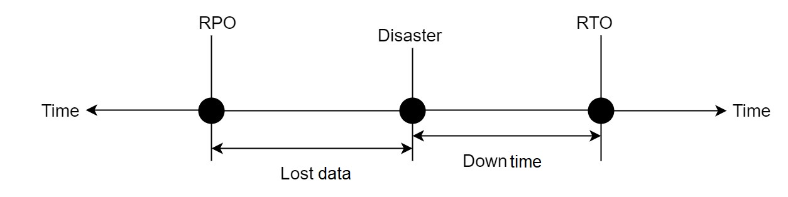
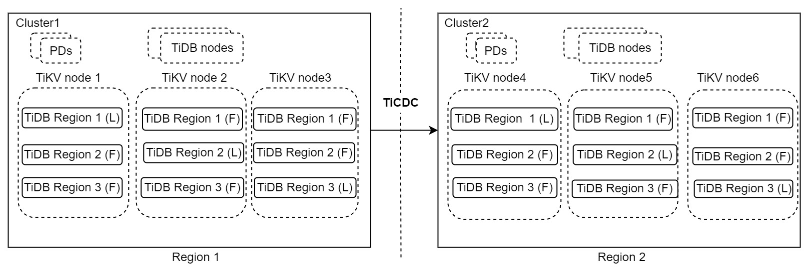
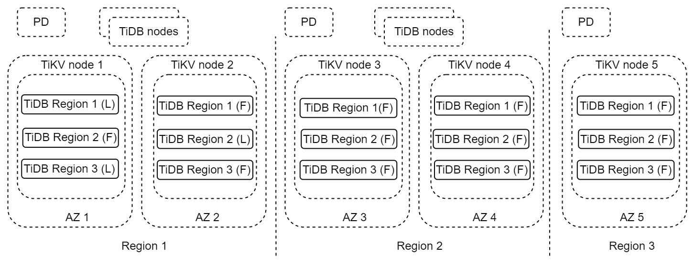
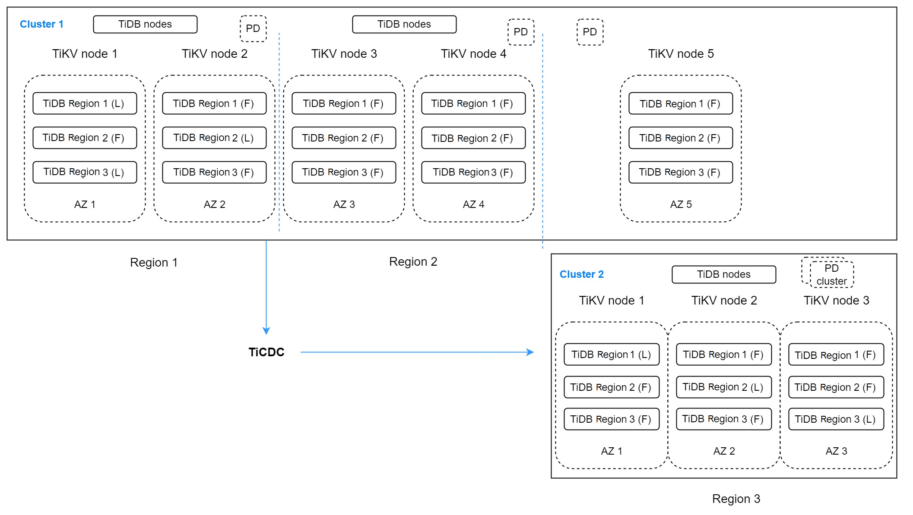

# 介绍

本文首先会对TiDB 提供的各种容灾方案进行介绍。 之后根据用户对容灾系统的RPO 和 RTO 要求，以及系统的业务重要性，给出推荐的容灾解决方案。

# 基本概念
RTO（Recovery Time Objective）：是指灾难发生后，系统恢复服务所需的时间。
RPO（Recovery Protect Objective）：是指在灾难发生后，确保对业务不产生损失的前提下，可以丢失的最大数据量。
下面的图形描述了这两个概念：

另外， 由于灾难可能影响的地域范围是不同的，在本文中，使用“错误容忍目标”来描述系统能够容忍的灾难的最大范围。本文主要讨论区域(Region)级别的容灾方案，这里的区域通常是指一个物理世界中的地区或者城市。

# 方案介绍
在进入具体的容灾方案之前，对于本文使用的 TiDB 特性从容灾的角度进行简单的介绍。

## TiDB 架构

TiDB 的设计采用了存储-计算分离的架构：
  - TiDB做为系统的计算层
  -  TiKV 是系统的存储层，采用行存的方式保存数据库的数据记录，其中 Region 是经过排序的若干行数据的集合，也是系统调度数据的单位。同一个 Region 的数据保存至少3分，通过 raft 协议在日志层对数据改变进行复制。
  - TiFlash 副本是可选的，它是一款列存存储，用于加速分析类查询的速度。数据通过 raft group 中的 learner 角色与TiKV 中的数据进行复制。
由于 TiDB 保存了三分完整的数据副本，所以天然就具备了基于多副本数据复制的容灾能力。 同时，由于 TiDB 采用了 raft log 来进行事务日志同步，也在一定程度上具备了基于事务日志同步的容灾能力。

## TiCDC 架构

TiCDC 作为 TiDB 的增量数据同步工具，通过 PD 内部的 etcd 实现高可用，通过多个 Capture 进程获取 TiKV 节点上的数据改变，在内部进行排序、合并等处理之后，通过多个同步任务，同时向多个下游系统进行数据同步。在上面的架构中：
  - TiKV server： 负责将对应节点上数据的改变推送到TiCDC 节点。当然，如果 TiCDC 发现收到的数据改变不完整，也会主动联系 TiKV Server 获取需要的数据改变。
  - TiCDC：负责启动多个 Capture 进程，每个 capture 负责一部分的 kv change logs 拉取， 并对获取到的数据改变进行排序，最后同步到不同的下游当中。
从上面的架构上可以看到，TiCDC 的架构和事务日志复制系统比较类似，但是扩展性更好，同时又兼顾了逻辑数据复制的很多特点。所以，也可以为 TiDB 在容灾场景提供很好的帮助和补充。

## BR 架构

BR 作为 TiDB 的备份恢复工具， 可以对TiDB 集群进行基于时间点的全量快照备份和持续的日志备份，从而对 TiDB 集群的数据进行保护，当 TiDB 集群完全不可用时，可以通过备份文件，在全新的集群中进行恢复。备份恢复通常是数据安全的最后一道防线。

## 基于 TiCDC 的主备集群容灾方案

在上面的架构中包含了2个 TiDB 集群，在 Region 1中包含了一个3副本的集群 Cluster1，作为主集群服务读写业务， Cluster2 作为灾备集群，运行在 Region 2，当Cluster1 出现灾难时继续对外提供服务。 两个集群之间通过 TiCDC 进行数据改变的同步。这种架构，我们简称为 “1:1” 解决方案。 

这种架构看起来非常简洁，可用性比较高，最大的错误容忍目标可以做到 Region 级别，写能力也能够得到扩展，RPO在秒级别， RTO 在分钟级，甚至更低。如果 RPO 为 0 并不是必须满足的要求，该方案是 TiDB 对于重要生产系统推荐的容灾方案。 对于该方案的详细信息，请参考 [文件名](./dr-secondary-cluster.md)

## 基于多副本的单集群容灾方案

在上面的架构中，每个 Region 都包含了两份完整的数据副本，他们位于不同的可用区当中（通常情况下，两个可用区之间的网络速度和带宽条件都是非常好的，在同一个 Region 中的不同 AZ 中读写请求的延迟是很低的），整个集群横跨了三个 Region。 Region 1 通常是用来处理读写业务请求的主 Region， Region 2 可以做为 Region 1 出现灾难后完全不可用时的灾难恢复 Region，而 Region 3 更多的是为了满足多数派协议而存在的一个副本。这种架构，我们简称为 “2-2-1” 解决方案。 
 
 该方案最大的错误容忍目标可以做到 Region 级别，写能力也能够得到扩展，并且RPO为0， RTO 也可以做到分钟级，甚至更低。如果 RPO 为 0 是必须满足的要求，该方案是 TiDB 对于重要生产系统推荐的容灾解决方案。 对于该方案的详细信息，请参考 [文件名](./dr-multi-replica-cluster.md)

 ## 多副本与TiCDC 相结合的容灾解决方案

 以上介绍的两种容灾解决方案都可以做到Region 级别的容灾，但是都无法抵御多个 Region 同时不可用的情况。如果用户的系统非常重要，需要“错误容忍目标”达到多个 Region，就需要将以上的两种容灾解决方案进行结合。
 

 在上面的部署中存在2个 TiDB 集群。Cluster1 有5个副本，跨3个 Region。Region 1包含两个副本作为主 Region，用于服务写入。Region2有两个副本作为 Region1 的容灾 Region，可以提供一些延迟不敏感的读取服务。最后一个副本用于投票，位于Region3中。作为Region 1和2的容灾集群，Cluster2在Region 3中运行并包含3个副本。 TiCDC在两个集群之间同步数据更改。这种部署可能看起来比较复杂，但它可以将容错目标提高到多 Region。如果多区域故障不必RPO=0，这种架构是一个很好的选择。这种架构，我们简称为 “2-2-1:1” 解决方案。 

当然，如果“错误容忍目标”为多个 Region，并且RPO 为 0 是一个必须满足的要求，用户也可以考虑创建一个包含至少9个副本，横跨5个Region 的集群来实现该能力。这种架构，我们简称为 “2-2-2-2-1” 解决方案。 

## 基于备份恢复的容灾解决方案

按照上面的部署，TiDB cluster1 部署在 Region1，BR 工具定期将集群的数据备份到 Region2 的目的地，并且持续将数据改变日志也备份到 Region2 的备份目的地。当 Region1 出现灾难导致 Cluster1 无法恢复时，用户可以使用备份的数据和数据改变在 Region2 恢复出新的集群 Cluster2 对外提供服务。 目前基于备份恢复的容灾方案 RPO 低于5分钟，而 RTO 则取决于需要恢复的集群数据大小，对于v6.5.0 版本的 BR， 其恢复速度可以参考对应的文档了解更多信息。 通常来说，大部分的客户会把跨 Region 的备份作为数据安全的最后一道防线，是大多数系统都需要的。  对于该方案的详细信息，请参考[文件名](./dr-backup-restore.md)。

另外，从6.5 版本开始，BR 支持基于 AWS 上的 EBS 快照的快速备份。如果用户在AWS 上运行 TiDB集群，要求备份过程对集群没有任何影响，并且要求恢复的时间尽量短。 用户可以考虑使用该特性来降低系统的RTO。 

## 其他容灾解决方案
除了本文上面提到的这些容灾方案，针对同城双中心这种特定的场景，如果 RPO=0 是一个必须的条件，用户也可以采用 DR-AUTO sync 解决方案。详细的信息请参考。[文件名](./two-data-centers-in-one-city-deployment.md))

# 小结
最后，对本文提到的各种容灾解决方案进行小结

