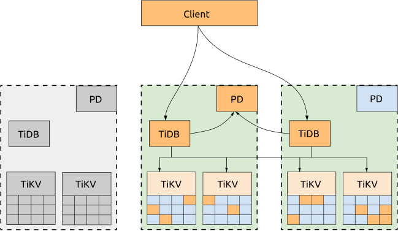
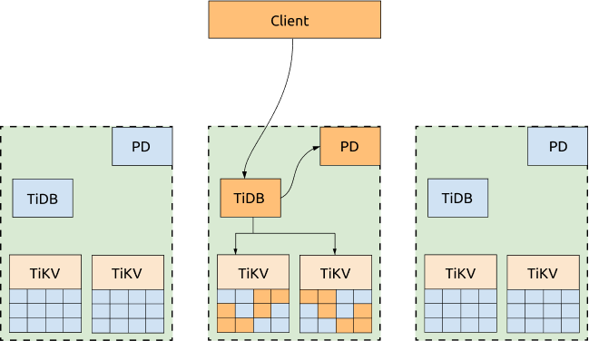
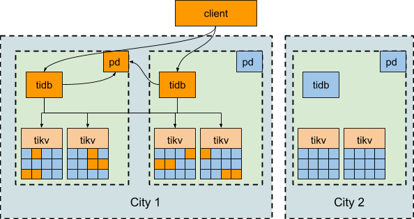
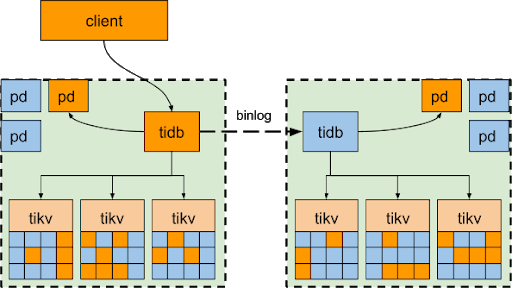
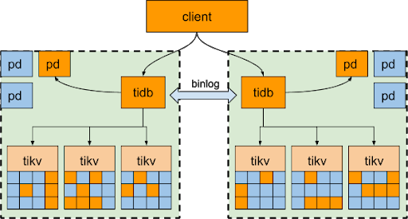

# 跨数据中心部署方案

作为 NewSQL 数据库，TiDB 兼顾了传统关系型数据库的优秀特性以及 NoSQL 数据库可扩展性，以及跨数据中心（下文简称“中心”）场景下的高可用。本文档旨在介绍跨数据中心部署的不同解决方案。

## 三中心部署方案

TiDB, TiKV, PD 分别分布在 3 个不同的中心，这是最常规，可用性最高的方案。

### 优点

所有数据的副本分布在三个数据中心，任何一个数据中心失效后，另外两个数据中心会自动发起 leader election，并在合理长的时间内（通常情况 20s 以内）恢复服务，并且不会产生数据丢失。

### 缺点

性能受网络延迟影响。

- 对于写入的场景，所有写入的数据需要同步复制到至少 2 个数据中心，由于 TiDB 写入过程使用两阶段提交，故写入延迟至少需要 2 倍数据中心间的延迟。
- 对于读请求来说，如果数据 leader 与发起读取的 TiDB 节点不在同一个数据中心，也会受网络延迟影响。
- TiDB 中的每个事务都需要向 PD leader 获取 TSO，当 TiDB 与 PD leader 不在同一个数据中心时，它上面运行的事务也会因此受网络延迟影响，每个有写入的事务会获取两次 TSO。

### 读性能优化

如果不需要每个数据中心同时对外提供服务，可以将业务流量全部派发到一个数据中心，并通过调度策略把 Region leader 和 PD leader 都迁移到同一个数据中心（我们在上文所述的测试中也做了这个优化）。这样一来，不管是从 PD 获取 TSO 还是读取 Region 都不受数据中心间网络的影响。当该数据中心失效后，PD leader 和 Region leader 会自动在其它数据中心选出，只需要把业务流量转移至其他存活的数据中心即可。

## 两地三中心部署方案

两地三中心的方案与三数据中心类似，算是三机房方案根据业务特点进行的优化，区别是其中有两个数据中心距离很近（通常在同一个城市），网络延迟相对很小。这种场景下，我们可以把业务流量同时派发到同城的两个数据中心，同时控制 Region leader 和 PD leader 也分布在同城的两个数据中心。

与三数据中心方案相比，两地三中心有以下优势：

- 写入速度更优
- 两中心同时提供服务资源利用率更高
- 依然能保证任何一个数据中心失效后保持可用并且不发生数据丢失

但是，缺陷是如果同城的两个数据中心同时失效（理论上讲要高于异地三数据中心损失 2 个的概率），将会导致不可用以及部分数据丢失。

## 两数据中心 + binlog 同步方案

两数据中心 + binlog 同步类似于传统的 MySQL 中 master/slave 方案。两个数据中心分别部署一套完整的 TiDB 集群，我们称之为主集群和从集群。正常情况下所有的请求都在主集群，写入的数据通过 binlog 异步同步至从集群并写入。

当主集群整个数据中心失效后，业务可以切换至从集群，与 MySQL 类似，这种情况下会有一些数据缺失。对比 MySQL，这个方案的优势是数据中心内的 HA -- 少部分节点故障时，通过重新选举 leader 自动恢复服务，不需要人工干预。

另外部分用户采用这种方式做双数据中心多活，两个数据中心各有一个集群，将业务分为两个库，每个库服务一部分数据，每个数据中心的业务只会访问一个库，两个集群之间通过 binlog 将本数据中心业务所涉及的库中的数据变更同步到对端机房，形成环状备份。

> **注意：**
>
> 在两数据中心 + binlog 同步部署方案中，数据中心之间只有 binlog 异步复制。在数据中心间的延迟较高的情况下，从集群落后主集群的数据量会增大。当主集群故障后（DR），会造成数据丢失，丢失的数据量受网络延迟等因素影响。

## 高可用和容灾分析

对于三数据中心方案和两地三中心方案，我们能得到的保障是任意一个数据中心故障时，集群能自动恢复服务，不需要人工介入，并能保证数据一致性。注意各种调度策略都是用于帮助性能优化的，当发生故障时调度机制总是第一优先考虑可用性而不是性能。

对于两数据中心 + binlog 同步的方案，主集群内少量节点故障时也能自动恢复服务，不需要人工介入，并能保证数据一致性。当整个主集群故障时，需要人工切换至从集群，并可能发生一些数据丢失，数据丢失的数量取决于同步延迟，和网络条件有关。
