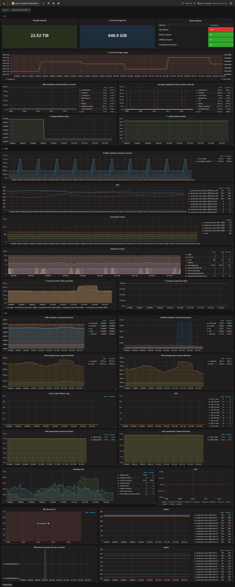

# 重要监控指标详解

使用 ansible 部署 tidb 集群时，一键部署监控系统 (prometheus/grafana)，监控架构请看 [TiDB 监控框架概述](monitor-overview.md)

目前 grafana dashboard 整体分为四个 dashboard，node_export，PD，TIDB，TIKV。 内容较多，主要在于尽快让 TIDB 开发确认问题。

对于日常运维，我们单独挑选出重要的 metrics 放在 overview 页面，方便日常运维人员观察集群组件(PD, TIDB, TIKV)使用状态以及集群使用状态 。

以下为 overview dashboard 说明：

## 说明

-   PD
    -   Storage Capacity   :   tidb 集群总可用数据库空间大小
    -   Current Storage Size   :   tidb 集群目前已用数据库空间大小
    -   Store Status  -- up store   :   tikv 正常节点数量
    -   Store Status  -- down store   :   tikv 异常节点数量

        如果大于0，证明有节点不正常
    -   Store Status  -- offline store   :   手动执行下线操作tikv节点数量
    -   Store Status  -- Tombstone store   :   下线成功的tikv节点数量
    -   Current storage usage   :   tikv 集群存储空间占用率

        超过 80% 应考虑添加 tikv 节点
    -   99% completed_cmds_duration_seconds   :   99% pd-server 请求完成时间

        小于 5ms
    -   average completed_cmds_duration_seconds   :   pd-server 请求平均完成时间

        小于 50ms
    -   leader balance ratio   :   leader ratio 最大的节点与最小的节点的差

        均衡状况下一般小于 5%，节点重启时会比较大
    -   region balance ratio   :   region ratio 最大的节点与最小的节点的差

        均衡状况下一般小于 5%，新增/下线节点时会比较大

-   TiDB
    -   handle_requests_duration_seconds   :   请求PD获取TSO响应时间

        小于100ms
    -   tidb server QPS   :   集群的请求量

        和业务相关
    -   connection count   :   从业务服务器连接到数据库的连接数

        和业务相关。但是如果连接数发生跳变，需要查明原因。比如突然掉为0，可以检查网络是否中断；如果突然上涨，需要检查业务。
    -   statement count   :   单位时间内不同类型语句执行的数目

        这个和业务相关
    -   Query Duration 99th percentile   :   99% 的query时间

-   TiKV
    -   99%  & 99.99%  scheduler command duration   :   99% & 99.99% 命令执行的时间

        99% 小于 50ms；99.99% 小于100ms
    -   95%  & 99% storage async_request duration   :   95%  & 99% Raft 命令执行时间

        95% 小于 50ms；99% 小于100ms
    -   server report failure message   :   发送失败或者收到了错误的 message

        如果出现了大量的 unreachadble 的消息，表明系统网络出现了问题。如果有 store not match 这样的错误，表明收到了不属于这个集群发过来的消息
    -   Vote   :   Raft vote 的频率

        通常这个值只会在发生 split 的时候有变动，如果长时间出现了 vote 偏高的情况，证明系统出现了严重的问题，有一些节点无法工作了
    -   95% & 99% coprocessor request duration   :   95% & 99%  coprocessor 执行时间

        和业务相关，但通常不会出现持续高位的值
    -   Pending task   :   累积的任务数量

        除了 pd worker，其他任何偏高都属于异常
    -   stall   :   RocksDB Stall 时间

        大于 0，表明 RocksDB 忙不过来，需要注意 IO 和 CPU 了
    -   channel full   :   channel 满了，表明线程太忙无法处理

        如果大于 0，表明线程已经没法处理了
    -   95% send_message_duration_seconds   :   95% 发送消息的时间

        小于50ms
    -   leader/region   :   每个tikv的leader/region数量

        和业务相关

## 图例

