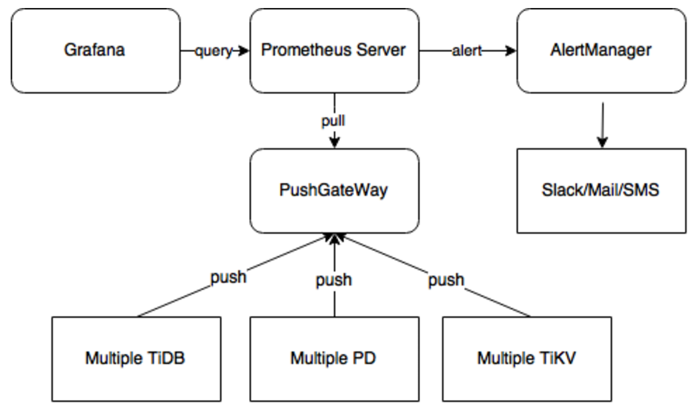
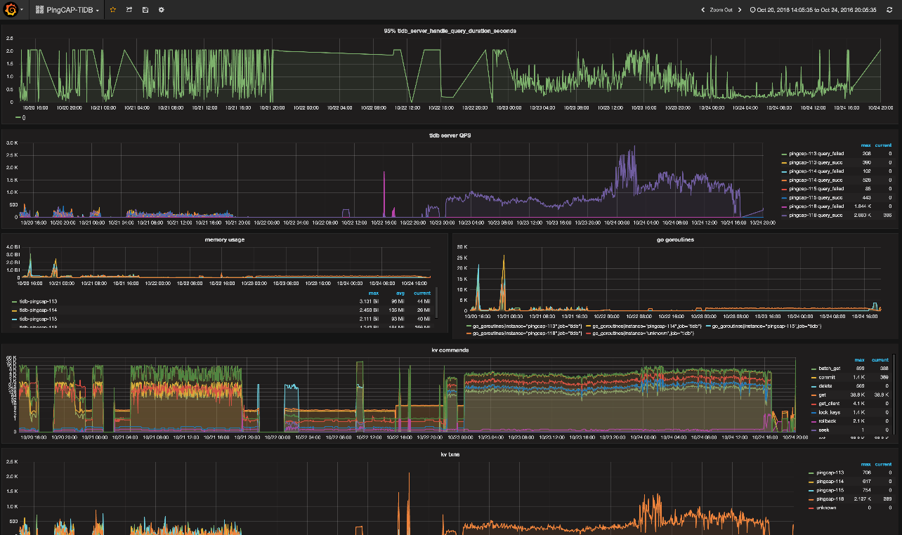

#TiDB 监控框架概述

TiDB 使用开源时序数据库 Prometheus 作为监控和性能指标信息存储方案，使用 Grafana 作为可视化组件进行展示。

Prometheus 的是一个拥有多纬度数据模型，灵活的查询语句的时序数据库。作为热门的开源项目之一的它，拥有活跃的社区，及优秀的案例。

同时作为 Prometheus 社区的活跃开发者的 PingCAP，以及对集群的监控需求，我们采用 Prometheus 来对TiDB/TiKV/PD 来进行监控和报警，并应用在我们的系统中。

Prometheus 提供了多个组件供用户使用。目前，我们使用 Prometheus Server，来收集和存储时间序列数据。Client 代码库，在程序中定制需要的 Metric 。Push GateWay 来接收 Client Push 上来的数据，统一供 Prometheus 主服务器抓取。以及 AlertManager 来实现报警机制。其结构如下图：

Grafana 是一个开源的 metric 分析及可视化系统。我们使用 Grafana 来展示 TiDB 的各项性能指标 。如下图所示:

