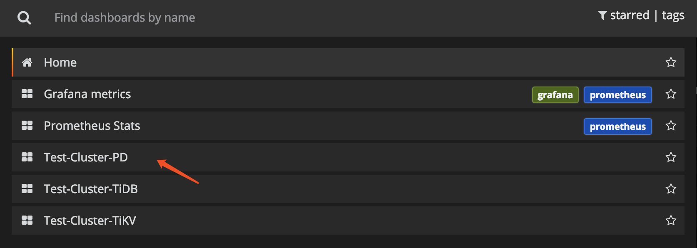

# TiDB 集群监控

TiDB 提供了以下两种接口来监控集群状态：

- [状态接口](#使用状态接口)：通过 HTTP 接口对外汇报组件的信息。
- [Metrics 接口](#使用-metrics-接口)：使用 Prometheus 记录组件中各种操作的详细信息，使用 Grafana 进行可视化展示。

## 使用状态接口

状态接口用于监控组件的一些基本信息，并且可以作为 keepalive 的监测接口。另外，通过 PD 的状态接口可以看到整个 TiKV 集群的详细信息。

### TiDB Server

- TiDB API 地址：`http://${host}:${port}`
- 默认端口：10080
- 各类 `api_name` 详细信息：参见 [TiDB API 文档](https://github.com/pingcap/tidb/blob/master/docs/tidb_http_api.md)

以下示例中，通过访问 `http://${host}:${port}/status` 获取当前 TiDB Server 的状态，并判断该 TiDB Server 是否存活。结果以 **JSON** 格式返回：

```bash
curl http://127.0.0.1:10080/status
{
    connections: 0,  # 当前 TiDB Server 上的客户端连接数
    version: "5.7.25-TiDB-v3.0.0-beta-250-g778c3f4a5",  # TiDB 版本号
    git_hash: "778c3f4a5a716880bcd1d71b257c8165685f0d70"  # TiDB 当前代码的 Git Hash
}
```

### PD Server

- PD API 地址：`http://${host}:${port}/pd/api/v1/${api_name}`
- 默认端口：2379
- 各类 `api_name` 详细信息：参见 [PD API Doc](https://cdn.rawgit.com/pingcap/docs/master/op-guide/pd-api-v1.html)

通过该接口可以获取当前所有 TiKV 节点的状态以及负载均衡信息。下面以一个单节点的 TiKV 集群为例，说明用户需要了解的信息：

```bash
curl http://127.0.0.1:2379/pd/api/v1/stores
{
  "count": 1,  # TiKV 节点数量
  "stores": [  # TiKV 节点的列表
    # 集群中单个 TiKV 节点的信息
    {
      "store": {
        "id": 1,
        "address": "127.0.0.1:20160",
        "version": "3.0.0-beta",
        "state_name": "Up"
      },
      "status": {
        "capacity": "20 GiB",  # 存储总容量
        "available": "16 GiB",  # 存储剩余容量
        "leader_count": 17,
        "leader_weight": 1,
        "leader_score": 17,
        "leader_size": 17,
        "region_count": 17,
        "region_weight": 1,
        "region_score": 17,
        "region_size": 17,
        "start_ts": "2019-03-21T14:09:32+08:00",  # 启动时间
        "last_heartbeat_ts": "2019-03-21T14:14:22.961171958+08:00",  # 最后一次心跳的时间
        "uptime": "4m50.961171958s"
      }
    }
  ]
```

## 使用 metrics 接口

Metrics 接口用于监控整个集群的状态和性能。

- 如果使用 TiDB-Ansible 部署 TiDB 集群，监控系统（Prometheus 和 Grafana）会同时部署。
- 如果使用其他方式部署 TiDB 集群，在使用 metrics 接口前，需先[部署 Prometheus 和 Grafana](#部署-prometheus-和-grafana)。

成功部署 Prometheus 和 Grafana 之后，[配置 Grafana](#配置-grafana)。

### 部署 Prometheus 和 Grafana

假设 TiDB 的拓扑结构如下：

| 节点  | 主机 IP | 服务 |
| :-- | :-- | :-------------- |
| Node1 | 192.168.199.113| PD1, TiDB, node_export, Prometheus, Grafana |
| Node2 | 192.168.199.114| PD2, node_export |
| Node3 | 192.168.199.115| PD3, node_export |
| Node4 | 192.168.199.116| TiKV1, node_export |
| Node5 | 192.168.199.117| TiKV2, node_export |
| Node6 | 192.168.199.118| TiKV3, node_export |

#### 第 1 步：下载二进制包

```bash
# 下载二进制包
$ wget https://github.com/prometheus/prometheus/releases/download/v2.2.1/prometheus-2.2.1.linux-amd64.tar.gz
$ wget https://github.com/prometheus/node_exporter/releases/download/v0.15.2/node_exporter-0.15.2.linux-amd64.tar.gz
$ wget https://s3-us-west-2.amazonaws.com/grafana-releases/release/grafana-4.6.3.linux-x64.tar.gz

# 解压二进制包
$ tar -xzf prometheus-2.2.1.linux-amd64.tar.gz
$ tar -xzf node_exporter-0.15.2.linux-amd64.tar.gz
$ tar -xzf grafana-4.6.3.linux-x64.tar.gz
```

#### 第 2 步：在 Node1，Node2，Node3，Node4 上启动 `node_exporter`

```bash
$ cd node_exporter-0.15.2.linux-amd64

# 启动 node_exporter 服务
$ ./node_exporter --web.listen-address=":9100" \
    --log.level="info" &
```

#### 第 3 步：在 Node1 上启动 Prometheus

编辑 Prometheus 的配置文件：

```yml
$ cd prometheus-2.2.1.linux-amd64
$ vi prometheus.yml

...

global:
  scrape_interval:     15s
  evaluation_interval: 15s
  # scrape_timeout 设置为全局默认值 (10s)
    external_labels:
      cluster: 'test-cluster'
      monitor: "prometheus"

scrape_configs:
  - job_name: 'overwritten-nodes'
    honor_labels: true  # 不要覆盖 job 和实例的 label
    static_configs:
    - targets:
      - '192.168.199.113:9100'
      - '192.168.199.114:9100'
      - '192.168.199.115:9100'
      - '192.168.199.116:9100'
      - '192.168.199.117:9100'
      - '192.168.199.118:9100'

  - job_name: 'tidb'
    honor_labels: true  # 不要覆盖 job 和实例的 label
    static_configs:
    - targets:
      - '192.168.199.113:10080'

  - job_name: 'pd'
    honor_labels: true  # 不要覆盖 job 和实例的 label
    static_configs:
    - targets:
      - '192.168.199.113:2379'
      - '192.168.199.114:2379'
      - '192.168.199.115:2379'

  - job_name: 'tikv'
    honor_labels: true  # 不要覆盖 job 和实例的 label
    static_configs:
    - targets:
      - '192.168.199.116:20180'
      - '192.168.199.117:20180'
      - '192.168.199.118:20180'

...

```

启动 Grafana 服务：

```bash
$ ./prometheus \
    --config.file="./prometheus.yml" \
    --web.listen-address=":9090" \
    --web.external-url="http://192.168.199.113:9090/" \
    --web.enable-admin-api \
    --log.level="info" \
    --storage.tsdb.path="./data.metrics" \
    --storage.tsdb.retention="15d" &
```

#### 第 4 步：在 Node1 上启动 Grafana

编辑 Grafana 的配置文件：

```ini
$ cd grafana-4.6.3
$ vi conf/grafana.ini

...

[paths]
data = ./data
logs = ./data/log
plugins = ./data/plugins
[server]
http_port = 3000
domain = 192.168.199.113
[database]
[session]
[analytics]
check_for_updates = true
[security]
admin_user = admin
admin_password = admin
[snapshots]
[users]
[auth.anonymous]
[auth.basic]
[auth.ldap]
[smtp]
[emails]
[log]
mode = file
[log.console]
[log.file]
level = info
format = text
[log.syslog]
[event_publisher]
[dashboards.json]
enabled = false
path = ./data/dashboards
[metrics]
[grafana_net]
url = https://grafana.net

...

```

启动 Grafana 服务：

```bash
$ ./bin/grafana-server \
    --config="./conf/grafana.ini" &
```

### 配置 Grafana

本小节介绍如何配置 Grafana。

#### 第 1 步：添加 Prometheus 数据源

1. 登录 Grafana 界面。

    - 默认地址：http://localhost:3000
    - 默认账户：admin
    - 默认密码：admin

2. 点击 Grafana 图标打开侧边栏。

3. 在侧边栏菜单中，点击 **Data Source**。

4. 点击 **Add data source**。

5. 指定数据源的相关信息：

    - 在 **Name** 处，为数据源指定一个名称。
    - 在 **Type** 处，选择 **Prometheus**。
    - 在 **URL** 处，指定 Prometheus 的 IP 地址。
    - 根据需求指定其它字段。

6. 点击 **Add** 保存新的数据源。

#### 第 2 步：导入 Grafana 面板

执行以下步骤，为 PD Server、TiKV Server 和 TiDB Server 分别导入 Grafana 面板：

1. 点击侧边栏的 Grafana 图标。

2. 在侧边栏菜单中，依次点击 **Dashboards** > **Import** 打开 **Import Dashboard** 窗口。

3. 点击 **Upload .json File** 上传对应的 JSON 文件（下载 [TiDB Grafana 配置文件](https://github.com/pingcap/tidb-ansible/tree/master/scripts))。

    > **注意**：TiKV、PD 和 TiDB 面板对应的 JSON 文件分别为 `tikv_pull.json`，`pd.json`，`tidb.json`。

4. 点击 **Load**。

5. 选择一个 Prometheus 数据源。

6. 点击 **Import**，Prometheus 面板即导入成功。

### 查看组件 metrics

在顶部菜单中，点击 **New dashboard**，选择要查看的面板。



可查看以下集群组件信息：

+ **TiDB Server：**
    + query 处理时间，可以看到延迟和吞吐
    + ddl 过程监控
    + TiKV client 相关的监控
    + PD client 相关的监控

+ **PD Server：**
    + 命令执行的总次数
    + 某个命令执行失败的总次数
    + 某个命令执行成功的耗时统计
    + 某个命令执行失败的耗时统计
    + 某个命令执行完成并返回结果的耗时统计

+ **TiKV Server：**
    + GC 监控
    + 执行 KV 命令的总次数
    + Scheduler 执行命令的耗时统计
    + Raft propose 命令的总次数
    + Raft 执行命令的耗时统计
    + Raft 执行命令失败的总次数
    + Raft 处理 ready 状态的总次数
