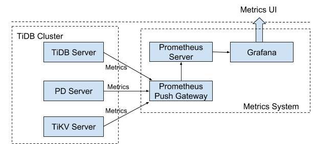

# TiDB 集群监控

TiDB 集群状态监控目前有两种接口，第一种是通过 HTTP 接口对外汇报组件的信息，我们称之为组件的状态接口；第二种是使用 prometheus 记录组件中各种操作的详细信息，我们称之为 Metrics 接口。

## 组件状态接口

这类接口可以获取组件的一些基本信息，并且可以作为 keepalive 监测接口。另外 PD 的接口可以看到整个 TiKV 集群的详细信息。

### TiDB Server
TiDB 对外暴露的 HTTP 接口是 http://host:port/status，默认的端口号是 10080 （可以通过 --status 参数设置），可以通过访问这个接口获取当前 TiDB Server 的状态，以及判断是否存活。返回结果是 **Json** 格式：

```bash
curl http://127.0.0.1:10080/status
{
    connections: 0,
    version: "5.5.31-TiDB-1.0",
    git_hash: "b99521846ff6f71f06e2d49a3f98fa1c1d93d91b"
}
```

+ connection: 当前 TiDB Server 上的客户端连接数
+ version: TiDB 版本号
+ git_hash: TiDB 当前代码的 Git Hash

### PD Server
PD API 地址： ``http://${host}:${port}/pd/api/v1/${api_name}``。

其中 port 默认为 2379，各类 api_name 详细信息参见 [PD API Doc](https://cdn.rawgit.com/pingcap/docs/master/op-guide/pd-api-v1.html)。

通过这个接口可以获取当前所有 TiKV 的状态以及负载均衡信息。其中最重要也是最常用的接口获取 TiKV 集群所有节点状态的接口，下面以一个单个 TiKV 构成的集群为例，说明一些用户需要了解的信息：

```bash
curl http://127.0.0.1:2379/pd/api/v1/stores
{
  "count": 1,  TiKV 节点数量
  "stores": [  // TiKV 节点的列表
   // 下面列出的是这个集群中单个 TiKV 节点的信息
   {
      "store": {
        "id": 1,
        "address": "127.0.0.1:22161",
        "state": 0
      },
      "status": {
        "store_id": 1,               // 节点的 ID
        "capacity": 1968874332160,   // 存储总容量
        "available": 1264847716352,  // 存储剩余容量
        "region_count": 1,           // 该节点上存放的  Region 数量
        "sending_snap_count": 0,
        "receiving_snap_count": 0,
        "start_ts": "2016-10-24T19:54:00.110728339+08:00",            // 启动时间
        "last_heartbeat_ts": "2016-10-25T10:52:54.973669928+08:00",   // 最后一次心跳时间
        "total_region_count": 1,           // 总 Region 数量
        "leader_region_count": 1,        // Leader Region 数量
        "uptime": "14h58m54.862941589s"
      },
      "scores": [
        100,
        35
      ]
    }
  ]
}
```

## Metrics 监控
这部分主要对整个集群的状态、性能做监控，通过 Prometheus+Grafana 展现 metrics 数据，在下面一节会介绍如何搭建监控系统。

### TiDB Server
+ query 处理时间，可以看到延迟和吞吐
+ ddl 过程监控
+ TiKV client 相关的监控
+ PD client 相关的监控

### PD Server
+ 命令执行的总次数
+ 某个命令执行失败的总次数
+ 某个命令执行成功的耗时统计
+ 某个命令执行失败的耗时统计
+ 某个命令执行完成并返回结果的耗时统计

### TiKV Server

+ GC 监控
+ 执行 KV 命令的总次数
+ Scheduler 执行命令的耗时统计
+ Raft propose 命令的总次数
+ Raft 执行命令的耗时统计
+ Raft 执行命令失败的总次数
+ Raft 处理 ready 状态的总次数

## 使用 Prometheus+Grafana

### 部署架构

整个架构如下图所示，在 TiDB/PD/TiKV 三个组件的启动参数中添加 Prometheus Pushgateway 地址:



### 搭建监控系统
Prometheus Push Gateway
参考： https://github.com/prometheus/pushgateway

Prometheus Server
参考： https://github.com/prometheus/prometheus#install

Grafana
参考： http://docs.grafana.org

### 配置
#### TiDB/PD/TiKV 配置

+   TiDB

    设置 \-\-metrics-addr 和 \-\-metrics-interval 两个参数，其中 metrics-addr 设为 Push Gateway 的地址，metrics-interval 为 push 的频率，单位为秒，默认值为 15

+   PD

    修改 toml 配置文件，填写 Push Gateway 的地址和推送频率

    ```toml
    [metric]
    # prometheus client push interval, set "0s" to disable prometheus.
    interval = "15s"
    # prometheus pushgateway address, leaves it empty will disable prometheus.
    address = "host:port"
    ```

+   TiKV

    修改 toml 配置文件，填写 Push Gateway 的地址和推送频率，job 字段一般设为“tikv”。

    ```toml
    [metric]
    # the Prometheus client push interval. Setting the value to 0s stops Prometheus client from pushing.
    interval = "15s"
    # the Prometheus pushgateway address. Leaving it empty stops Prometheus client from pushing.
    address = "host:port"
    # the Prometheus client push job name. Note: A node id will automatically append, e.g., "tikv_1".
    job = "tikv"
    ```

#### PushServer 配置
一般无需特殊配置，使用默认端口 9091 即可

+   Prometheus 配置

    在 yaml 配置文件中添加 Push Gateway 地址：

    ```yaml
    scrape_configs:
      # The job name is added as a label `job=<job_name>` to any timeseries scraped from this config.
      - job_name: 'TiDB'

        # Override the global default and scrape targets from this job every 5 seconds.
        scrape_interval: 5s

        honor_labels: true

        static_configs:
          - targets: ['host:port'] # 这里填写 pushgateway 地址
            labels:
              group: 'production'
    ```

#### Grafana 配置

+   进入 Grafana Web 界面（默认地址: http://localhost:3000，默认账号: admin 密码: admin）

    点击 Grafana Logo -> 点击 Data Sources -> 点击 Add data source -> 填写 data source 信息 ( 注: Type 选 Prometheus，Url 为 Prometheus 地址，其他根据实际情况填写 ）

+   导入 dashboard 配置文件

    点击 Grafana Logo -> 点击 Data Sources -> 点击 Import -> 选择需要的 Dashboard [配置文件](https://grafana.com/tidb)上传 -> 选择对应的 data source
