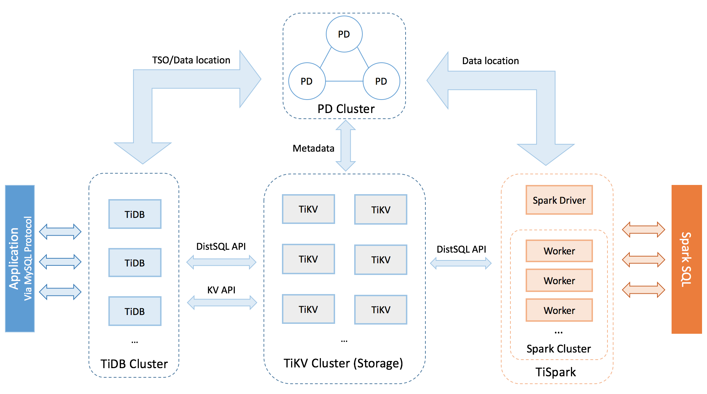

# TiDB 简介与整体架构

## TiDB 简介

TiDB 是 PingCAP 公司受 Google [Spanner](http://research.google.com/archive/spanner.html) / [F1](http://research.google.com/pubs/pub41344.html) 论文启发而设计的开源分布式 HTAP (Hybrid Transactional and Analytical Processing) 数据库，结合了传统的 RDBMS 和 NoSQL 的最佳特性。TiDB 兼容 MySQL，支持无限的水平扩展，具备强一致性和高可用性。TiDB 的目标是为 OLTP (Online Transactional Processing) 和 OLAP (Online Analytical Processing) 场景提供一站式的解决方案。

TiDB 具备如下核心特性：

- 高度兼容 MySQL
    
    大多数情况下，无需修改代码即可从 MySQL 轻松迁移至 TiDB，分库分表后的 MySQL 集群亦可通过 TiDB 工具进行实时迁移。

- 水平弹性扩展

    通过简单地增加新节点即可实现 TiDB 的水平扩展，按需扩展吞吐或存储，轻松应对高并发、海量数据场景。

- 分布式事务

    TiDB 100% 支持标准的 ACID 事务。

- 真正金融级高可用

    相比于传统主从 (M-S) 复制方案，基于 Raft 的多数派选举协议可以提供金融级的 100% 数据强一致性保证，且在不丢失大多数副本的前提下，可以实现故障的自动恢复 (auto-failover)，无需人工介入。

- 一站式 HTAP 解决方案

    TiDB 作为典型的 OLTP 行存数据库，同时兼具强大的 OLAP 性能，配合 TiSpark，可提供一站式 HTAP 解决方案，一份存储同时处理 OLTP & OLAP，无需传统繁琐的 ETL 过程。

- 云原生 SQL 数据库

    TiDB 是为云而设计的数据库，同 Kubernetes 深度耦合，支持公有云、私有云和混合云，使部署、配置和维护变得十分简单。

TiDB 的设计目标是 100% 的 OLTP 场景和 80% 的 OLAP 场景，更复杂的 OLAP 分析可以通过 [TiSpark 项目](https://github.com/pingcap/docs-cn/blob/master/tispark/tispark-user-guide.md)来完成。

TiDB 对业务没有任何侵入性，能优雅的替换传统的数据库中间件、数据库分库分表等 Sharding 方案。同时它也让开发运维人员不用关注数据库 Scale 的细节问题，专注于业务开发，极大的提升研发的生产力。

三篇文章了解 TiDB 技术内幕：

- [说存储](https://pingcap.com/blog-cn/tidb-internal-1/)
- [说计算](https://pingcap.com/blog-cn/tidb-internal-2/)
- [谈调度](https://pingcap.com/blog-cn/tidb-internal-3/)

## TiDB 整体架构

要深入了解 TiDB 的水平扩展和高可用特点，首先需要了解 TiDB 的整体架构。

TiDB 集群主要分为三个组件：

### TiDB Server

TiDB Server 负责接收 SQL 请求，处理 SQL 相关的逻辑，并通过 PD 找到存储计算所需数据的 TiKV 地址，与 TiKV 交互获取数据，最终返回结果。
TiDB Server 是无状态的，其本身并不存储数据，只负责计算，可以无限水平扩展，可以通过负载均衡组件（如LVS、HAProxy 或 F5）对外提供统一的接入地址。

### PD Server

Placement Driver (简称 PD) 是整个集群的管理模块，其主要工作有三个： 一是存储集群的元信息（某个 Key 存储在哪个 TiKV 节点）；二是对 TiKV 集群进行调度和负载均衡（如数据的迁移、Raft group leader 的迁移等）；三是分配全局唯一且递增的事务 ID。

PD 是一个集群，需要部署奇数个节点，一般线上推荐至少部署 3 个节点。

### TiKV Server

TiKV Server 负责存储数据，从外部看 TiKV 是一个分布式的提供事务的 Key-Value 存储引擎。存储数据的基本单位是 Region，每个 Region 负责存储一个 Key Range （从 StartKey 到 EndKey 的左闭右开区间）的数据，每个 TiKV 节点会负责多个 Region 。TiKV 使用 Raft 协议做复制，保持数据的一致性和容灾。副本以 Region 为单位进行管理，不同节点上的多个 Region 构成一个 Raft Group，互为副本。数据在多个 TiKV 之间的负载均衡由 PD 调度，这里也是以 Region 为单位进行调度。

## 核心特性

### 水平扩展

无限水平扩展是 TiDB 的一大特点，这里说的水平扩展包括两方面：计算能力和存储能力。TiDB Server 负责处理 SQL 请求，随着业务的增长，可以简单的添加 TiDB Server 节点，提高整体的处理能力，提供更高的吞吐。TiKV 负责存储数据，随着数据量的增长，可以部署更多的 TiKV Server 节点解决数据 Scale 的问题。PD 会在 TiKV 节点之间以 Region 为单位做调度，将部分数据迁移到新加的节点上。所以在业务的早期，可以只部署少量的服务实例（推荐至少部署 3 个 TiKV， 3 个 PD，2 个 TiDB），随着业务量的增长，按照需求添加 TiKV 或者 TiDB 实例。

### 高可用

高可用是 TiDB 的另一大特点，TiDB/TiKV/PD 这三个组件都能容忍部分实例失效，不影响整个集群的可用性。下面分别说明这三个组件的可用性、单个实例失效后的后果以及如何恢复。

+   TiDB

    TiDB 是无状态的，推荐至少部署两个实例，前端通过负载均衡组件对外提供服务。当单个实例失效时，会影响正在这个实例上进行的 Session，从应用的角度看，会出现单次请求失败的情况，重新连接后即可继续获得服务。单个实例失效后，可以重启这个实例或者部署一个新的实例。

+   PD

    PD 是一个集群，通过 Raft 协议保持数据的一致性，单个实例失效时，如果这个实例不是 Raft 的 leader，那么服务完全不受影响；如果这个实例是 Raft 的 leader，会重新选出新的 Raft leader，自动恢复服务。PD 在选举的过程中无法对外提供服务，这个时间大约是3秒钟。推荐至少部署三个 PD 实例，单个实例失效后，重启这个实例或者添加新的实例。

+   TiKV

    TiKV 是一个集群，通过 Raft 协议保持数据的一致性（副本数量可配置，默认保存三副本），并通过 PD 做负载均衡调度。单个节点失效时，会影响这个节点上存储的所有 Region。对于 Region 中的 Leader 结点，会中断服务，等待重新选举；对于 Region 中的 Follower 节点，不会影响服务。当某个 TiKV 节点失效，并且在一段时间内（默认 30 分钟）无法恢复，PD 会将其上的数据迁移到其他的 TiKV 节点上。
