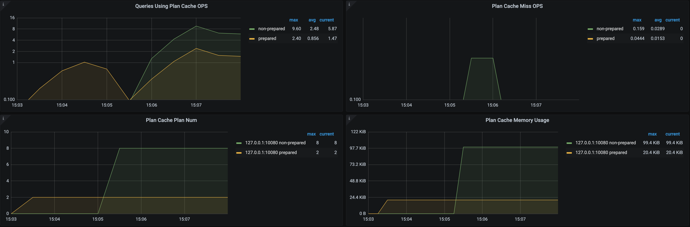

# 非 Prepared 语句执行计划缓存

> **警告：**
>
> 非 Prepared 语句执行计划缓存目前为实验特性，不建议在生产环境中使用。该功能可能会在未事先通知的情况下发生变化或删除。如果发现 bug，请在 GitHub 上提 [issue](https://github.com/pingcap/tidb/issues) 反馈。

对于某些非 `PREPARE` 语句，TiDB 可以像 [`Prepare`/`Execute` 语句](/sql-prepared-plan-cache.md)一样支持执行计划缓存。这可以让这些语句跳过优化器阶段，以提升性能。

此功能基本原理如下：

1. 打开此功能后，TiDB 首先根据 AST 对查询进行参数化，如将 `select * from t where b<10 and a=1` 参数化为 `select * from t where b<? and a=?`；
2. 然后用参数化后的查询，在 Non-Prepared Plan Cache 中进行查找；
3. 如果能找到可以直接复用的计划，则直接使用，并跳过整个优化过程；
4. 如果找不到可以直接复用的计划，则继续进行查询优化，并在最后把生成的计划放回到 Cache 中，以便下次进行复用；

Non-Prepared Plan Cache 为 Session 级别，且和 [Prepared Plan Cache](sql-prepared-plan-cache.md) 相互独立，其中缓存的 Plan 互不影响。

## 使用方法

目前可以通过 `tidb_enable_non_prepared_plan_cache` 来打开和关闭此项功能，同时通过 `tidb_non_prepared_plan_cache_size` 来控制 Non-Prepared Plan Cache 的大小，当缓存的计划数超过 `tidb_non_prepared_plan_cache_size` 时，会使用 LRU 策略来进行逐出。

## 实例

下面是一些实例：



1. 创建用于测试的表 `t`：

    ```sql
    CREATE TABLE t (a INT, b INT, KEY(b));
    ```

2. 开启 Non-Prepared Plan Cache：

    ```sql
    SET tidb_enable_non_prepared_plan_cache = true;
    ```

3. 依次执行以下查询：

    ```sql
    SELECT * FROM t WHERE b < 10 AND a = 1;
    SELECT * FROM t WHERE b < 5 AND a = 2;
    ```

4. 查看第二个查询语句是否命中 cache：

    ```sql
    SELECT @@last_plan_from_cache;
    ```

    输出结果中 `last_plan_from_cache` 的值为 `1`，表示第二次执行的查询计划来自于 cache。

    ```sql
    +------------------------+
    | @@last_plan_from_cache |
    +------------------------+
    |                      1 |
    +------------------------+
    1 row in set (0.00 sec)
    ```

## 限制

TiDB 对一种参数化后的查询，只能缓存一个计划，比如对于 `select * from t where a<1` 和 `select * from t where a<100000`，由于参数化后的形式相同，因此他们会共用一个计划；

如果由此产生性能问题，可以通过 hint ` ignore_plan_cache()` 忽略计划缓存中的计划，让优化器每次重新为 SQL 生成执行计划。 在 SQL 无法修改的情况下，可以通过创建 binding 来解决，比如 `create binding for select ... using select /*+ ignore_plan_cache() */` ...

由于上述风险，以及 `Plan Cache` 只在简单的查询上有明显收益（如果查询较为复杂，本身执行时间较长，使用 `Plan Cache` 收益不大），TiDB 目前对 Non-Prepared Plan Cache 的生效范围有比较严格的限制，如下：

1. [Prepared Plan Cache](/sql-prepared-plan-cache.md) 无法支持的查询或者计划，Non-Prepared Plan Cache 同样无法支持；
2. 目前仅支持包含 Scan-Selection-Projection 算子的单表的点查或范围查询，如 `select * from t where a<10 and b in (1, 2)`；包含 `Agg`, `Limit`, `Window`, `Sort` 等更复杂算子的查询暂不支持；包含非范围查询条件如 `c like 'c%'`, `a+1<2`（不支持 `+` 操作） 等的查询不支持；
3. `JSON`, `Enum`, `Set` 或 `Bit` 类型的列出现在过滤条件中的查询不支持，如 `select * from t where json_col='{}'`；
4. 过滤条件中有 `Null` 值出现的查询不支持，如 `select * from t where a=null`；
5. 参数化后参数个数超过 50 个的查询不支持，如 `select * from t where a in (1, 2, 3, ... 51)`；
6. 访问分区表，虚拟列，临时表，视图，内存表的查询不支持，如 `select * from information_schema.colunms`，其中 `columns` 为 TiDB 内存表；
7. 带有 hint、子查询、Lock 的查询不支持；

## 诊断

开启 Non-Prepared Plan Cache 后，可以通过 `explain format='plan_cache' select ...` 来验证查询是否能够命中，对于无法命中的查询，会通过 warning 的方式返回其无法命中的原因。

注意如果不加 `format='plan_cache'`，则 `explain` 永远不会命中 Cache。

```sql
mysql> explain format='plan_cache' select * from t where a+2 < 10;
...
3 rows in set, 1 warning (0.00 sec)

mysql> show warnings;
+---------+------+-----------------------------------------------------------------------+
| Level   | Code | Message                                                               |
+---------+------+-----------------------------------------------------------------------+
| Warning | 1105 | skip non-prep plan cache: query has some unsupported binary operation |
+---------+------+-----------------------------------------------------------------------+
1 row in set (0.00 sec)
```

可以看到在上述例子中，由于 `+` 操作并不被 Non-Prepared Plan Cache 支持，所以无法命中缓存。

## 监控

开启 Non-Prepared Plan Cache 的开关后，可以在下面几个面板看到 Cache 的内存使用情况、Cache 中 Plan 的个数、Cache 命中情况等：



在 `Statement Summary` 表和慢查询日志中，也会对 Cache 命中情况有所体现，如下面是 `Statement Summary` 中的例子：

```sql
mysql> create table t (a int);
Query OK, 0 rows affected (0.03 sec)

mysql> set @@tidb_enable_non_prepared_plan_cache=1; -- 打开开关
Query OK, 0 rows affected (0.00 sec)

mysql> select * from t where a<1;                   -- 第一次执行
Empty set (0.02 sec)

mysql> select * from t where a<2;                   -- 第二次执行
Empty set (0.01 sec)

mysql> select * from t where a<3;                   -- 第三次执行
Empty set (0.00 sec)

-- 查询执行过三次，且命中 Plan Cache 两次
mysql> select digest_text, query_sample_text, exec_count, plan_in_cache, plan_cache_hits from information_schema.statements_summary where digest_text like '%select * from %';
+---------------------------------+------------------------------------------+------------+---------------+-----------------+
| digest_text                     | query_sample_text                        | exec_count | plan_in_cache | plan_cache_hits |
+---------------------------------+------------------------------------------+------------+---------------+-----------------+
| select * from `t` where `a` < ? | select * from t where a<1 [arguments: 1] |          3 |             1 |               2 |
+---------------------------------+------------------------------------------+------------+---------------+-----------------+
1 row in set (0.01 sec)
```