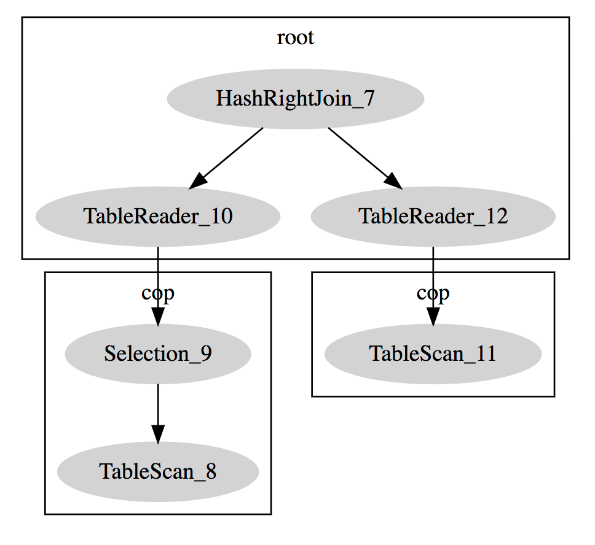
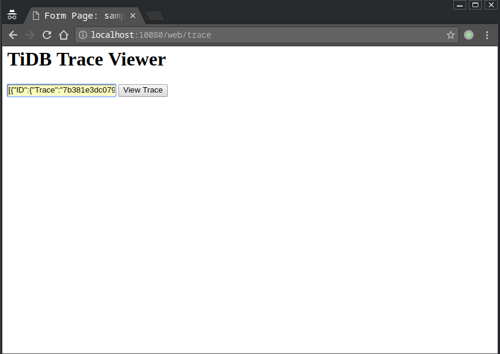
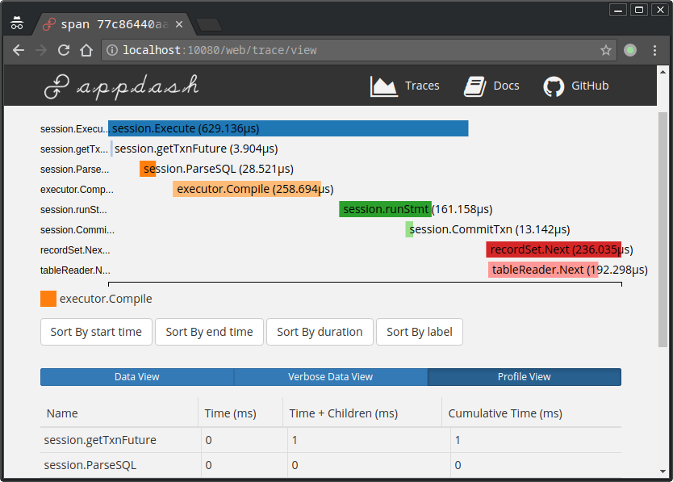

# 实用工具语句

## `DESCRIBE` 语句

`DESCRIBE` 和 `EXPLAIN` 是同义词，另外还可以缩写为 `DESC`。请参考 `EXPLAIN` 语句的用法。

## `EXPLAIN` 语句

```sql
{EXPLAIN | DESCRIBE | DESC}
    tbl_name [col_name]

{EXPLAIN | DESCRIBE | DESC}
    [explain_type]
    explainable_stmt

explain_type:
    FORMAT = format_name

format_name:
      "DOT"
    | "ROW"

explainable_stmt: {
    SELECT statement
  | DELETE statement
  | INSERT statement
  | REPLACE statement
  | UPDATE statement
}
```

如果不指定`FORMAT`，或者指定`FORMAT = "row"`，`EXPLAIN`语句将以 MySQL 标准的格式输出结果，不过结果具体字段和 MySQL 有一定差异。详细信息可参考[理解 TiDB 执行计划](../sql/understanding-the-query-execution-plan.md)章节。

除此之外，TiDB 还支持输出 DotGraph 结果，这时需要指定 `FORMAT = "dot"`，示例如下：

```sql
create table t(a bigint, b bigint);
desc format = "dot" select A.a, B.b from t A join t B on A.a > B.b where A.a < 10;

TiDB > desc format = "dot" select A.a, B.b from t A join t B on A.a > B.b where A.a < 10;desc format = "dot" select A.a, B.b from t A join t B on A.a > B.b where A.a < 10;
+--------------------------------------------------------------------------------------------------------------------------------------------------------------------------------------------------------------------------------------------------------------------------------------------------------------------------------------------------------------------------------------------------------------------------------------------------------------------------------------------+
| dot contents                                                                                                                                                                                                                                                                                                                                                                                                                                                                               |
+--------------------------------------------------------------------------------------------------------------------------------------------------------------------------------------------------------------------------------------------------------------------------------------------------------------------------------------------------------------------------------------------------------------------------------------------------------------------------------------------+
|
digraph HashRightJoin_7 {
subgraph cluster7{
node [style=filled, color=lightgrey]
color=black
label = "root"
"HashRightJoin_7" -> "TableReader_10"
"HashRightJoin_7" -> "TableReader_12"
}
subgraph cluster9{
node [style=filled, color=lightgrey]
color=black
label = "cop"
"Selection_9" -> "TableScan_8"
}
subgraph cluster11{
node [style=filled, color=lightgrey]
color=black
label = "cop"
"TableScan_11"
}
"TableReader_10" -> "Selection_9"
"TableReader_12" -> "TableScan_11"
}
 |
+--------------------------------------------------------------------------------------------------------------------------------------------------------------------------------------------------------------------------------------------------------------------------------------------------------------------------------------------------------------------------------------------------------------------------------------------------------------------------------------------+
1 row in set (0.00 sec)
```

如果电脑上安装了 `dot` 程序 (包含在 graphviz 软件包中)，可以通过如下方式生成 PNG 文件：

```bash
dot xx.dot -T png -O

这里的 xx.dot 是上面的语句返回结果。
```

如果没有安装 `dot`，可以将结果拷贝到[这个网站](http://www.webgraphviz.com/)，可以得到一个树状图：



目前 TiDB 中的 `EXPLAIN` 语句暂不支持 MySQL 中 `JSON` 格式的输出。

## `USE` 语句

```sql
USE db_name
```

切换需要使用的 Database 的时候，如果 SQL 语句中的表没有显式指定的 Database，即默认使用当前选定的 Database。

## `TRACE` 语句

```sql
TRACE [FORMAT = format_name] traceable_stmt

format_name:
    "json" | "row"

traceable_stmt: {
    SELECT statement
  | DELETE statement
  | INSERT statement
  | REPLACE statement
  | UPDATE statement
}
```

```sql
mysql> trace format = 'row' select * from mysql.user;
+---------------------------|-----------------|------------+
| operation                 | startTS         | duration   |
+---------------------------|-----------------|------------+
| session.getTxnFuture      | 19:54:35.310841 | 4.255µs    |
|   ├─session.Execute       | 19:54:35.310837 | 928.349µs  |
|   ├─session.ParseSQL      | 19:54:35.310906 | 35.379µs   |
|   ├─executor.Compile      | 19:54:35.310972 | 420.688µs  |
|   ├─session.runStmt       | 19:54:35.311427 | 222.431µs  |
|   ├─session.CommitTxn     | 19:54:35.311601 | 14.696µs   |
|   ├─recordSet.Next        | 19:54:35.311828 | 419.797µs  |
|   ├─tableReader.Next      | 19:54:35.311834 | 379.932µs  |
|   ├─recordSet.Next        | 19:54:35.312310 | 26.831µs   |
|   └─tableReader.Next      | 19:54:35.312314 | 2.84µs     |
+---------------------------|-----------------|------------+
10 rows in set (0.00 sec)
```

当 format 为 `json` 时，输出是一段 JSON 格式的内容。如果内容过长，则输出会被换行。

```sql
mysql> trace format='json' select * from  t\G;
*************************** 1. row ***************************
operation: [
  {"ID":{"Trace":"22a6ccdaf58481ea","Span":"4f29711d1db208b4","Parent":"64aa858bd66f5c65"},
  "Annotations":[{"Key":"Name","Value":"c2Vzc2lvbi5nZXRUeG5GdXR1cmU="},{"Key":"_schema:name","Value":null},{"Key":"Span.Start","Value":"MjAxOS0wMy0yMFQxNjoxMDo1My4yNDQ5NDc1MTgrMDg6MDA="},{"Key":"Span.End","Value":"MjAxOS0wMy0yMFQxNjoxMDo1My4yNDQ5NTI1MDYrMDg6MDA="},{"Key":"_schema:Timespan","Value":null}],
  "Sub":[
    {"ID":{"Trace":"22a6ccdaf58481ea","Span":"5a1f3a948a72ff6f","Parent":"64aa858bd66f5c65"},
    "Annotations":[{"Key":"Name","Value":"c2Vzc2lvbi5QYXJzZVNRTA=="},{"Key":"_schema:name","Value":null},{"Key":"Span.Start","Value":"MjAxOS0wMy0yMFQxNjoxMDo1My4yNDUwMTc3MzgrMDg6MDA="},{"Key":"Span.End","Value":"MjAxOS0wMy0yMFQxNjoxMDo1My4yNDUwNTczNzQrMDg6MDA="},{"Key":"_schema:Timespan","Value":null}],
    "Sub":null},
    {"ID":{"Trace":"22a6ccdaf58481ea","Span":"1252ea914624eff1","Parent":"64aa858bd66f5c65"},
    "Annotations":[{"Key":"Name","Value":"ZXhlY3V0b3IuQ29tcGlsZQ=="},{"Key":"_schema:name","Value":null},{"Key":"Span.Start","Value":"MjAxOS0wMy0yMFQxNjoxMDo1My4yNDUxMTc3NzQrMDg6MDA="},{"Key":"Span.End","Value":"MjAxOS0wMy0yMFQxNjoxMDo1My4yNDUzNzMwNjIrMDg6MDA="},{"Key":"_schema:Timespan","Value":null}],
    "Sub":null},
    {"ID":{"Trace":"22a6ccdaf58481ea","Span":"1a32f23071104f0d","Parent":"64aa858bd66f5c65"},
    "Annotations":[{"Key":"Name","Value":"c2Vzc2lvbi5Db21taXRUeG4="},{"Key":"_schema:name","Value":null},{"Key":"Span.Start","Value":"MjAxOS0wMy0yMFQxNjoxMDo1My4yNDU1NzIyMTkrMDg6MDA="},{"Key":"Span.End","Value":"MjAxOS0wMy0yMFQxNjoxMDo1My4yNDU1ODY4MDIrMDg6MDA="},{"Key":"_schema:Timespan","Value":null}],
    "Sub":null},
    {"ID":{"Trace":"22a6ccdaf58481ea","Span":"1a253a1a7e9513ca","Parent":"64aa858bd66f5c65"},
    "Annotations":[{"Key":"Name","Value":"c2Vzc2lvbi5ydW5TdG10"},{"Key":"_schema:name","Value":null},{"Key":"Msg","Value":"eyJzcWwiOiJzZWxlY3QgKiBmcm9tICB0In0="},{"Key":"Time","Value":"MjAxOS0wMy0yMFQxNjoxMDo1My4yNDU0MTkxOCswODowMA=="},{"Key":"_schema:log","Value":null},{"Key":"Span.Start","Value":"MjAxOS0wMy0yMFQxNjoxMDo1My4yNDU0MTMxMTcrMDg6MDA="},{"Key":"Span.End","Value":"MjAxOS0wMy0yMFQxNjoxMDo1My4yNDU2MjE1MjgrMDg6MDA="},{"Key":"_schema:Timespan","Value":null}],
    "Sub":null},
    {"ID":{"Trace":"22a6ccdaf58481ea","Span":"0db4399b79ba58c5","Parent":"64aa858bd66f5c65"},
    "Annotations":[{"Key":"Name","Value":"c2Vzc2lvbi5FeGVjdXRl"},{"Key":"_schema:name","Value":null},{"Key":"Span.Start","Value":"MjAxOS0wMy0yMFQxNjoxMDo1My4yNDQ5NDI4MSswODowMA=="},{"Key":"Span.End","Value":"MjAxOS0wMy0yMFQxNjoxMDo1My4yNDU2OTcwMzcrMDg6MDA="},{"Key":"_schema:Timespan","Value":null}],
    "Sub":null},
    {"ID":{"Trace":"22a6ccdaf58481ea","Span":"5fb58dc2f1f6273a","Parent":"64aa858bd66f5c65"},
    "Annotations":[{"Key":"Name","Value":"dGFibGVSZWFkZXIuTmV4dA=="},{"Key":"_schema:name","Value":null},{"Key":"Span.End","Value":"MjAxOS0wMy0yMFQxNjoxMDo1NC4xODIxODMxODIrMDg6MDA="},{"Key":"Span.Start","Value":"MjAxOS0wMy0yMFQxNjoxMDo1My4yNDU3NTM5ODYrMDg6MDA="},{"Key":"_schema:Timespan","Value":null}],
    "Sub":null},
    {"ID":{"Trace":"22a6ccdaf58481ea","Span":"4c4ceeeeba9bb2eb","Parent":"64aa858bd66f5c65"},
    "Annotations":[{"Key":"Name","Value":"cmVjb3JkU2V0Lk5leHQ="},{"Key":"_schema:name","Value":null},{"Key":"Span.Start","Value":"MjAxOS0wMy0yMFQxNjoxMDo1My4yNDU3NDc0NjMrMDg6MDA="},{"Key":"Span.End","Value":"MjAxOS0wMy0yMFQxNjoxMDo1NC4xODIyMDUyNTUrMDg6MDA="},{"Key":"_schema:Timespan","Value":null}],
    "Sub":null}]
}]
1 row in set (0.93 sec)
```

输出的 JSON 内容可以在集成的 Web UI 里面查看（默认 10080 端口）。

打开 trace viewer 页面，将 `json` 数据填进去：




