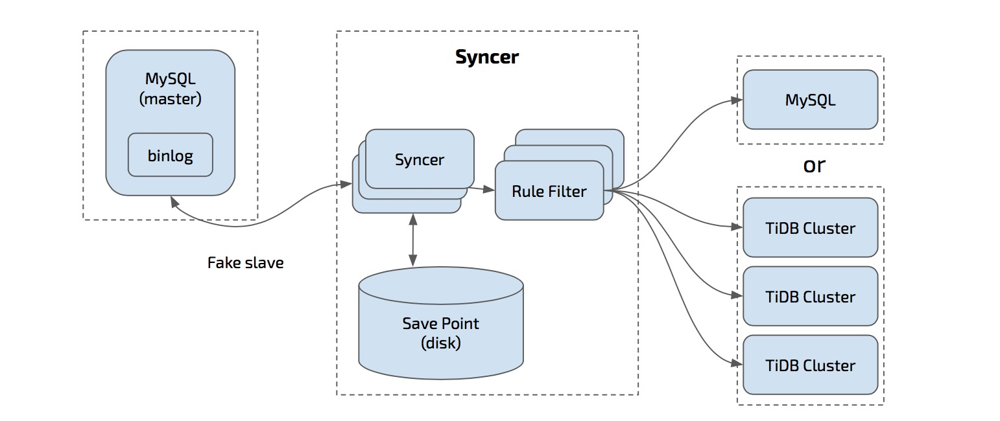

## syncer 架构


## 下载 TiDB 工具集 (Linux)

```bash
# 下载 tool 压缩包
wget http://download.pingcap.org/tidb-tools-latest-linux-amd64.tar.gz
wget http://download.pingcap.org/tidb-tools-latest-linux-amd64.sha256

# 检查文件完整性，返回 ok 则正确
sha256sum -c tidb-tools-latest-linux-amd64.sha256
# 解开压缩包
tar -xzf tidb-tools-latest-linux-amd64.tar.gz
cd tidb-tools-latest-linux-amd64
```

## MySQL 开启 binlog

+   MySQL 开启 binlog 功能，参考 [Setting the Replication Master Configuration](http://dev.mysql.com/doc/refman/5.7/en/replication-howto-masterbaseconfig.html)
+   Binlog 格式必须使用 `ROW` format，这也是 MySQL 5.7 之后推荐的 binlog 格式，可以使用如下语句打开:

    ```sql
    SET GLOBAL binlog_format = ROW;
    ```

## `syncer` 增量导入数据示例

### 设置同步开始的 position

设置 syncer 的 meta 文件, 这里假设 meta 文件是 `syncer.meta`:

```bash
# cat syncer.meta
binlog-name = "mysql-bin.000003"
binlog-pos = 930143241
binlog-gtid = "2bfabd22-fff7-11e6-97f7-f02fa73bcb01:1-23,61ccbb5d-c82d-11e6-ac2e-487b6bd31bf7:1-4"
```

+ 注意： `syncer.meta` 只需要第一次使用的时候配置，后续 `syncer` 同步新的 binlog 之后会自动将其更新到最新的 position
+ 注意： 如果使用 binlog position 同步则只需要配置 binlog-name binlog-pos; 使用 gtid 同步则只需要设置 gtid

### 启动 `syncer`

`syncer` 的配置文件 `config.toml`:

```toml
log-level = "info"

server-id = 101

# meta 文件地址
meta = "./syncer.meta"
worker-count = 1
batch = 1

pprof-addr = ":10081"

skip-sqls = ["ALTER USER", "CREATE USER"]

# 支持白名单过滤, 指定只同步的某些库和某些表, 例如:

# 指定同步 db1 和 db2 下的所有表
replicate-do-db = ["db1","db2"]

# 指定同步 db1.table1
[[replicate-do-table]]
db-name ="db1"
tbl-name = "table1"

# 指定同步 db3.table2
[[replicate-do-table]]
db-name ="db3"
tbl-name = "table2"

# 支持正则，以~开头表示使用正则
# 同步所有以 test 开头的库
replicate-do-db = ["~^test.*"]

# sharding 同步规则，采用 wildcharacter
# 1. 星号字符 (*) 可以匹配零个或者多个字符,
#    例子, doc* 匹配 doc 和 document, 但是和 dodo 不匹配;
#    星号只能放在 pattern 结尾，并且一个 pattern 中只能有一个
# 2. 问号字符 (?) 匹配任一一个字符
[[route-rules]]
pattern-schema = "route_*"
pattern-table = "abc_*"
target-schema = "route"
target-table = "abc"

[[route-rules]]
pattern-schema = "route_*"
pattern-table = "xyz_*"
target-schema = "route"
target-table = "xyz"

[from]
host = "127.0.0.1"
user = "root"
password = ""
port = 3306

[to]
host = "127.0.0.1"
user = "root"
password = ""
port = 4000
```

启动 `syncer`:

```bash
./bin/syncer -config config.toml
2016/10/27 15:22:01 binlogsyncer.go:226: [info] begin to sync binlog from position (mysql-bin.000003, 1280)
2016/10/27 15:22:01 binlogsyncer.go:130: [info] register slave for master server 127.0.0.1:3306
2016/10/27 15:22:01 binlogsyncer.go:552: [info] rotate to (mysql-bin.000003, 1280)
2016/10/27 15:22:01 syncer.go:549: [info] rotate binlog to (mysql-bin.000003, 1280)
```

### 在 MySQL 插入新的数据

```sql
INSERT INTO t1 VALUES (4, 4), (5, 5);
```

登录到 TiDB 查看：

```sql
mysql -h127.0.0.1 -P4000 -uroot -p
mysql> select * from t1;
+----+------+
| id | age  |
+----+------+
|  1 |    1 |
|  2 |    2 |
|  3 |    3 |
|  4 |    4 |
|  5 |    5 |
+----+------+
```

`syncer` 每隔 30s 会输出当前的同步统计，如下


```bash
2016/10/27 15:22:31 syncer.go:668: [info] [syncer]total events = 1, insert = 1, update = 0, delete = 0, total tps = 0, recent tps = 0, binlog name = mysql-bin.000003, binlog pos = 1280.
2016/10/27 15:23:01 syncer.go:668: [info] [syncer]total events = 2, insert = 2, update = 0, delete = 0, total tps = 0, recent tps = 0, binlog name = mysql-bin.000003, binlog pos = 1538.
```

可以看到，使用 `syncer`，我们就能自动的将 MySQL 的更新同步到 TiDB。

## sharding 同步支持

根据上面的 route-rules 可以支持将分库分表的数据导入到同一个库同一个表中，但是在开始前需要检查分库分表规则
+   是否可以利用 route-rule 的语义规则表示
+   分表中是否包含唯一递增主键，或者合并后数据上有冲突的唯一索引或者主键

## 分库分表同步示例


则只需要在所有 mysql 实例下面，启动 syncer, 并且设置以下 route-rule
```
[[route-rules]]
pattern-schema = "example_db"
pattern-table = "table_*"
target-schema = "example_db"
target-table = "table"
```