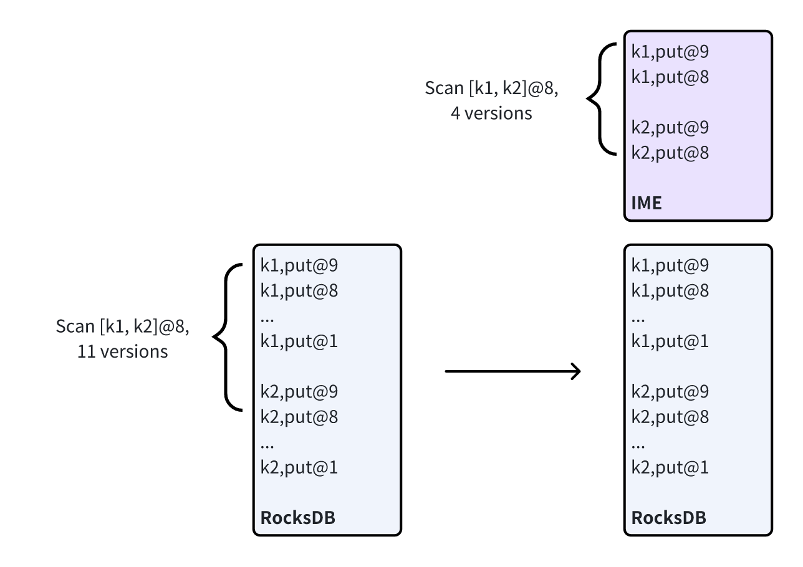

# TiKV 内存引擎（in-memory engine）

## 适用场景

TiKV In-memory Engine （以下简称 IME）主要用于加速需要访问大量 MVCC 历史版本的查询，即[查询访问的总共版本数量（total_keys）远大于处理的版本数量（processed_keys）](/analyze-slow-queries.md#过期-key-多)

例如以下场景：

- 业务需要查询频繁更新或删除的记录。
- 业务需要调整 gc_life_time，使 TiDB 保留较长时间的历史版本（比如 24 小时）。

## 原理解释

TiKV In-memory Engine 在内存中缓存了最近写入的 MVCC 版本，并实现了独立于 TiDB 的 MVCC GC 机制，使其可快速 GC 缓存中的 MVCC 记录，从而减少查询时访问的记录的个数，以达到降低请求延时和减少 CPU 开销的效果。

<div style="text-align: center;"></div>


上图为 TiKV 如何组织 MVCC 版本的示意图，图中共有 2 行记录，每行记录各有 9 个 MVCC 版本。左侧为没开 IME 的情况，表中记录按主键升序保存在 RocksDB 中，相同行的 MVCC 版本紧邻在一起。右侧为开 IME 的情况，RocksDB 中的数据有左侧一致，同时 IME 缓存了 2 行记录的最新两个 MVCC 版本。当 TiKV 处理一个范围为 [k1, k2]，start ts 为 8 的扫描请求时，左侧未开启 IME 时需要处理 11 个 MVCC 版本，而右侧开启 IME 时只需处理 4 个 MVCC 版本，因此减少了请求延时和 CPU 消耗。当 TiKV 处理一个范围为 [k1, k2]，start ts 为 7 的扫描请求时，由于右侧缺少需要读取的历史版本，因此 IME 缓存失效，回退到读取 RocksDB 中的数据。

## 使用方式

开启 IME 功能需要调整 TiKV 配置并重启。下面是最简配置：

```toml
[in-memory-engine]
# 该参数为 In-memory Engine 功能的开关，默认为 false，调整为 true 即可开启。
enable = true
```

下面是配置说明：

```toml
[in-memory-engine]
# 该参数为 In-memory Engine 功能的开关，默认为 false，调整为 true 即可开启。
enable = true
#
# 该参数控制 In-memory Engine 可使用的内存大小。默认值为系统内存的 10%，同时最大值为 5GB，
# 可通过手动配置使用更多内存。
# 注意：当 in-memory-engine 开启后，block-cache.capacity 会减少 10%。
#capacity = "5GiB"
#
# 该参数控制 In-memory Engine GC 缓存 MVCC 的版本的时间间隔。默认为 3 分钟，代表每 3 分钟
# GC 一次缓存的 MVCC 版本。调小该参数可加快 GC 频率，减少 MVCC 记录，但会增加 GC CPU 的
# 消耗和增加 In-memory Engine 失效的概率。
#gc-run-interval = "3m"
#
# 该参数控制 In-memory Engine 选取加载 Region 时 MVCC 读放大的阈值。默认为 10，代表
# 在某个 Region 中读一行记录需要处理的 MVCC 版本数量超过 10 个时将有可能会被加载到
# In-memory Engine 中。
#mvcc-amplification-threshold = 10
```

> **注意：**
>
> + 出于性能考虑，IME 默认关闭，并且从关闭状态到开启状态需要重启 TiKV。
> + 除 `enable` 之外，其他配置都可以动态调整。


### 自动加载

在开启 In-memory Engine 之后，自动加载即生效。自动加载会根据 Region 的读流量和 MVCC 放大程度进行 Region 的选择。具体而言，首先 Region 按照最近时间段的 next + prev 次数进行排序，然后我们使用 mvcc-amplification-threshold （默认为 10，mvcc amplification 衡量读放大程度，计算公式为 (next + prev) / processed_keys）对 Region 进行过滤，然后载入前 N 个 MVCC 放大严重的 Region，N 基于内存估算而来。

IME 也会定期进行 Region 的驱逐工作。首先，IME 会驱逐那些读流量过小或者 MVCC 放大程度过低的 Region。如果内存使用达到了 capacity 的 90%，并且有新的 Region 需要被载入，那么 IME 会根据读取流量来筛选 Region 进行驱逐。

## 兼容性

+ BR：IME 与 BR 可同时使用，但 BR restore 会驱逐 IME 中涉及恢复的 Region，BR restore 完成后，如果对应 Region 还是热点，则会被 IME 自动加载。
+ Lightning：IME 与 Lightning 可同时使用，但 Lightning 的物理导入模式会驱逐 IME 中涉及恢复的 Region，Lightning 物理导入完成后，如果对应 Region 还是热点，则会被 IME 自动加载。
+ Follower read 与 Stale read：IME 可与这两个 feature 同时开启，但由于 IME 只能加速 Leader 上的 coprocessor 请求，所以 IME 无法加速 Follower read 和 Stale read。
+ Flashback：IME 与 Flashback 同时使用时，Flashback 会导致 IME 缓存失效，Flashback 完成后 IME 会自动加载热点 Region。

## FAQ

**1. In-memory Engine 能否减少写入延时，提高写入吞吐？**

不能，In-memory Engine 只能加速多 MVCC 版本常见中读请求。

**2. 如何判断 In-memory Engine 能否改善我的场景？**

执行以下 SQL 查看是否存在 `Total_keys` 远大于 `Process_keys` 的慢查询。

```sql
SELECT
    Time,
    DB,
    Index_names,
    Process_keys,
    Total_keys,
    CONCAT(
        LEFT(REGEXP_REPLACE(Query, '\\s+', ' '), 20),
        '...',
        RIGHT(REGEXP_REPLACE(Query, '\\s+', ' '), 10)
    ) as Query,
    Query_time,
    Cop_time,
    Process_time
FROM
    INFORMATION_SCHEMA.SLOW_QUERY
WHERE
    Is_internal = 0
    AND Cop_time > 1
    AND Process_keys > 0
    AND Total_keys / Process_keys >= 10
    AND Time >= NOW() - INTERVAL 10 MINUTE
ORDER BY Total_keys DESC
LIMIT 5;
```

示例：

下述结果显示 `db1.tbl1` 表上存在 MVCC 放大严重的查询，TiKV 在处理 1358517 个 MVCC 版本后，仅返回了 2 条记录。

```
+----------------------------+-----+-------------------+--------------+------------+-----------------------------------+--------------------+--------------------+--------------------+
| Time                       | DB  | Index_names       | Process_keys | Total_keys | Query                             | Query_time         | Cop_time           | Process_time       |
+----------------------------+-----+-------------------+--------------+------------+-----------------------------------+--------------------+--------------------+--------------------+
| 2024-11-18 11:56:10.303228 | db1 | [tbl1:some_index] |            2 |    1358517 |  SELECT * FROM tbl1 ... LIMIT 1 ; | 1.2581352350000001 |         1.25651062 |        1.251837479 |
| 2024-11-18 11:56:11.556257 | db1 | [tbl1:some_index] |            2 |    1358231 |  SELECT * FROM tbl1 ... LIMIT 1 ; |        1.252694002 |        1.251129038 |        1.240532546 |
| 2024-11-18 12:00:10.553331 | db1 | [tbl1:some_index] |            2 |    1342914 |  SELECT * FROM tbl1 ... LIMIT 1 ; |        1.473941872 | 1.4720495900000001 | 1.3666103170000001 |
| 2024-11-18 12:01:52.122548 | db1 | [tbl1:some_index] |            2 |    1128064 |  SELECT * FROM tbl1 ... LIMIT 1 ; |        1.058942591 |        1.056853228 |        1.023483875 |
| 2024-11-18 12:01:52.107951 | db1 | [tbl1:some_index] |            2 |    1128064 |  SELECT * FROM tbl1 ... LIMIT 1 ; |        1.044847031 |        1.042546122 |        0.934768555 |
+----------------------------+-----+-------------------+--------------+------------+-----------------------------------+--------------------+--------------------+--------------------+
5 rows in set (1.26 sec)
```
