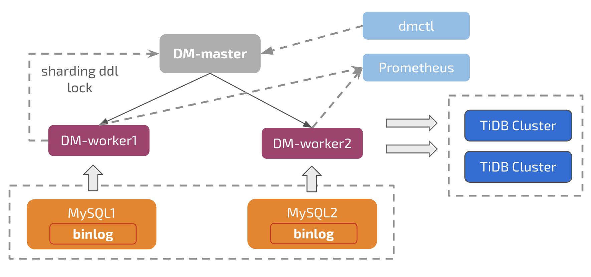

# Data Migration Overview

Data Migration (DM) is an integrated scheduling and management tool based on mydumper, Loader, and Syncer. You can use DM to synchronize the full data or the incremental data from MySQL to TiDB.

## Architecture

The Data Migration tool consists of three components: dm-master, dm-worker, and dmctl. The features of each component are as follows:

+ dm-master:

    - Storing the topology information of the DM cluster
    - Monitoring the running state of dm-worker processes
    - Monitoring the running state of data synchronization tasks
    - Providing a unified portal for the management of data synchronization tasks
    - Coordinating the DDL synchronization of sharded tables in each instance under the sharding scenario

+ dm-worker:

    - Persisting the binlog data to the local storage
    - Storing the configuration information of the data synchronization subtasks
    - Orchestrating the operation of the data synchronization subtasks
    - Monitoring the running state of the data synchronization subtasks

+ dmctl:

    - Creating/Updating/Dropping data synchronization tasks
    - Checking the state of data synchronization tasks
    - Handling the errors during data synchronization tasks
    - Verifying the configuration correctness of data synchronization tasks
