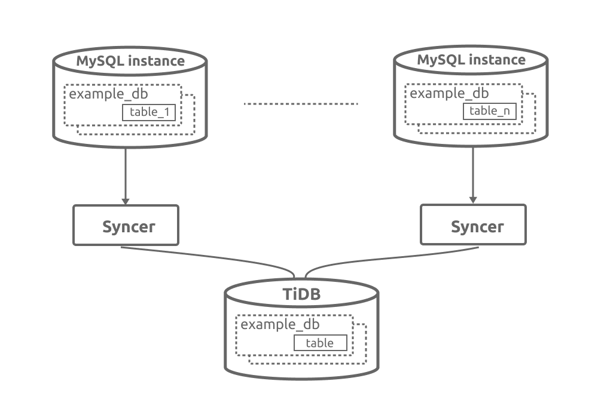

# Syncer User Guide

## Syncer Architecture


## Downloading the TiDB Toolset (Linux)

```bash
# Download the tool package.
wget http://download.pingcap.org/tidb-enterprise-tools-latest-linux-amd64.tar.gz
wget http://download.pingcap.org/tidb-enterprise-tools-latest-linux-amd64.sha256

# Check the file integrity. If the result is OK, the file is correct.
sha256sum -c tidb-enterprise-tools-latest-linux-amd64.sha256

# Extract the package. 
tar -xzf tidb-enterprise-tools-latest-linux-amd64.tar.gz
cd tidb-enterprise-tools-latest-linux-amd64
```
## Where to deploy Syncer
Syncer can be deployed to any of the machines that can connect to MySQL or TiDB cluster. But it is recommended to be deployed to the TiDB cluster.
## Enabling binary logging (binlog) in MySQL

Before using the `syncer` tool, make sure:
+ Binlog is enabled in MySQL. See [Setting the Replication Master Configuration](http://dev.mysql.com/doc/refman/5.7/en/replication-howto-masterbaseconfig.html).

+ Binlog must use the `row` format which is the recommended binlog format in MySQL 5.7. It can be configured using the following statement:

    ```bash
    SET GLOBAL binlog_format = ROW;
    ``` 
## Using the `syncer` tool to import data incrementally

### 1. Obtaining the position to synchronise

Set the meta file for `syncer`. Assuming the meta file is `syncer.meta` file:

```bash
# cat syncer.meta
binlog-name = "mysql-bin.000003"
binlog-pos = 930143241
binlog-gtid = "2bfabd22-fff7-11e6-97f7-f02fa73bcb01:1-23,61ccbb5d-c82d-11e6-ac2e-487b6bd31bf7:1-4"
```
**Note:** 
+ The `syncer.meta` file only needs to be configured once when it is first used. The position will be automatically updated when binlog is synchronised. 
+ If you use the binlog position to synchronise, you only need to configure `binlog-name` and `binlog-pos`; if you use `binlog-gtid` to synchronise, you only need to configure `binlog-gtid`.

### 2. Start `syncer`

The `config.toml` file for `syncer`:

```toml
log-level = "info"

server-id = 101

# The file path for meta:
meta = "./syncer.meta"
worker-count = 16
batch = 10

# The testing address for pprof. It can also be used by Prometheus to pull the syncer metrics.
status-addr = ":10081"

skip-sqls = ["ALTER USER", "CREATE USER"]

# Support whitelist filter. You can specify the database and table to be synchronised. For example:
# Synchronise all the tables of db1 and db2:
replicate-do-db = ["db1","db2"]

# Synchronise db1.table1.
[[replicate-do-table]]
db-name ="db1"
tbl-name = "table1"

# Synchronise db3.table2.
[[replicate-do-table]]
db-name ="db3"
tbl-name = "table2"

# Support regular expressions. Start with '~'  to use regular expressions.
# To synchronise all the databases that start with `test`:
replicate-do-db = ["~^test.*"]

# The sharding synchronising rules support wildcharacter.
# 1. The asterisk character (*, also called "star") matches zero or more characters,
#    for example, "doc*" matches "doc" and "document" but not "dodo";
#    asterisk character must be in the end of the wildcard word,
#    and there is only one asterisk in one wildcard word.
# 2. The question mark '?' matches exactly one character.
#[[route-rules]]
#pattern-schema = "route_*"
#pattern-table = "abc_*"
#target-schema = "route"
#target-table = "abc"

#[[route-rules]]
#pattern-schema = "route_*"
#pattern-table = "xyz_*"
#target-schema = "route"
#target-table = "xyz"

[from]
host = "127.0.0.1"
user = "root"
password = ""
port = 3306

[to]
host = "127.0.0.1"
user = "root"
password = ""
port = 4000

```

Start `syncer`:

```bash
./bin/syncer -config config.toml
2016/10/27 15:22:01 binlogsyncer.go:226: [info] begin to sync binlog from position (mysql-bin.000003, 1280)
2016/10/27 15:22:01 binlogsyncer.go:130: [info] register slave for master server 127.0.0.1:3306
2016/10/27 15:22:01 binlogsyncer.go:552: [info] rotate to (mysql-bin.000003, 1280)
2016/10/27 15:22:01 syncer.go:549: [info] rotate binlog to (mysql-bin.000003, 1280)
```

### 3. Inserting data into MySQL

```bash
INSERT INTO t1 VALUES (4, 4), (5, 5);
```

### 4. Logging in TiDB and viewing the data:

```bash
mysql -h127.0.0.1 -P4000 -uroot -p
mysql> select * from t1;
+----+------+
| id | age  |
+----+------+
|  1 |    1 |
|  2 |    2 |
|  3 |    3 |
|  4 |    4 |
|  5 |    5 |
+----+------+
```

`syncer` outputs the current synchronised data statistics every 30 seconds:

```bash
2017/06/08 01:18:51 syncer.go:934: [info] [syncer]total events = 15, total tps = 130, recent tps = 4,
master-binlog = (ON.000001, 11992), master-binlog-gtid=53ea0ed1-9bf8-11e6-8bea-64006a897c73:1-74,
syncer-binlog = (ON.000001, 2504), syncer-binlog-gtid = 53ea0ed1-9bf8-11e6-8bea-64006a897c73:1-17
2017/06/08 01:19:21 syncer.go:934: [info] [syncer]total events = 15, total tps = 191, recent tps = 2,
master-binlog = (ON.000001, 11992), master-binlog-gtid=53ea0ed1-9bf8-11e6-8bea-64006a897c73:1-74,
syncer-binlog = (ON.000001, 2504), syncer-binlog-gtid = 53ea0ed1-9bf8-11e6-8bea-64006a897c73:1-35
```

You can see that by using `syncer`, the updates in MySQL are automatically synchronised in TiDB.

## Supporting synchronising data from sharded tables

`Syncer` supports importing data from sharded tables into one table within one database according to the `route-rules`. 

For example, 




You just need to start `syncer` in all the MySQL instances and set the following `route-rules`:

```
[[route-rules]]
pattern-schema = "example_db"
pattern-table = "table_*"
target-schema = "example_db"
target-table = "table"
```

**Note:** But before synchronising, you need to check:
+ If the sharding rules can be represented using the `route-rules` syntax;
+ If the sharded tables contain monotone increasing primary keys, or if there are conflicts in the unique indexes or the primary keys after the combination. 

## Monitoring

The `syncer` monitoring scheme contains the following components:
+ Prometheus, a time series database, to store the monitoring and performance metrics
+ Grafana, an open source project for analysing and visualising metrics, to display the performance metrics.
+ AlertManager, for the alerting mechanism

For more information, see the following diagram:


