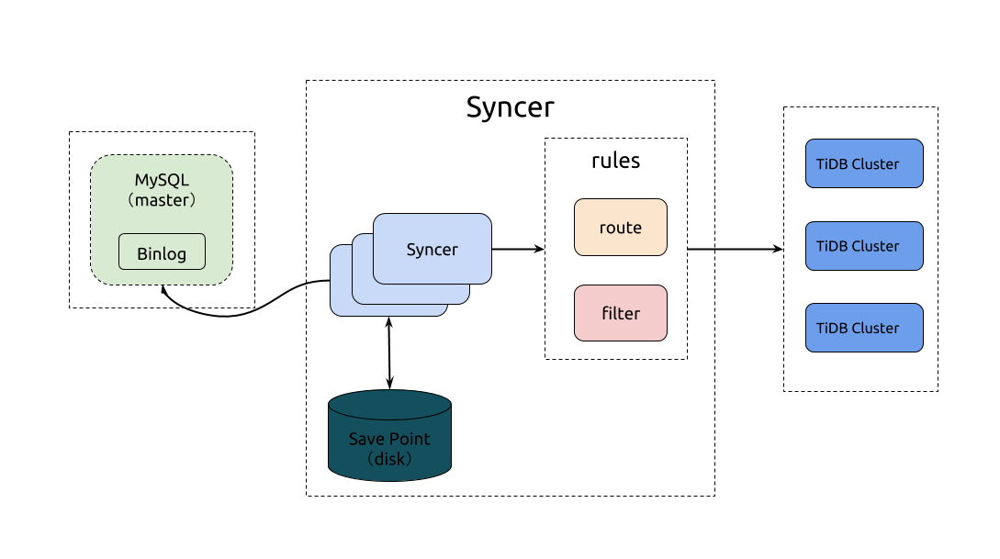

# Syncer 使用文档

## syncer 架构


## 下载 TiDB 工具集 (Linux)

```bash
# 下载 tool 压缩包
wget http://download.pingcap.org/tidb-enterprise-tools-latest-linux-amd64.tar.gz
wget http://download.pingcap.org/tidb-enterprise-tools-latest-linux-amd64.sha256

# 检查文件完整性，返回 ok 则正确
sha256sum -c tidb-enterprise-tools-latest-linux-amd64.sha256
# 解开压缩包
tar -xzf tidb-enterprise-tools-latest-linux-amd64.tar.gz
cd tidb-enterprise-tools-latest-linux-amd64
```

## Syncer 部署位置

Syncer 可以部署在任一台可以连通对应的 MySQL 和 TiDB 集群的机器上，推荐部署在 TiDB 集群。

## `syncer` 增量导入数据示例

使用前请详细阅读 [syncer 同步前预检查](#syncer-同步前检查)

### 设置同步开始的 position

设置 syncer 的 meta 文件，这里假设 meta 文件是 `syncer.meta`：

```bash
# cat syncer.meta
binlog-name = "mysql-bin.000003"
binlog-pos = 930143241
binlog-gtid = "2bfabd22-fff7-11e6-97f7-f02fa73bcb01:1-23,61ccbb5d-c82d-11e6-ac2e-487b6bd31bf7:1-4"
```

+ 注意： `syncer.meta` 只需要第一次使用的时候配置，后续 `syncer` 同步新的 binlog 之后会自动将其更新到最新的 position
+ 注意： 如果使用 binlog position 同步则只需要配置 binlog-name binlog-pos；使用 gtid 同步则需要设置 gtid，且启动 syncer 时带有 `--enable-gtid`

### 启动 `syncer`

`syncer` 的命令行参数说明：

```
Usage of syncer:
  -L string
      日志等级: debug, info, warn, error, fatal (默认为 "info")
  -V  
      输出 syncer 版本；默认 false
  -auto-fix-gtid
      当 mysql master/slave 切换时，自动修复 gtid 信息；默认 false
  -b int
      batch 事务大小 (默认 10)
  -c int
      syncer 处理 batch 线程数 (默认 16)
  -config string
      指定相应配置文件启动 sycner 服务；如 `--config config.toml` 
  -enable-gtid
      使用 gtid 模式启动 syncer；默认 false，开启前需要上游 MySQL 开启 GTID 功能
  -log-file string
      指定日志文件目录；如 `--log-file ./syncer.log`
  -log-rotate string
      指定日志切割周期, hour/day (默认 "day")
  -meta string
      指定 syncer 上游 meta 信息文件  (默认与配置文件相同目录下 "syncer.meta")
  -server-id int
     指定 MySQL slave sever-id (默认 101)
  -status-addr string
      指定 syncer metric 信息; 如 `--status-addr 127:0.0.1:10088`
```

`syncer` 的配置文件 `config.toml`：


```toml
log-level = "info"

server-id = 101

## meta 文件地址
meta = "./syncer.meta"

worker-count = 16
batch = 10

## pprof 调试地址, Prometheus 也可以通过该地址拉取 syncer metrics
## 将 127.0.0.1 修改为相应主机 IP 地址
status-addr = "127.0.0.1:10086"

## 跳过 DDL 或者其他语句，格式为 **前缀完全匹配**
# skip-sqls = ["ALTER USER", "CREATE USER"]
## 支持 "DELETE","INSERT","UPDATE" 三种语句
# skip-events = ["DELETE","INSERT","UPDATE"]

## 指定要同步数据库名；支持正则匹配，表达式语句必须以 `~` 开始
#replicate-do-db = ["~^b.*","s1"]

## 指定要同步的 db.table 表
## db-name 与 tbl-name 不支持 `db-name ="dbname，dbname2"` 格式
#[[replicate-do-table]]
#db-name ="dbname"
#tbl-name = "table-name"
 
#[[replicate-do-table]]
#db-name ="dbname1"
#tbl-name = "table-name1"

## 指定要同步的 db.table 表；支持正则匹配，表达式语句必须以 `~` 开始
#[[replicate-do-table]]
#db-name ="test"
#tbl-name = "~^a.*"

## 指定**忽略**同步数据库；支持正则匹配，表达式语句必须以 `~` 开始
#replicate-ignore-db = ["~^b.*","s1"]

## 指定**忽略**同步数据库
## db-name & tbl-name 不支持 `db-name ="dbname，dbname2"` 语句格式
#[[replicate-ignore-table]]
#db-name = "your_db"
#tbl-name = "your_table"

## 指定要**忽略**同步数据库名；支持正则匹配，表达式语句必须以 `~` 开始
#[[replicate-ignore-table]]
#db-name ="test"
#tbl-name = "~^a.*"


# sharding 同步规则，采用 wildcharacter
# 1. 星号字符 (*) 可以匹配零个或者多个字符，
#    例子，doc* 匹配 doc 和 document，但是和 dodo 不匹配；
#    星号只能放在 pattern 结尾，并且一个 pattern 中只能有一个
# 2. 问号字符 (?) 匹配任一一个字符

#[[route-rules]]
#pattern-schema = "route_*"
#pattern-table = "abc_*"
#target-schema = "route"
#target-table = "abc"

#[[route-rules]]
#pattern-schema = "route_*"
#pattern-table = "xyz_*"
#target-schema = "route"
#target-table = "xyz"

[from]
host = "127.0.0.1"
user = "root"
password = ""
port = 3306

[to]
host = "127.0.0.1"
user = "root"
password = ""
port = 4000

```


启动 `syncer`：

```bash
./bin/syncer -config config.toml

2016/10/27 15:22:01 binlogsyncer.go:226: [info] begin to sync binlog from position (mysql-bin.000003, 1280)
2016/10/27 15:22:01 binlogsyncer.go:130: [info] register slave for master server 127.0.0.1:3306
2016/10/27 15:22:01 binlogsyncer.go:552: [info] rotate to (mysql-bin.000003, 1280)
2016/10/27 15:22:01 syncer.go:549: [info] rotate binlog to (mysql-bin.000003, 1280)
```

### 在 MySQL 插入新的数据

```sql
INSERT INTO t1 VALUES (4, 4), (5, 5);
```
登录到 TiDB 查看：

```sql
mysql -h127.0.0.1 -P4000 -uroot -p
mysql> select * from t1;
+----+------+
| id | age  |
+----+------+
|  1 |    1 |
|  2 |    2 |
|  3 |    3 |
|  4 |    4 |
|  5 |    5 |
+----+------+
```

`syncer` 每隔 30s 会输出当前的同步统计，如下


```bash
2017/06/08 01:18:51 syncer.go:934: [info] [syncer]total events = 15, total tps = 130, recent tps = 4,
master-binlog = (ON.000001, 11992), master-binlog-gtid=53ea0ed1-9bf8-11e6-8bea-64006a897c73:1-74,
syncer-binlog = (ON.000001, 2504), syncer-binlog-gtid = 53ea0ed1-9bf8-11e6-8bea-64006a897c73:1-17
2017/06/08 01:19:21 syncer.go:934: [info] [syncer]total events = 15, total tps = 191, recent tps = 2,
master-binlog = (ON.000001, 11992), master-binlog-gtid=53ea0ed1-9bf8-11e6-8bea-64006a897c73:1-74,
syncer-binlog = (ON.000001, 2504), syncer-binlog-gtid = 53ea0ed1-9bf8-11e6-8bea-64006a897c73:1-35
```

可以看到，使用 `syncer`，我们就能自动的将 MySQL 的更新同步到 TiDB。

-----

## FAQ 

### 指定数据库同步

1. 通过实际案例描述 syncer 同步数据库参数优先级关系。
2. 如果使用 route-rules 规则，请移步 [sharding 同步支持](#sharding-同步支持) 
3. 优先级：replicate-do-db --> replicate-do-table --> replicate-ignore-db --> replicate-ignore-table

```toml
# 指定同步 ops 数据库
# 指定同步以 ti 开头的数据库
replicate-do-db = ["ops","~^ti.*"]

# china 数据库下有 guangzhou / shanghai / beijing 等多张表，只同步 shanghai 与 beijing 表。
# 指定同步 china 数据库下 shanghai 表
[[replicate-do-table]]
db-name ="china"
tbl-name = "shanghai"

# 指定同步 china 数据库下 beijing 表
[[replicate-do-table]]
db-name ="china"
tbl-name = "beijing"

# ops 数据库下有 ops_user / ops_admin / weekly 等数据表，只需要同步 ops_user 表。
# 因 replicate-do-db 优先级比 replicate-do-table 高，所以此处设置只同步 ops_user 表无效，实际工作会同步 ops 整个数据库
[[replicate-do-table]]
db-name ="ops"
tbl-name = "ops_user"

# history 数据下有 2017_01 2017_02 ... 2017_12 / 2016_01  2016_02 ... 2016_12  等多张表,只需要同步 2017 年的数据表
[[replicate-do-table]]
db-name ="history"
tbl-name = "~^2017_.*"

# 忽略同步 ops 与 fault 数据库
# 忽略同步以 www 开头的数据库
## 因 replicate-do-db 优先级比 replicate-ignore-db 高，所以此处忽略同步 ops 不生效。
replicate-ignore-db = ["ops","fault","~^www"]

# fault 数据库下有 faults / user_feedback / ticket 等数据表
# 忽略同步 user_feedback 数据表
# 因 replicate-ignore-db 优先级比 replicate-ignore-table 高，所以此处设置只同步 user_feedback 表无效，实际工作会同步 fault 整个数据库
[[replicate-ignore-table]]
db-name = "fault"
tbl-name = "user_feedback"

# order 数据下有 2017_01 2017_02 ... 2017_12 / 2016_01  2016_02 ... 2016_12  等多张表,忽略 2016 年的数据表
[[replicate-ignore-table]]
db-name ="order"
tbl-name = "~^2016_.*"
```


### sharding 同步支持

根据配置文件的 route-rules 可以支持将分库分表的数据导入到同一个库同一个表中，但是在开始前需要检查分库分表规则
+   是否可以利用 route-rule 的语义规则表示
+   分表中是否包含唯一递增主键，或者合并后数据上有冲突的唯一索引或者主键
+   暂时对 ddl 支持不完善


#### 分库分表同步示例

1. 需要在所有 mysql 实例下面，启动 syncer，并且设置以下 route-rules
2. replicate-do-db & replicate-ignore-db 与 route-rules 同时使用场景下，replicate-do-db & replicate-ignore-db 需要指定 route-rules 中 target-schema & target-table 内容


```toml
# 场景如下:
# 数据库A 下有 order_2016 / history_2016 等多个数据库
# 数据库B 下有 order_2017 / history_2017 等多个数据库
# 指定同步数据库A  order_2016 数据库，数据表如下 2016_01 2016_02 ... 2016_12 
# 指定同步数据表B  order_2017 数据库，数据表如下 2017_01 2017_02 ... 2017_12
# 表内使用 order_id 作为主键，数据之间主键不冲突
# 忽略同步 history_2016 与 history_2017 数据库
# 目标库需要为 order ，目标数据表为 order_2017 / order_2016

# syncer 获取到上游数据后，发现 route-rules 规则启用，先做合库合表操作，再进行 do-db & do-table 判定
## 此处需要设置 target-schema & target-table 判定需要同步的数据库
[[replicate-do-table]]
db-name ="order"
tbl-name = "order_2016"

[[replicate-do-table]]
db-name ="order"
tbl-name = "order_2017"

[[route-rules]]
pattern-schema = "order_2016"
pattern-table = "2016_??"
target-schema = "order"
target-table = "order_2016"

[[route-rules]]
pattern-schema = "order_2017"
pattern-table = "2017_??"
target-schema = "order"
target-table = "order_2017"

```

### syncer 同步前检查

1.  源库 server-id 检查

    - 可通过以下命令查看 server-id

    ```
    mysql> show global variables like 'server_id';
    +---------------+-------  
    | Variable_name | Value |
    +---------------+-------+
    | server_id     | 1     |
    +---------------+-------+
    1 row in set (0.01 sec)
    ```

1.  检查 Binlog 相关参数

    - 可以用如下命令确认是否开启了 binlog：

    ```
    mysql> show global variables like 'log_bin';
    +--------------------+---------+
    | Variable_name      | Value   |
    +--------------------+---------+
    | log_bin            | ON      |
    +--------------------+---------+
    1 row in set (0.00 sec)
    ```

1.  检查 MySQL binlog 格式是否为 ROW

    - 可以用如下命令检查 binlog 格式：

    ```
    mysql> show global variables like 'binlog_format';
    +--------------------+----------+
    | Variable_name      | Value    |
    +--------------------+----------+
    | binlog_format      | ROW      |
    +--------------------+----------+
    1 row in set (0.00 sec)
    ```

1.  检查 MySQL binlog_row_image  是否为 FULL

    - 可以用如下命令检查 binlog_row_image：

    ```
    mysql> show global variables like 'binlog_row_image';
    +--------------------------+---------+
    | Variable_name            | Value   |
    +--------------------------+---------+
    | binlog_row_image         | FULL    |
    +--------------------------+---------+
    1 row in set (0.01 sec)
    ```


1.  检查 mydumper 用户权限

    - mydumper user 至少拥有以下操作权限： `select , reload`
    - mydumper 目标数据库为 RDS 时，可以添加 --no-locks 参数，避免申请 reload 权限
      

1.  检查上下游同步用户权限

    - 需要上游 MySQL 同步账号至少赋予以下权限：` select , replication slave , replication client`
    
    - 下游 TiDB 采用 root 同权限账号

1.  检查 GTID 与 POS 相关信息

    - 使用以下语句查看当前 binlog 与 POS 信息：`show master status;`
    - 使用以下语句查看 binlog 内容：`show binlog events in 'mysql-bin.000023' from 136676560 limit 10;`


### 安全启动 syncer 服务

推荐使用 [supervise](https://cr.yp.to/daemontools/supervise.html) 类似服务守护 syncer 进程启动  

1. 使用 screen 服务启动；以下实例需要事先安装 screen 与 sendmail 相关软件，且配置 smtp 相关信息
    - `screen -S syncer-ops`；创建一个会话窗口

    `./syncer --config ops.toml --enable-gtid  --auto-fix-gtid;echo "syncer is down"|mail -s "syncer status" `

    - screen 使用 `CTRL + A & D` 联合键退出；使用 `screen -ls` 查看已创建会话，使用 `screen -r ID` 恢复会话
2. 使用 `nohup &` 方式启动 syncer 服务
    - 创建 `syncer.sh`，输入以下内容  

    `./syncer --config ops.toml --enable-gtid  --auto-fix-gtid -log-file ./${1}.log --status-addr 127.0.0.1:${2};echo "syncer is down"|mail -s "syncer status" `

    - 创建 start_ops.sh，内容如下

    `nohup ./syncer.sh ops 10088 &>./nohup.out &`

    - 使用 `sh start_ops.sh` 方式启动 syncer 服务


### 运维常见问题

1. syncer 日志滚动刷新,数据不同步

   - 查看上游数据库 server-id，如果为空或者为 0，syncer 无法正常同步数据，同时 server-id 在 MySQL cluster 中应该唯一 

1. DDL 与 DML 同步机制

    - 当 binlog 内有 DDL 的时候，如果 DDL 前面有 DML，syncer 优先同步 DDL 前所有 DML 语句，再执行相应 DDL 

2. syncer 启动时没有填写 meta 文件信息，应该怎么办

    - syncer 启动时未读取到 meta 指定 binlog 位置，syncer 会自动获取上游数据库存在的第一个 binlog 的第一个位置开始同步

3. syncer 如何手动跳过指定语句

    - syncer 遇到无法执行的 SQL 会自动退出
    - 查看 syncer.meta 文件内 binlog-name 与 binlog-pos 信息
    - 登陆上游数据，通过类似语句查看 `show binlog events in 'mysql-bin.000023' from 136676560 limit 10;`
        - TiDB 数据库 `alter add column` 目前不支持同时添加多列，新版本 syncer 会对类似 SQL 切割，如果还未跳过可以联系 TiDB 技术支持
    - 获取到 SQL 后在 TiDB 执行该语句
        - 如果使用 POS 点位置启动，修改 meta 文件内 binlog-pos 到相应语句的 END POS 信息，再次启动服务
        - 如果使用 GTID 启动，需要修改 GTID 位置到相应语句之后第一个 GTID，再次启动服务

4. MySQL to MySQL 场景是否可以用 syncer 


    - 不推荐使用 syncer，syncer 对下游 TiDB 有定向开发；下游是 MySQL 时，会有部分语句不支持，同时对 MySQL to MySQL 的 DDL 支持效果不佳

5. syncer 日志错误解释

    - `no db error` 检查下游是否存在需要同步的 database 信息
    - `driver: bad connection` 网络连接闪断，具体可以通过 tcpdump 抓包获取时谁先发起断开连接请求。另外推荐使用 supervise 守护 syncer 进程，当 syncer 进程挂掉的时候，supervise 会自动拉起 syncer 进程
    - 其他 error 信息由 TiDB 服务返回，可以登陆 TiDB 服务查看日志详细内容. 
        - `Error 9002: TiKV server timeout[try again later]` TiClient error，检查 TiKV 服务状态以及 TiKV 的[主机配置](https://github.com/pingcap/docs-cn/blob/master/op-guide/recommendation.md)是否满足要求


-----

## 监控方案

Syncer 使用开源时序数据库 Prometheus 作为监控和性能指标信息存储方案，使用 Grafana 作为可视化组件进行展示，配合 AlertManager 来实现报警。其方案如下图


### 配置 Syncer 监控与告警

- syncer 对外提供 metric 接口，需要 Prometheus 主动获取数据。以下将分别配置 syncer 监控与告警，期间需要重启 Prometheus。
    - Prometheus 添加 syncer job 信息，
    - 将以下内容刷新到 prometheus 配置文件，重启 prometheus

    ```
      - job_name: 'syncer_ops' // 任务名字，区分数据上报
        static_configs:
          - targets: ['10.1.1.4:10086'] // syncer 监听地址与端口，通知 prometheus 获取 syncer 的监控数据。
    ```

    - 配置 Prometheus --> alertmanager 告警
    - 将以下内容刷新到 alert.rule 配置文件，且 Prometheus 指定 --alertmanager.url 参数启动。

    ```
    # syncer
    ALERT syncer_status
      IF  syncer_binlog_file{node='master'} - ON(instance, job) syncer_binlog_file{node='syncer'} > 1
      FOR 1m
      LABELS {channels="alerts", env="test-cluster"}
      ANNOTATIONS {
      summary = "syncer status error",
      description="alert: syncer_binlog_file{node='master'} - ON(instance, job) syncer_binlog_file{node='syncer'} > 1 instance: {{     $labels.instance }} values: {{ $value }}",
      }
    ```

#### Grafana 配置

+   进入 Grafana Web 界面（默认地址：http://localhost:3000， 默认账号：admin 密码： admin）

+      导入 dashboard 配置文件

    点击 Grafana Logo -> 点击 Dashboards -> 点击 Import -> 选择需要的 Dashboard [配置文件](https://github.com/pingcap/docs/tree/master/etc)上传 -> 选择对应的 data source
### Grafana Syncer metrics 说明 

#### title: binlog events
- metrics：`irate(syncer_binlog_events_total[1m])`
- info：syncer已经同步到的master biglog相关信息统计，主要有 `query` `rotate` `update_rows` `write_rows` `delete_rows` 五种类型。

#### title：syncer_binlog_file
- metrics：`syncer_binlog_file`
- info：syncer同步 master binlog 文件数量。

#### title：binlog pos
- metrics：`syncer_binlog_pos`
- info：syncer同步当前 master binlog 的 binlog-pos 信息

#### title：syncer_gtid
- metrics：`syncer_gtid`
- info：syncer同步当前 master binlog 的 binlog-gtid 信息

#### title：syncer_binlog_file
- metrics：`syncer_binlog_file{node="master"} - ON(instance, job) syncer_binlog_file{node="syncer"}`
- info：syncer与 master 同步时，相差的 binlog 文件数量，正常状态为 0，表示数据正在实时同步。数值越大，相差 binlog 文件数越多。

#### title：binlog skipped events
- metrics：`irate(syncer_binlog_skipped_events_total[1m])`
- info：syncer同步master biglog文件时跳过执行sql数量统计。跳过sql语句格式由 `syncer.toml` 文件中 `skip-sqls` 参数控制。具体设置查看[官方文档](https://pingcap.com/doc-syncer-zh)

#### title：syncer_txn_costs_gauge_in_second
- metrics：`syncer_txn_costs_gauge_in_second`
- info：syncer 处理一个 batch 的时间，单位为秒
