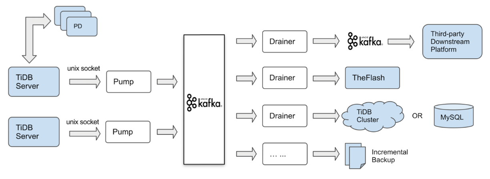

# TiDB-Binlog 部署方案

## TiDB-Binlog 简介

TiDB-Binlog 用于收集 TiDB 的 Binlog，并提供实时备份和同步功能的商业工具。

TiDB-Binlog 支持以下功能场景:

* *数据同步*:       同步 TiDB 集群数据到其他数据库
* *实时备份和恢复*:  备份 TiDB 集群数据，同时可以用于 TiDB 集群故障时恢复

## TiDB-Binlog 架构

首先介绍 TiDB-Binlog 的整体架构。



TiDB-Binlog 集群主要分为三个组件：

#### Pump

Pump 是一个守护进程，在每个 TiDB 的主机上后台运行。他的主要功能是实时记录 TiDB 产生的 Binlog 并顺序写入kafka中

#### Drainer

Drainer 从 kafka 中收集 Binlog，并按照在 TiDB 中事务的提交顺序转化为指定数据库兼容的 SQL 语句，最后同步到目的数据库或者写到顺序文件

#### Kafka & Zookeeper

Kafka 集群用来存储由 Pump 写入的 binlog 数据，并提供给 Drainer 进行读取。（local版本将 binlog 存储在文件中，最新版本都使用 Kafka 存储）

## TiDB-Binlog 安装

### 下载官方 Binary

-   CentOS 7+

    ```bash
    # 下载压缩包
    wget http://download.pingcap.org/tidb-binlog-latest-linux-amd64.tar.gz
    wget http://download.pingcap.org/tidb-binlog-latest-linux-amd64.sha256

    # 检查文件完整性，返回 ok 则正确
    sha256sum -c tidb-binlog-latest-linux-amd64.sha256

    # 解开压缩包
    tar -xzf tidb-binlog-latest-linux-amd64.tar.gz
    cd tidb-binlog-latest-linux-amd64
    ```

### TiDB-Binlog 部署

#### 注意

*   需要为一个 TiDB 集群中的每台 TiDB server 部署一个 pump，目前 TiDB server 只支持以 unix socket 方式的输出 binlog。
*   手动部署时， 启动优先级为： PUMP > TiDB ； 停止优先级为 TiDB > PUMP


    我们设置 TiDB 启动参数 binlog-socket 为对应的 pump 的参数 socket 所指定的 unix socket 文件路径，最终部署结构如下图所示：

    

*   drainer 不支持对 ignore schemas（在过滤列表中的 schemas） 的 table 进行 rename DDL 操作

*   在已有的 TiDB 集群中启动 drainer，一般需要全量备份 并且获取 savepoint，然后导入全量备份，最后启动 drainer 从 savepoint 开始同步；

    为了保证数据的完整性，在 pump 运行 10 分钟左右后按顺序进行下面的操作

    *  使用 generate_binlog_position 工具生成 drainer 启动需要的 savepint 文件，工具在项目 [tidb-tools](https://github.com/pingcap/tidb-tools) 中，make generate_binlog_position 编译该工具，具体的使用参考工具的 README 说明。
    *  全量备份，例如 mydumper 备份 tidb
    *  全量导入备份到目标系统
    *  设置 savepoint 文件路径，然后启动 drainer， `bin/drainer --config=conf/drainer.toml --data-dir=${drainer_savepoint_dir}`

*   drainer 输出的 pb, 需要在配置文件设置下面的参数

    ```toml
    [syncer]
    db-type = "pb"
    disable-dispatch = true

    [syncer.to]
    dir = "/path/pb-dir"
    ```
   
*   Kafka 和 Zookeeper 集群的安装和配置不在本文赘述，需要在部署 TiDB-Binlog 之前部署好。Kafka 需要0.9及以上版本，且保证设置参数auto.create.topics.enable=true, 推荐部署在3～5台服务器上，机器的磁盘空间和具体的业务数据量相关。


#### 使用 tidb-ansible 部署 PUMP

- 如无 Kafka 集群，可使用 [kafka-ansible](https://github.com/pingcap/thirdparty-ops/tree/master/kafka-ansible) 部署 Kafka 集群。
- 使用 [TiDB-Ansible](https://github.com/pingcap/tidb-ansible) 部署 TiDB 集群时，修改 `tidb-ansible/inventory.ini` 文件，设置 `enable_binlog = True`， 并配置 `zookeeper_addrs` 变量为 Kafka 集群的 zookeeper 地址，这样部署 TiDB 集群时会部署 PUMP。

  配置样例:
  ```
  # binlog trigger
  enable_binlog = True
  # zookeeper address of kafka cluster, example:
  # zookeeper_addrs = "192.168.0.11:2181,192.168.0.12:2181,192.168.0.13:2181"
  zookeeper_addrs = "192.168.0.11:2181,192.168.0.12:2181,192.168.0.13:2181"
  ``` 

#### 使用 Binary 部署 PUMP

1. PUMP 命令行参数说明

    ```
    Usage of pump:
    -L string
        日志输出信息等级设置: debug, info, warn, error, fatal (默认 "info")
    -V
        打印版本信息
    -addr string
        pump 提供服务的 rpc 地址(默认 "127.0.0.1:8250")
    -advertise-addr string
        pump 对外提供服务的 rpc 地址(默认 "127.0.0.1:8250")
    -config string
        配置文件路径,如果你指定了配置文件，pump 会首先读取配置文件的配置
        如果对应的配置在命令行参数里面也存在，pump 就会使用命令行参数的配置来覆盖配置文件里面的
    -data-dir string
        pump 数据存储位置路径
    -kafka-addrs string
        连接的 kafka 的地址 (默认 "127.0.0.1:9092")
    -zookeeper-addrs string
        zookeeper 地址，如果设置了该选项则从 zookeeper 中获取 kafka 地址，如果不设置则使用 kafka-addrs 的值
    -gc int
        日志最大保留天数 (默认 7)， 设置为 0 可永久保存
    -heartbeat-interval uint
        pump 向 pd 发送心跳间隔 (单位 秒)
    -log-file string
        log 文件路径
    -log-rotate string
        log 文件切换频率, hour/day
    -metrics-addr string
       prometheus pushgataway 地址，不设置则禁止上报监控信息
    -metrics-interval int
       监控信息上报频率 (默认 15，单位 秒)
    -pd-urls string
        pd 集群节点的地址 (默认 "http://127.0.0.1:2379")
    -socket string
        unix socket 模式服务监听地址 (默认 unix:///tmp/pump.sock)
    ```


 2. PUMP 配置文件

    ```toml
    # pump Configuration.
    # pump 提供服务的 rpc 地址(默认 "127.0.0.1:8250")
    addr = "127.0.0.1:8250"
    # pump 对外提供服务的 rpc 地址(默认 "127.0.0.1:8250")
    advertise-addr = ""
    # binlog 最大保留天数 (默认 7)， 设置为 0 可永久保存
    gc = 7
    #  pump 数据存储位置路径
    data-dir = "data.pump"
    # 连接的 kafka 的地址(默认 "127.0.0.1:9092")
    kafka-addrs = "127.0.0.1:9092"
    # zookeeper 地址，如果设置了该选项则从 zookeeper 中获取 kafka 地址，如果不设置则使用 kafka-addrs 的值
    # zookeeper-addrs = "127.0.0.1:2181"
    # pump 向 pd 发送心跳间隔 (单位 秒)    
    heartbeat-interval = 3
    # pd 集群节点的地址 (默认 "http://127.0.0.1:2379")
    pd-urls = "http://127.0.0.1:2379"
    # unix socket 模式服务监听地址 (默认 unix:///tmp/pump.sock)
    socket = "unix:///tmp/pump.sock"
    ```

3. 启动示例

    ```bash
    ./bin/pump -config pump.toml
    ```

#### 使用 Binary 部署 Drainer

1.  Drainer 命令行参数说明

    ```
    Usage of drainer:
    -L string
        日志输出信息等级设置: debug, info, warn, error, fatal (默认 "info")
    -V
        打印版本信息
    -addr string
        drainer 提供服务的地址(默认 "127.0.0.1:8249")
    -c int
        同步下游的并发数，该值设置越高同步的吞吐性能越好 (default 1)
    -config string
       配置文件路径, drainer 会首先读取配置文件的配置
       如果对应的配置在命令行参数里面也存在，drainer 就会使用命令行参数的配置来覆盖配置文件里面的
    -data-dir string
        drainer 数据存储位置路径 (默认 "data.drainer")
    -kafka-addrs string
        连接的 kafka 的地址 (默认 "127.0.0.1:9092")
    -zookeeper-addrs string
        zookeeper 地址，如果设置了该选项则从 zookeeper 中获取 kafka 地址，如果不设置则使用 kafka-addrs 的值  
    -dest-db-type string
        drainer 下游服务类型 (默认为 mysql)
    -detect-interval int
        向 pd 查询在线 pump 的时间间隔 (默认 10，单位 秒)
    -disable-dispatch
        是否禁用拆分单个 binlog 的 sqls 的功能，如果设置为 true，则按照每个 binlog
        顺序依次还原成单个事务进行同步( 下游服务类型为 mysql, 该项设置为 False )
    -gen-savepoint
        如果设置为 true, 则只生成 drainer 的 savepoint meta 文件, 可以配合 mydumper 使用
    -ignore-schemas string
        db 过滤列表 (默认 "INFORMATION_SCHEMA,PERFORMANCE_SCHEMA,mysql,test"),
        不支持对 ignore schemas 的 table 进行 rename DDL 操作
    -log-file string
        log 文件路径
    -log-rotate string
        log 文件切换频率, hour/day
    -metrics-addr string
       prometheus pushgataway 地址，不设置则禁止上报监控信息
    -metrics-interval int
       监控信息上报频率 (默认 15，单位 秒)
    -pd-urls string
       pd 集群节点的地址 (默认 "http://127.0.0.1:2379")
    -txn-batch int
       输出到下游数据库一个事务的 sql 数量 (default 1)
    ```


2. Drainer 配置文件

    ```toml
    # drainer Configuration.

    # drainer 提供服务的地址(默认 "127.0.0.1:8249")
    addr = "127.0.0.1:8249"

    # 向 pd 查询在线 pump 的时间间隔 (默认 10，单位 秒)
    detect-interval = 10

    # drainer 数据存储位置路径 (默认 "data.drainer")
    data-dir = "data.drainer"
    
    # 连接的 kafka 的地址 (默认 "127.0.0.1:9092")
    kafka-addrs = "127.0.0.1:9092"
    
    # zookeeper 地址，如果设置了该选项则从 zookeeper 中获取 kafka 地址，如果不设置则使用 kafka-addrs 的值
    # zookeeper-addrs = "127.0.0.1:2181"
    
    # pd 集群节点的地址 (默认 "http://127.0.0.1:2379")
    pd-urls = "http://127.0.0.1:2379"

    # log 文件路径
    log-file = "drainer.log"

    # syncer Configuration.
    [syncer]

    ## db 过滤列表 (默认 "INFORMATION_SCHEMA,PERFORMANCE_SCHEMA,mysql,test"),
    ## 不支持对 ignore schemas 的 table 进行 rename DDL 操作
    ignore-schemas = "INFORMATION_SCHEMA,PERFORMANCE_SCHEMA,mysql"

    # 输出到下游数据库一个事务的 sql 数量 (default 1)
    txn-batch = 1

    # 同步下游的并发数，该值设置越高同步的吞吐性能越好 (default 1)
    worker-count = 1

    # 是否禁用拆分单个 binlog 的 sqls 的功能，如果设置为 true，则按照每个 binlog
    # 顺序依次还原成单个事务进行同步( 下游服务类型为 mysql, 该项设置为 False )
    disable-dispatch = false

    # drainer 下游服务类型 (默认为 mysql)
    # 参数有效值为 "mysql", "pb"
    db-type = "mysql"

    # replicate-do-db priority over replicate-do-table if have same db name
    # and we support regex expression ,
    # 以 '~' 开始声明使用正则表达式

    #replicate-do-db = ["~^b.*","s1"]

    #[[syncer.replicate-do-table]]
    #db-name ="test"
    #tbl-name = "log"

    #[[syncer.replicate-do-table]]
    #db-name ="test"
    #tbl-name = "~^a.*"

    # db-type 设置为 mysql 时，下游数据库服务器参数
    [syncer.to]
    host = "127.0.0.1"
    user = "root"
    password = ""
    port = 3306

    # db-type 设置为 pb 时,存放 binlog 文件的目录
    # [syncer.to]
    # dir = "data.drainer"
    ```


3. 启动示例

    ```bash
    ./bin/drainer -config drainer.toml
    ```

## TiDB-Binlog 监控

这部分主要对 TiDB-Binlog 的状态、性能做监控，通过 Prometheus + Grafana 展现 metrics 数据，

### pump/drainer 配置

使用 ansible 部署的 pump 服务，已经在启动参数设置 metrics 。

drainer 启动时可以设置 `--metrics-addr` 和 `--metrics-interval` 两个参数，其中 metrics-addr 设为 Push Gateway 的地址，metrics-interval 为 push 的频率，单位为秒，默认值为15

### Grafana 配置

+   进入 Grafana Web 界面（默认地址: `http://localhost:3000`，默认账号: admin 密码: admin）

    点击 Grafana Logo -> 点击 Data Sources -> 点击 Add data source -> 填写 data source 信息 ( 注: Type 选 Prometheus，Url 为 Prometheus 地址，根据实际情况 添加/填写 ）

+   导入 dashboard 配置文件

    点击 Grafana Logo -> 点击 Dashboards -> 点击 Import -> 选择需要的 [dashboard 配置文件](https://github.com/pingcap/docs/tree/master/etc)上传 -> 选择对应的 data source
