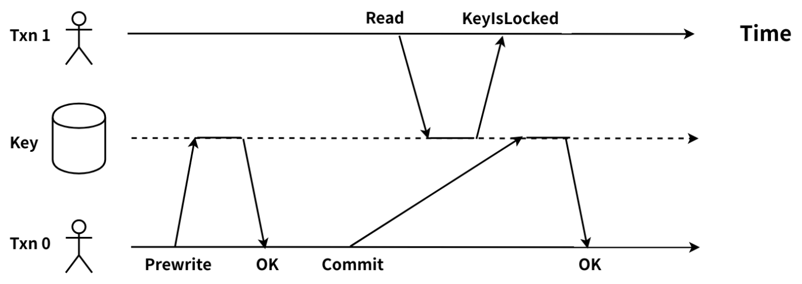

# 锁冲突 - 常见问题处理

TiDB 支持完整的分布式事务，提供乐观事务与悲观事务（TiDB 3.0 中引入）两种事务模型。本文重点描述在使用乐观事务或者悲观事务的过程中常见的报错以及解决思路。

## 乐观锁

TiDB 中事务使用两阶段提交，分为 Prewrite 和 Commit 两个阶段，示意图如下。本章节不再介绍相关细节，如果需要可以阅读 [Percolator 和 TiDB 事务算法](https://pingcap.com/blog-cn/percolator-and-txn/)，来了解更多内容。


### Prewrite 阶段

在两阶段提交的 Prewrite 阶段会对目标 key 分别上 primary lock 和 secondary lock。在冲突严重的场景中，会出写冲突 write-conflict ，keyislocked 等报错。我们一起看下这个阶段可能会遇到的 lock 相关具体的报错信息。

#### 读写冲突

为什么会出现读写冲突？

在 TiDB 中，事务要读到最新的 commit ts 小于事务 start ts 的数据。可能该 lock 所属事务已提交，且 commit ts 小于读事务的 start ts。在这个期间，有一个关键问题是，当读事务遇到 Percolator 的 lock 时，是无法知道这个事务是在 Commit 阶段还是 Prewrite 阶段。所以就会出现读写冲突的情况，如下图：



> Txn0 完成了 Prewrite ，在 Commit 的过程中 Txn1 对该 key 发起了读请求，Txn1 需要读取 start ts > commit ts 最近的 key 的版本。此时，Txn1 的 start ts > Txn0 的 lock ts ，需要读取的 key 上的锁信息仍未清理，故无法判断 Txn0 是否提交成功，Txn1 与 Txn0 出现了读写冲突。

我们可以通过下面两种途径来发现当前环境中是否存在读写冲突：

1. TiDB 监控及日志

* 监控
通过 TiDB Grafana 监控分析，监控项 KV Errors --> Lock Resolve OPS --> not_expired / resolve 以及监控项 KV Errors --> KV Backoff OPS --> txnLockFast ，如果有较为明显的上升趋势，那么可能是当前的环境中出现了大量的读写冲突问题。其中，not_expired 是指对应的锁还没有超时，resolve 是指尝试清锁的操作，txnLockFast 代表出现了读写冲突。


* 日志

在 TiDB 的日志中可以看到下述信息：

```log
[INFO] [coprocessor.go:743] ["[TIME_COP_PROCESS] resp_time:406.038899ms txnStartTS:416643508703592451 region_id:8297 store_addr:10.8.1.208:20160 backoff_ms:255 backoff_types:[txnLockFast,txnLockFast] kv_process_ms:333 scan_total_write:0 scan_processed_write:0 scan_total_data:0 scan_processed_data:0 scan_total_lock:0 scan_processed_lock:0"]
```

  * txnStartTS：发起读请求的事务的 start ts，如上面示例中的 416643508703592451
  * backoff_types：读写发生了冲突，并且读请求进行了 backoff 重试，重试的类型为 txnLockFast
  * backoff_ms：读请求 backoff 重试的耗时，单位为 ms ，如上面示例中的 255
  * region_id：读请求访问的目标 region 的 id

2. TiKV 日志

在 TiKV 的日志可以看到下面的信息：

```log
[ERROR] [endpoint.rs:454] [error-response] [err=""locked primary_lock:7480000000000004D35F6980000000000000010380000000004C788E0380000000004C0748 lock_version: 411402933858205712 key: 7480000000000004D35F7280000000004C0748 lock_ttl: 3008 txn_size: 1""]
```

* 日志解析
  这段报错报错信息表示出现了读写冲突，当读数据时发现 key 有锁阻碍读，这个锁包括未提交的乐观锁和未提交的 prewrite 后的悲观锁。

  * primary_lock：锁对应事务的 primary lock。
  * lock_version：锁对应事务的 start ts。
  * key：表示被锁的 key。
  * lock_ttl: 锁的 TTL。
  * txn_size：锁所在事务在其 region 的 key 数量，指导清锁方式。
  
3. 处理建议

* 在遇到读写冲突时会有 backoff 自动重试机制，如上述示例中 Txn1 会进行 backoff 重试，单次初始 100 ms，单次最大 3000 ms，总共最大 20000 ms
* 可以使用 [mok](https://github.com/disksing/mok) 来 key 查对应的行的 table id 以及 handle id，如下：

    ```sh
    $ mok 7480000000000004D35F7280000000004C0748
    "7480000000000004D35F7280000000004C0748"
    └─## decode hex key
    └─"t\200\000\000\000\000\000\004\323_r\200\000\000\000\000L\007H"
        └─## table row key
        ├─table: 1235
        └─row: 4982600
    ```

#### KeyIsLocked

事务在 Prewrite 阶段第一步会检查是否有写写冲突，第二步会检查目标 key 是否已经被另一个事务上锁。当检测到该 key 被 lock 后，会在 TiKV 端报出 KeyIsLocked 。目前该报错信息没有打印到 TiDB 以及 TiKV 的日志中。与读写冲突一样，在出现 KeyIsLocked 时，后台会自动进行 backoff 重试。

1. 监控信息
如果在 TiKV 端，Prewrite 阶段大量的出现 KeyIsLocked。那么在 TiDB 端的 Grafana 监控中可以看到监控项 KV Errors --> Lock Resolve OPS --> resolve 以及监控项 KV Errors --> KV Backoff OPS --> txnLock 会有比较明显的上升趋势，其中 reslove 是指尝试清锁的操作，txnLock 代表出现了写冲突。


2. 处理建议

* 监控中出现少量 txnLock ，无需过多关注。会在后台自动进行 backoff 重试，单次初始 200ms，单次最大 3000ms。
* 如果出现大量的 txnLock ，需要从业务的角度评估下冲突的原因。
* 使用悲观锁模式。

### Commit 阶段

当 Prewrite 全部完成时，client 便会取得 commit ts，然后继续两阶段提交的第二阶段。这里需要注意的是，由于 primary key 是否提交成功标志着整个事务是否提交成功，因而 client 需要在单独 commit rimary key 之后再继续 commit 其余的 key。

#### 锁被清除 LockNotFound

TxnLockNotFound 这个报错是指事务提交的慢了，超过了 TTL（默认为 3s ，且不可改，目前写死在代码中）。当要提交时，发现被其他事务给 Rollback 掉了。在开启 TiDB [自动重试事务](https://pingcap.com/docs-cn/stable/tidb-specific-system-variables/#tidb_retry_limit)的情况下，会自动在后台进行事务重试（注意显示和隐式事务的差别）。

1. TiDB 日志

如果出现了 TxnLockNotFound 的情况，会在 TiDB 的日志中看到下面的信息：

```log
[WARN] [session.go:446] ["commit failed"] [conn=149370] ["finished txn"="Txn{state=invalid}"] [error="[kv:6]Error: KV error safe to retry tikv restarts txn: Txn(Mvcc(TxnLockNotFound{ start_ts: 412720515987275779, commit_ts: 412720519984971777, key: [116, 128, 0, 0, 0, 0, 1, 111, 16, 95, 114, 128, 0, 0, 0, 0, 0, 0, 2] })) [try again later]"]
```

* 日志解析
  * start_ts：出现 TxnLockNotFound 报错的事务的 start_ts ，如上例中的 412720515987275779
  * commit_ts：出现 TxnLockNotFound 报错的事务的 commit_ts ，如上例中的 412720519984971777

2. TiKV 日志

同样，在出现 TxnLockNotFound 报错时，在 TiKV 的日志中同样可以看到相应的报错信息，如下：

```log
Error: KV error safe to retry restarts txn: Txn(Mvcc(TxnLockNotFound)) [ERROR [Kv.rs:708] ["KvService::batch_raft send response fail"] [err=RemoteStoped]
```

3. 处理建议

* 当事务提交的慢了，超过了 TTL 被其他事务给 Rollback 掉了。在遇到这个问题时，通过检查 start_ts 和 commit_ts 之间的提交间隔，可以确认是否超过了默认的 TTL 3s 的时间。

    查看提交间隔：

    ```shell
    ./pd-ctl tso [start_ts]
    ./pd-ctl tso [commit_ts]
    ```

* 遇到这个报错时，建议检查下是否是因为写入性能的缓慢导致事务提交的效率差，进而出现了 lock 被清除的现象。
  
* 在关闭 TiDB 事务重试的情况下，需要在应用端捕获异常，并进行重试。

## 悲观锁

在 v3.0.8 之前，TiDB 默认使用的乐观事务模式会导致事务提交时因为冲突而失败。为了保证事务的成功率，需要修改应用程序，加上重试的逻辑。悲观事务模式可以避免这个问题，应用程序无需添加重试逻辑，就可以正常执行。

TiDB 悲观锁复用了乐观锁的两阶段提交逻辑，重点在 DML 执行时做了改造。在两阶段提交之前增加了 Acquire Pessimistic Lock 阶段, 简要步骤如下。本章节不再介绍相关细节，如果需要可以阅读 [TiDB 悲观锁实现原理](https://asktug.com/t/topic/33550)，来了解更多内容：


> 1.【与乐观锁共用】TiDB 收到来自客户端的 begin 请求，获取当前版本号作为本事务的 StartTS
>
> 2. TiDB 收到来自客户端的更新数据的请求: TiDB 向 TiKV 发起加悲观锁请求，该锁持久化到 TiKV。
>
> 3.【与乐观锁共用】client 发起 commit ，TiDB 开始执行与乐观锁一样的两阶段提交。


### Prewrite 阶段

因为悲观锁模式下，在事务的提交阶段沿用的仍然是乐观锁模式，所以在 Prewrite 阶段乐观锁遇到的锁相关的一些报错，在悲观锁模式同样会遇到，如下：

#### 读写冲突

报错信息以及处理建议同乐观锁模式。

### Commit 阶段

在乐观模型下，会出现 TxnLockNotFound ，而在悲观锁模型下，不会出现这个问题。同样的，悲观锁也有一个 TTL 的时间，默认为 20s ，且不可调整，txn heartbeat 会自动的更新事务的 TTL ，以确保第二个事务不会将第一个事务的锁清掉。

### 其他

#### pessimistic lock retry limit reached

在冲突非常严重的场景下，当发生 write conflict 时，乐观事务会直接终止，而悲观事务会尝试用最新数据重试该语句直到没有 write conflict。因为 TiDB 的加锁操作是一个写入操作，且操作过程是先读后写，需要 2 次 RPC。如果在这中间发生了 write conflict ，那么会重试。每次重试都会打印 log，不用特别关注。重试次数由 [pessimistic-txn.max-retry-count](https://pingcap.com/docs-cn/stable/tidb-configuration-file/#max-retry-count) 定义。

1. TiDB 日志

悲观事务模式下，如果发生 write conflict ，并且重试的次数达到了上限，那么在 TiDB 的日志中会出现含有下述关键字的报错信息。如下：

```log
err="pessimistic lock retry limit reached"
```

2. 处理建议
   * 如果上述报错出现的比较频繁，建议从业务的角度进行调整。

#### Lock wait timeout exceeded

在悲观锁模式下，事务之间出现会等锁的情况。等锁的超时时间由 TiDB 的[innodb_lock_wait_timeout](https://pingcap.com/docs-cn/stable/system-variables/#tidb-%E6%94%AF%E6%8C%81%E7%9A%84-mysql-%E7%B3%BB%E7%BB%9F%E5%8F%98%E9%87%8F) 参数来定义， 这个是 sql statement 层面的最大允许等锁时间，即一个 sql 语句期望加锁，但锁一直获取不到，超过这个时间， TiDB 不会再尝试加锁，会向客户端返回相应的报错信息。

1. 日志
当出现等锁超时的情况时，会向客户端返回下述报错信息：

    ```log
    ERROR 1205 (HY000): Lock wait timeout exceeded; try restarting transaction
    ```

1. 处理建议

   * 如果出现的次数非常频繁，建议从业务逻辑的角度来进行调整。

#### 悲观事务执行时间限制

除了有不能超出 GC 时间的限制外，悲观锁的 TTL 有上限，默认为 10 分钟，所以执行时间超过 10 分钟的悲观事务有可能提交失败。这个超时时间由 TiDB 参数 [performance.max-txn-ttl](https://github.com/pingcap/tidb/blob/master/config/config.toml.example) 指定。

1. TiDB 日志

当悲观锁的事务执行时间超过 TTL 时，会出现下述报错：

```log
TTL manager has timed out, pessimistic locks may expire, please commit or rollback this transaction
```

2. 处理建议

   * 当遇到该报错时，建议确认下业务逻辑是否可以进行优化，如将大事务拆分为小事务。在未使用[大事务](https://pingcap.com/docs-cn/stable/tidb-configuration-file/#txn-total-size-limit)的前提下，大事务可能会触发 TiDB 的事务限制。

   * 可适当调整相关参数，使其适应事务要求。

#### Deadlock found when trying to get lock

死锁是指两个或两个以上的事务在执行过程中，由于竞争资源而造成的一种阻塞的现象，若无外力作用，它们都将无法推进下去，将永远在互相等待。此时，需要终止其中一个事务使其能够继续推进下去。

1. 日志

TiDB 中在使用悲观锁的情况下，多个事务之间出现了死锁，必定有一个事务 abort 来解开死锁。在客户端层面行为和 MySQL 一致，对客户端返回表示死锁的 Error 1213。如下：

```log
[err="[executor:1213]Deadlock found when trying to get lock; try restarting transaction"]
```

2. 处理建议

   * 如果出现非常频繁，需要调整业务代码来降低死锁发生概率。
