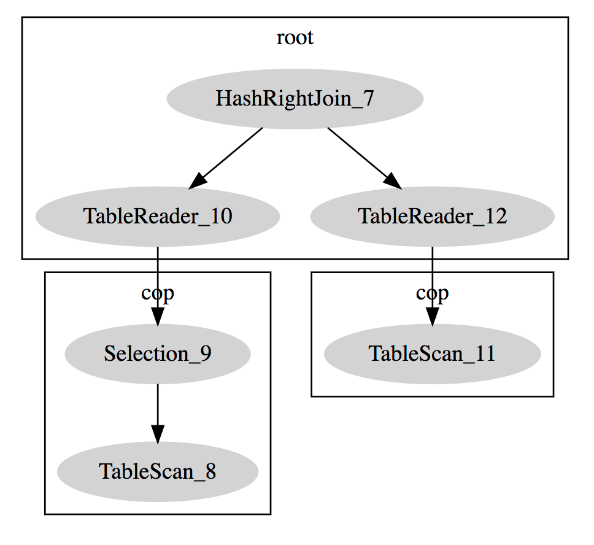

# Utility Statements

This document describes the utility statements, including the `DESCRIBE`, `EXPLAIN`, and `USE` statements.

## `DESCRIBE` statement

The `DESCRIBE` and `EXPLAIN` statements are synonyms, which can also be abbreviated as `DESC`. See the usage of the `EXPLAIN` statement.

## `EXPLAIN` statement

```sql
{EXPLAIN | DESCRIBE | DESC}
    tbl_name [col_name]

{EXPLAIN | DESCRIBE | DESC}
    [explain_type]
    explainable_stmt

explain_type:
    FORMAT = format_name

format_name:
    "DOT"

explainable_stmt: {
    SELECT statement
  | DELETE statement
  | INSERT statement
  | REPLACE statement
  | UPDATE statement
}
```

For more information about the `EXPLAIN` statement, see [Understand the Query Execution Plan](../sql/understanding-the-query-execution-plan.md).

In addition to the MySQL standard result format, TiDB also supports DotGraph and you need to specify `FORMAT = "dot"` as in the following example:

```sql
create table t(a bigint, b bigint);
desc format = "dot" select A.a, B.b from t A join t B on A.a > B.b where A.a < 10;

TiDB > desc format = "dot" select A.a, B.b from t A join t B on A.a > B.b where A.a < 10;desc format = "dot" select A.a, B.b from t A join t B on A.a > B.b where A.a < 10;
+--------------------------------------------------------------------------------------------------------------------------------------------------------------------------------------------------------------------------------------------------------------------------------------------------------------------------------------------------------------------------------------------------------------------------------------------------------------------------------------------+
| dot contents                                                                                                                                                                                                                                                                                                                                                                                                                                                                               |
+--------------------------------------------------------------------------------------------------------------------------------------------------------------------------------------------------------------------------------------------------------------------------------------------------------------------------------------------------------------------------------------------------------------------------------------------------------------------------------------------+
|
digraph HashRightJoin_7 {
subgraph cluster7{
node [style=filled, color=lightgrey]
color=black
label = "root"
"HashRightJoin_7" -> "TableReader_10"
"HashRightJoin_7" -> "TableReader_12"
}
subgraph cluster9{
node [style=filled, color=lightgrey]
color=black
label = "cop"
"Selection_9" -> "TableScan_8"
}
subgraph cluster11{
node [style=filled, color=lightgrey]
color=black
label = "cop"
"TableScan_11"
}
"TableReader_10" -> "Selection_9"
"TableReader_12" -> "TableScan_11"
}
 |
+--------------------------------------------------------------------------------------------------------------------------------------------------------------------------------------------------------------------------------------------------------------------------------------------------------------------------------------------------------------------------------------------------------------------------------------------------------------------------------------------+
1 row in set (0.00 sec)
```

If the `dot` program (in the `graphviz` package) is installed on your computer, you can generate a PNG file using the following method:

```bash
dot xx.dot -T png -O

The xx.dot is the result returned by the above statement.
```

If the `dot` program is not installed on your computer, copy the result to [this website](http://www.webgraphviz.com/) to get a tree diagram:



## `USE` statement

```sql
USE db_name
```

The `USE` statement is used to switch the default database. If the table in this SQL statement does not correspond to an explicitly specified database, then the currently selected database is used by default.
