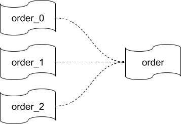

# Data Migration Sharding Solution

This document introduces the sharding solution provided by Data Migration, its background, design details, and sharding DDL restrictions.

Data Migration supports merging the data of multiple sharded MySQL instances and tables into a single TiDB instance. Generally, Data Migration does it automatically and you need to do nothing. But when some abnormal conditions occur, you need to handle them manually. For details, see [Troubleshooting Sharding DDL Locks](../tools/troubleshooting-sharding-ddl-locks.md).

## Background

Currently, [Syncer](../tools/syncer.md) adopts the `ROW` format of binlog that does not contain the column name. The `ROW` format of binlog has the nature of self-description on a single machine. In this case, only one binlog updates the target database, and the column values corresponding to the newly added or modified column can be determined according to the downstream table schema, so the DML statements can be constructed correctly.

However, in the case of merging multiple sharded instances and tables, multiple binlogs update the target database, and the DDL statements cannot be completely updated synchronously, so the DML statements might be inconsistent with the table schema.

Here is an example:



Assume that the table schema is as below:

```sql
(
  `id` int(11) primary key
)
```

When the following operations are executed, the row data and columns cannot match according to the binlog logic.

1. `order_0` executes `ALTER TABLE order_0 ADD COLUMN name` and is replicated to `order`.
2. `order_1` executes `INSERT INTO order_1 VALUES(12)`.

## Design details

This section describes the constraints and processing of sharding data migration.

### Constraints

- Deploy the DM-workers supporting the sharding data replication task.
- You can only execute a single DDL statement on a single table.
- Execute this DDL statement on all the upstream tables to be merged into a same downstream table.

### Processing

To complete the sharding data replication task, Data Migration uses the global DDL lock in the following two layers of DDL replication:

- The first layer: It is the DDL replication within the DM-worker. The replication related information is saved by DM-worker. Only after the replication is finished at this layer, the second layer of replication is carried out.
- The second layer: The replication is executed by coordinating the DM-workers using the global DDL lock. The replication related information is saved by both DM-master and DM-worker.

The processing details are as follows:

1. DM-worker creates a sharding group for all upstream tables to be merged into the same target table (first layer replication; members are the upstream tables)

2. DM-master creates a sharding group for all DM-workers that perform the target table merging task (the second layer replication; the members are all DM-workers that are doing the task)

3. When a certain upstream table in the sharding group within the DM-worker encounters a DDL statement, the replication of the target table in the DM-worker is partially suspended (the DML statements before the DDL structure change continue to replicate, while the DML statements after the DDL structure change and the subsequent DDL statements are ignored), but the replication of other target tables in this task continues.

4. When all upstream tables in the sharding group within the DM-worker encounter this DDL statement, DM-worker suspends the execution of this task. (The replication of other target tables of the task is also suspended, so that the newly created replication stream in the subsequent step 8 catches up with the global replication stream.)

5. The DM-worker requests the DM-master to create a DDL lock corresponding to the target table on the task. If the DDL lock already exists, the DM-worker registers its own information; if the DDL lock does not exist, the DM-master creates a DDL lock for the DM-worker, and the DM-worker registers its own information and becomes the DDL lock owner. The DDL lock is identified by _<task, DDL>_ related information.

6. When the DM-worker registers information, the DM-master judges whether all DDL statements are replicated according to the task group information (of the second layer replication). If they are all replicated, the DM-master notifies the DDL lock owner to execute the DDL statement. (Assuming that the DDL lock owner crashes in the process, if the owner restarts, it redoes the first layer replication, and triggers redoing the second layer replication when the first layer replication is finished, which means it automatically recovers; if the owner does not restart, you need to use the `unlock-ddl-lock` command to manually specify another DM-worker to execute the DDL statement to complete the replication.)

7. The DM-master checks whether the DDL lock owner successfully executes the DDL statement. If the execution is successful, it notifies all the DM-workers that are waiting for the execution of this DDL statement to continue to replicate after this DDL statement.

8. When the DM-worker resumes replication after recovering from the DDL lock, it creates a new task replication stream and re-executes the DML/DDL statements ignored in step 3 to complete the previously skipped data.

9. After the DM-worker completes the DML statements, it continues the normal replication.

## Sharding DDL usage restrictions

Data Migration has the following sharding DDL usage restrictions:

- All the tables in a sharding group must execute the same DDL statements in the same order.

   - Currently, Data Migration does not support executing the sharding DDL statements in an unordered and crossed way.
   - The whole replication process hangs up whenever a certain DDL statement on a table is not executed.

- Only after one DDL operation is completed in the whole sharding group, this group can execute the next DDL statement.

- The sharding group replication task does not support `DROP DATABASE`/`DROP TABLE`.

- The sharding group replication task supports `RENAME TABLE`, but with the following limits:

   - A table can only be renamed to a new name that is not used by any other table.
   - A single `RENAME TABLE` statement can only involve a single `RENAME` operation. (Online DDL is supported in another solution)

- The replication point where each table starts the task should be before or after all sharding DDL operations that need to be replicated
    
    - If some of the sharding DDL statements have been executed when you start to replicate the replication points, the sharding DDL operation can never be replicated successfully.

- If you need to change `router-rules`, you need to wait for replication of all sharding DDL operations to complete.

    - While in the process of sharding DDL replication, it reports an error if you use dmctl to change `router-rules`.

- If you need to `CREATE` a new table to an existing sharding group, you need to keep the table schema the same as the newly altered table schema.

    - For example, the original table_a, table_b initially has two columns (a, b), and after the sharding DDL has three columns (a, b, c), the table of the new `CREATE` after the replication is completed should have three columns (a, b, c).

- While the sharding DDL lock is waiting for replication, if DM-master is restarted, the replication process can be blocked because of the lock information loss.