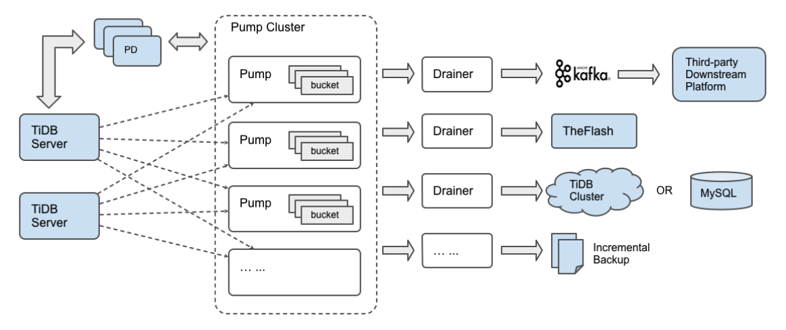

# TiDB-Binlog Cluster User Guide

This document introduces the architecture and the deployment of TiDB-Binlog of the cluster version.

TiDB-Binlog is an enterprise tool used to collect the binlog data of TiDB and provide real-time backup and replication.

TiDB-Binlog has the following features:

* **Data replication:** replicate the data in the TiDB cluster to other databases
* **Real-time backup and restoration:** back up the data in the TiDB cluster and restore the TiDB cluster when the cluster fails

## TiDB-Binlog architecture

The TiDB-Binlog architecture is as follows:



The TiDB-Binlog cluster is composed of Pump and Drainer.

### Pump

Pump is used to record the binlogs generated in TiDB, sort the binlogs based on the commit time of the transaction, and send binlogs to Drainer for consumption.

### Drainer

Drainer collects and merges binlogs from each Pump, converts the binlog to SQL or data of a specific format, and replicates the data to the downstream.

## Main features

* Multiple Pumps form a cluster which can scale out horizontally.
* TiDB uses the built-in Pump Client to send the binlog to each Pump.
* Pump stores binlogs and sends the binlogs to Drainer in order.
* Drainer reads binlogs of each Pump, merges and sorts the binlogs, and sends the binlogs to the downstream.

## Hardware requirements

Pump and Drainer can be deployed and run on common 64-bit hardware server platforms with the Intel x86-64 architecture. 

The server hardware requirements for development, testing, and the production environment are as follows:

| Service     | The Number of Servers       | CPU   | Disk          | Memory   |
| -------- | -------- | --------| --------------- | ------ |
| Pump | 3 | 8 core+    | SSD, 200 GB+ | 16G |
| Drainer | 1 | 8 core+ | SAS, 100 GB+ (If you need to output a local file, use SSD and increase the disk size) | 16G |

## Notes

* You need to use TiDB v2.0.8-binlog, v2.1.0-rc.5 or the later version. Otherwise, the TiDB cluster is not compatible with the cluster version of TiDB-Binlog.
* When TiDB is running, you need to guarantee that at least one Pump is running normally.
* To enable TiDB-Binlog, add the `enable-binlog` startup parameter to TiDB.
* Drainer does not support the `rename` DDL operation on the table of `ignore schemas` (the schemas in the filter list).
* If you want to start Drainer in the existing TiDB cluster, generally, you need to make a full backup of the cluster data, obtain `savepoint`, import the data to the target database, and then start Drainer to replicate the incremental data from `savepoint`.
* Drainer supports replicating binlogs to MySQL, TiDB, Kafka or the local files. If you need to replicate binlogs to other destinations, you can set Drainer to replicate the binlog to Kafka and read the data in Kafka for customization processing. See [Binlog Slave Client User Guide](../tools/binlog-slave-client.md).
* If TiDB-Binlog is used for recovering the incremental data, you can set the downstream to `pb` (local files in the proto buffer format). Drainer converts the binlog to data in the specified proto buffer format and writes the data to local files. In this way, you can use [Reparo](../tools/reparo.md) to recover the incremental data.
* Pump/Drainer has two states: `paused` and `offline`. If you press Ctrl + C or kill the process, both Pump and Drainer become `paused`. The paused Pump do not need to send all the binlog data to Drainer. If you need to exit from Pump for a long period of time (or do not use Pump any more), use `binlogctl` to make Pump offline. The same goes for Drainer.
* If the downstream is MySQL/TiDB, you can use [sync-diff-inspector](../tools/sync-diff-inspector.md) to verify the data after data replication.

## TiDB-Binlog deployment

This section shows two methods of deploying TiDB-Binlog:

- [Deploy TiDB-Binlog using TiDB-Ansible](#deploy-tidb-binlog-using-tidb-ansible)
- [Deploy TiDB-Binlog using Binary](#deploy-tidb-binlog-using-binary)

It is recommended to deploy TiDB-Binlog using TiDB-Ansible. If you just want to do a simple testing, you can deploy TiDB-Binlog using Binary.

### Deploy TiDB-Binlog using TiDB-Ansible 

#### Step 1: Download TiDB-Ansible

1. Use the TiDB user account to log in to the central control machine and go to the `/home/tidb` directory. The information about the branch of TiDB-Ansible and the corresponding TiDB version is as follows. If you have questions regarding which version to use, email to [info@pingcap.com](mailto:info@pingcap.com) for more information or [file an issue](https://github.com/pingcap/tidb-ansible/issues/new).

    | tidb-ansible branch | TiDB version | Note |
    | ------------------- | ------------ | ---- |
    | release-2.0 | 2.0 version | The latest 2.0 stable version. You can use it in the production environment. |
    | release-2.1 | 2.1 version | The latest 2.1 stable version. You can use it in the production environment (recommended). |
    | master | master version | This version includes the latest features with a daily update. |

2. Use the following command to download the corresponding branch of TiDB-Ansible from the [TiDB-Ansible project](https://github.com/pingcap/tidb-ansible) on GitHub. The default folder name is `tidb-ansible`.

    - Download the 2.0 version:
        
        ```bash
        $ git clone -b release-2.0-new-binlog https://github.com/pingcap/tidb-ansible.git
        ```

    - Download the 2.1 version:

        ```bash
        $ git clone -b release-2.1 https://github.com/pingcap/tidb-ansible.git
        ```

    - Download the master version:

        ```bash
        $ git clone https://github.com/pingcap/tidb-ansible.git
        ```

#### Step 2: Deploy Pump

1. Modify the `tidb-ansible/inventory.ini` file.

    1. Set `enable_binlog = True` to start `binlog` of the TiDB cluster.

        ```ini
        ## binlog trigger
        enable_binlog = True
        ```

    2. Add the deployment machine IPs for `pump_servers`.

        ```ini
        ## Binlog Part
        [pump_servers]
        172.16.10.72
        172.16.10.73
        172.16.10.74
        ```

        Pump retains the data of the latest 5 days by default. You can modify the value of the `gc` variable in the `tidb-ansible/conf/pump.yml` file and remove the related comments. Take modifying the variable value to 7 as an example:

        ```yaml
        global:
          # an integer value to control the expiry date of the binlog data, which indicates for how long (in days) the binlog data would be stored
          # must be bigger than 0
          gc: 7
        ```

        Make sure the space of the deployment directory is sufficient for storing Binlog. For more details, see [Configure the deployment directory](../op-guide/ansible-deployment.md#configure-the-deployment-directory). You can also set a separate deployment directory for Pump.

        ```ini
        ## Binlog Part
        [pump_servers]
        pump1 ansible_host=172.16.10.72 deploy_dir=/data1/pump
        pump2 ansible_host=172.16.10.73 deploy_dir=/data1/pump
        pump3 ansible_host=172.16.10.74 deploy_dir=/data1/pump
        ```

2. Deploy and start the TiDB cluster with Pump components.

   After configuring the `inventory.ini` file as described above, choose one of the following two methods for deployment.

    **Method 1**: Adding a Pump component to an existing TiDB cluster requires step-by-step steps as follows.

     1. Deploy pump_servers and node_exporters

         ```
        ansible-playbook deploy.yml --tags=pump -l ${pump1_ip},${pump2_ip},[${alias1_name},${alias2_name}]
         ```

     2. Start pump_servers

         ```
         Ansible-playbook start.yml --tags=pump
         ```

     3. Update and restart tidb_servers

         ```
         Ansible-playbook rolling_update.yml --tags=tidb
         ```

     4. Update monitoring information

         ```
        Ansible-playbook rolling_update_monitor.yml --tags=prometheus
         ```

        **Method 2**: Deploy a TiDB cluster with Pump components from scratch

        For how to use Ansible to deploy the TiDB cluster, see [Deploy TiDB Using Ansible](../op-guide/ansible-deployment.md).  

3. Check the Pump status.

    Use `binlogctl` to check the Pump status. Change the `pd-urls` parameter to the PD address of the cluster. If `State` is `online`, Pump is started successfully.

    ```bash
    $ cd /home/tidb/tidb-ansible
    $ resources/bin/binlogctl -pd-urls=http://172.16.10.72:2379 -cmd pumps
    
    INFO[0000] pump: {NodeID: ip-172-16-10-72:8250, Addr: 172.16.10.72:8250, State: online, MaxCommitTS: 403051525690884099, UpdateTime: 2018-12-25 14:23:37 +0800 CST}
    INFO[0000] pump: {NodeID: ip-172-16-10-73:8250, Addr: 172.16.10.73:8250, State: online, MaxCommitTS: 403051525703991299, UpdateTime: 2018-12-25 14:23:36 +0800 CST}
    INFO[0000] pump: {NodeID: ip-172-16-10-74:8250, Addr: 172.16.10.74:8250, State: online, MaxCommitTS: 403051525717360643, UpdateTime: 2018-12-25 14:23:35 +0800 CST}
    ```

#### Step 3: Deploy Drainer

1. Obtain `initial_commit_ts`. 

    Run the following command to use `binlogctl` to generate the `tso` information which is needed for the initial start of Drainer:

    ```bash
    $ cd /home/tidb/tidb-ansible
    $ resources/bin/binlogctl -pd-urls=http://127.0.0.1:2379 -cmd generate_meta
    INFO[0000] [pd] create pd client with endpoints [http://192.168.199.118:32379]
    INFO[0000] [pd] leader switches to: http://192.168.199.118:32379, previous:
    INFO[0000] [pd] init cluster id 6569368151110378289
    2018/06/21 11:24:47 meta.go:117: [info] meta: &{CommitTS:400962745252184065}
    ```

     After this command is executed, `meta: &{CommitTS:400962745252184065}` is generated. The value of CommitTS is used as the value of the `initial-commit-ts` parameter needed for the initial start of Drainer.

2. Back up and restore all the data.

    It is recommended to use [mydumper](../tools/mydumper.md) to make a full backup of TiDB and then use [Loader](../tools/loader.md) to export the data to the downstream. For more details, see [Backup and Restore](../op-guide/backup-restore.md).

3. Modify the `tidb-ansible/inventory.ini` file.

    Add the deployment machine IPs for `drainer_servers`. Set `initial_commit_ts` to the value you have obtained, which is only used for the initial start of Drainer.

    - Assume that the downstream is MySQL with the alias `drainer_mysql`:

        ```ini
        [drainer_servers]
        drainer_mysql ansible_host=172.16.10.71 initial_commit_ts="402899541671542785"
        ```

    - Assume that the downstream is `pb` with the alias `drainer_pb`:

        ```ini
        [drainer_servers]
        drainer_pb ansible_host=172.16.10.71 initial_commit_ts="402899541671542785"
        ```

4. Modify the configuration file.

    - Assume that the downstream is MySQL:

        ```bash
        $ cd /home/tidb/tidb-ansible/conf
        $ cp drainer.toml drainer_mysql_drainer.toml
        $ vi drainer_mysql_drainer.toml
        ```

        > **Note:**
        >
        > Name the configuration file as `alias_drainer.toml`. Otherwise, the customized configuration file cannot be found during the deployment process.
        
        Set `db-type` to `mysql` and configure the downstream MySQL information:

        ```toml
        # downstream storage, equal to --dest-db-type
        # Valid values are "mysql", "pb", "kafka", and "flash".
        db-type = "mysql"

        # the downstream MySQL protocol database
        [syncer.to]
        host = "172.16.10.72"
        user = "root"
        password = "123456"
        port = 3306
        # Time and size limits for flash batch write
        # time-limit = "30s"
        # size-limit = "100000"
        ```

    - Assume that the downstream is `pb`:

        ```bash
        $ cd /home/tidb/tidb-ansible/conf
        $ cp drainer.toml drainer_pb_drainer.toml
        $ vi drainer_pb_drainer.toml
        ```

        Set `db-type` to `pb`.

        ```toml
        # downstream storage, equal to --dest-db-type
        # Valid values are "mysql", "pb", "kafka", and "flash".
        db-type = "pb"

        # Uncomment this if you want to use `pb` or `sql` as `db-type`.
        # `Compress` compresses the output file, like the `pb` and `sql` file. Now it supports the `gzip` algorithm only. 
        # The value can be `gzip`. Leave it empty to disable compression. 
        [syncer.to]
        compression = ""
        # default data directory: "{{ deploy_dir }}/data.drainer"
        dir = "data.drainer"
        ```

5. Deploy Drainer.

    ```bash
    $ ansible-playbook deploy_drainer.yml
    ```

6. Start Drainer.

    ```bash
    $ ansible-playbook start_drainer.yml
    ```

### Deploy TiDB-Binlog using Binary

#### Download the official Binary

Run the following command to download the binary:

```bash
wget https://download.pingcap.org/tidb-{version}-linux-amd64.tar.gz
wget https://download.pingcap.org/tidb-{version}-linux-amd64.sha256

# Check the file integrity. If the result is OK, the file is correct.
sha256sum -c tidb-{version}-binlog-linux-amd64.sha256
```

For TiDB v2.1.0 GA or later versions, Pump and Drainer are already included in the TiDB download package. For other TiDB versions, you need to download Pump and Drainer separately using the following command:

```bash
wget https://download.pingcap.org/tidb-binlog-{version}-linux-amd64.tar.gz
wget https://download.pingcap.org/tidb-binlog-{version}-linux-amd64.sha256

# Check the file integrity. If the result is OK, the file is correct.
sha256sum -c tidb-binlog-{version}-linux-amd64.sha256
```

#### The usage example

Assuming that you have three PD nodes, one TiDB node, two Pump nodes, and one Drainer node, the information of each node is as follows:

```
TiDB="192.168.0.10"
PD1="192.168.0.16"
PD2="192.168.0.15"
PD3="192.168.0.14"
Pump="192.168.0.11"
Pump="192.168.0.12"
Drainer="192.168.0.13"
```

The following part shows how to use Pump and Drainer based on the nodes above.

1. Deploy Pump using the binary.

    - Taking deploying Pump on "192.168.0.11" as an example, the description for command line parameters of Pump is as follows:

        ```
        Usage of Pump:
        -L string
            the output information level of logs: debug, info, warn, error, fatal ("info" by default)
        -V
            the print version information
        -addr string
            the RPC address through which Pump provides the service (-addr="192.168.0.11:8250")
        -advertise-addr string
            the RPC address through which Pump provides the external service (-advertise-addr="192.168.0.11:8250")
        -config string
            the path of the configuration file. If you specify the configuration file, Pump reads the configuration in the configuration file first. If the corresponding configuration also exits in the command line parameters, Pump uses the configuration of the command line parameters to cover that of the configuration file.
        -data-dir string
            the path where the Pump data is stored
        -enable-tolerant
            After `tolerant` is enabled, Pump (enabled by default) does not report an error if the binlog fails to write into Pump.
        -gc int
            the number of days to retain the data in Pump (7 by default)
        -heartbeat-interval int
            the interval of the heartbeats Pump sends to PD (in seconds)
        -log-file string
            the file path of logs
        -log-rotate string
            the switch frequency of logs (hour/day)
        -metrics-addr string
            the Prometheus Pushgateway address. If not set, it is forbidden to report the monitoring metrics.
        -metrics-interval int
            the report frequency of the monitoring metrics (15 by default, in seconds)
        -pd-urls string
            the address of the PD cluster nodes (-pd-urls="http://192.168.0.16:2379,http://192.168.0.15:2379,http://192.168.0.14:2379")
        ```

    - Taking deploying Pump on "192.168.0.11" as an example, the Pump configuration file is as follows:

        ```toml
        # Pump Configuration

        # the bound address of Pump
        addr = "192.168.0.11:8250"

        # the address through which Pump provides the service
        advertise-addr = "192.168.0.11:8250"

        # the number of days to retain the data in Pump (7 by default)
        gc = 7

        # the directory where the Pump data is stored
        data-dir = "data.pump"

        # the interval of the heartbeats Pump sends to PD (in seconds)
        heartbeat-interval = 2
    
        # the address of the PD cluster nodes
        pd-urls = "http://192.168.0.16:2379,http://192.168.0.15:2379,http://192.168.0.14:2379"

        # [storage]
        # Set to true (by default) to ensure reliability. Make sure the binlog data is updated to the disk
        # sync-log = true
        ```

    - The example of starting Pump:

        ```bash
        ./bin/pump -config pump.toml
        ```
  
        If the command line parameters is the same with the configuration file parameters, the values of command line parameters are used.

2. Deploy Drainer using binary.

    - Taking deploying Drainer on "192.168.0.13" as an example, the description for command line parameters of Drainer is as follows:

        ```
        Usage of Drainer:
        -L string
            the output information level of logs: debug, info, warn, error, fatal ("info" by default)
        -V
            the print version information
        -addr string
            the address through which Drainer provides the service (-addr="192.168.0.13:8249")
        -c int
            the number of the concurrency of the downstream for replication. The bigger the value, the better throughput performance of the concurrency (1 by default).
        -config string
            the directory of the configuration file. Drainer reads the configuration file first.
            If the corresponding configuration exists in the command line parameters, Drainer uses the configuration of the command line parameters to cover that of the configuration file.
        -data-dir string
            the directory where the Drainer data is stored ("data.drainer" by default)
        -dest-db-type string
            the downstream service type of Drainer
            The value can be "mysql", "kafka", "pb", and "flash". ("mysql" by default)
        -detect-interval int
            the interval of checking the online Pump in PD (10 by default, in seconds)
        -disable-detect
            whether to disable the conflict monitoring
        -disable-dispatch
            whether to disable the SQL feature of splitting a single binlog file. If it is set to "true", each binlog file is restored to a single transaction for replication based on the order of binlogs. 
            It is set to "False", when the downstream is MySQL.
        -ignore-schemas string
            the db filter list ("INFORMATION_SCHEMA,PERFORMANCE_SCHEMA,mysql,test" by default)
            It does not support the Rename DDL operation on tables of `ignore schemas`.
        -initial-commit-ts
            If Drainer does not have the related breakpoint information, you can configure the related breakpoint information using this parameter.
            0 by default
        -log-file string
            the path of the log file
        -log-rotate string
            the switch frequency of log files, hour/day
        -metrics-addr string
            the Prometheus Pushgateway address
            It it is not set, the monitoring metrics are not reported.
        -metrics-interval int
            the report frequency of the monitoring metrics (15 by default, in seconds)
        -pd-urls string
            the address of the PD cluster nodes (-pd-urls="http://192.168.0.16:2379,http://192.168.0.15:2379,http://192.168.0.14:2379")
        -safe-mode
            whether to enable the safe mode (divides the Update statement to Delete + Replace)
        -txn-batch int
            the number of SQL statements of a transaction which are output to the downstream database (1 by default)
        ```

    - Taking deploying Drainer on "192.168.0.13" as an example, the Drainer configuration file is as follows:

        ```toml
        # Drainer Configuration.

        # the address through which Drainer provides the service ("192.168.0.13:8249")
        addr = "192.168.0.13:8249"

        # the interval of checking the online Pump in PD (10 by default, in seconds)
        detect-interval = 10

        # the directory where the Drainer data is stored "data.drainer" by default)
        data-dir = "data.drainer"

        # the address of the PD cluster nodes
        pd-urls = "http://192.168.0.16:2379,http://192.168.0.15:2379,http://192.168.0.14:2379"

        # the directory of the log file
        log-file = "drainer.log"

         # Drainer compress data when the binlog is obtained form Pump.The value can be "gzip". If it is not configured, it will not be compressed.
        # compressor = "gzip"

        # Syncer Configuration
        [syncer]
         # If this item is set, it will use its sql-mode to analyze DDL statements
        # sql-mode = "STRICT_TRANS_TABLES,NO_ENGINE_SUBSTITUTION"

        # the number of SQL statements of a transaction which are output to the downstream database (20 by default)
        txn-batch = 20

        # the number of the concurrency of the downstream for replication. The bigger the value,
        # the better throughput performance of the concurrency (16 by default)
        worker-count = 16

        # whether to disable the SQL feature of splitting a single binlog file. If it is set to "true",
        # each binlog file is restored to a single transaction for replication based on the order of binlogs.
        # If the downstream service is MySQL, set it to "False".
        disable-dispatch = false

        # the downstream service type of Drainer ("mysql" by default)
        # Valid value: "mysql", "kafka", "pb", "flash"
        db-type = "mysql"

        # the db filter list ("INFORMATION_SCHEMA,PERFORMANCE_SCHEMA,mysql,test" by default)
        # Does not support the Rename DDL operation on tables of `ignore schemas`.
        ignore-schemas = "INFORMATION_SCHEMA,PERFORMANCE_SCHEMA,mysql"

        # `replicate-do-db` has priority over `replicate-do-table`. When they have the same `db` name,
        # regular expressions are supported for configuration.
        # The regular expression should start with "~".

        # replicate-do-db = ["~^b.*","s1"]

        # [[syncer.replicate-do-table]]
        # db-name ="test"
        # tbl-name = "log"

        # [[syncer.replicate-do-table]]
        # db-name ="test"
        # tbl-name = "~^a.*"

        # Ignore the replication of some tables
        # [[syncer.ignore-table]]
        # db-name = "test"
        # tbl-name = "log"

        # the server parameters of the downstream database when `db-type` is set to "mysql"
        [syncer.to]
        host = "192.168.0.13"
        user = "root"
        password = ""
        port = 3306

        # the directory where the binlog file is stored when `db-type` is set to `pb`
        # [syncer.to]
        # dir = "data.drainer"

        # the Kafka configuration when `db-type` is set to "kafka"
        # [syncer.to]
        # zookeeper-addrs = "127.0.0.1:2181"
        # kafka-addrs = "127.0.0.1:9092"
        # kafka-version = "0.8.2.0"

        # the topic name of the Kafka cluster that saves the binlog data. The default value is <cluster-id>_obinlog
        # To run multiple Drainers to replicate data to the same Kafka cluster, you need to set different `topic-name`s for each Drainer.
        # topic-name = ""
        ```

    - The example of starting Drainer:

        > **Note:**
        >
        > If the downstream is MySQL/TiDB, to guarantee the data integrity, you need to obtain the `initial-commit-ts` value and make a full backup of the data and restore the data before the initial start of Drainer. For details, see [Deploy Drainer](#step-3-deploy-drainer).

        When Drainer is started for the first time, use the `initial-commit-ts` parameter.

        ```bash
        ./bin/drainer -config drainer.toml -initial-commit-ts {initial-commit-ts}
        ```

        If the command line parameter and the configuration file parameter are the same, the parameter value in the command line is used.

## TiDB-Binlog operations

### Pump/Drainer state

Pump/Drainer state description:

* `online`: running normally.
* `pausing`: in the pausing process. It turns into this state after you use `kill` or press Ctrl + C to exit from the process.
* `paused`: has been stopped. While Pump is in this state, it rejects the request of writing binlog into it and does not provide the binlog for Drainer any more. When Drainer is in this state, it does not replicate data to the downstream. After Pump and Drainer exit normally from all the threads, they switch the state to `paused` and then exits from the process.
* `closing`: in the offline process. `binlogctl` is used to get Pump/Drainer offline and Pump/Drainer is in this state before the process exits. In this state, Pump does not accept new requests of writing binlog into it and waits for all the binlog data to be used up by Drainer.
* `offline`: becomes offline. After Pump sents all the binlog data that it saves to Drainer, its state is switched to `offline`. Drainer's state can be switched to `offline` after all the threads have exited.

> **Note:**
>
> * When Pump/Drainer is `pausing` or `paused`, the data replication is interrupted.
> * When Pump is `closing`, you need to guarantee that all the data has been consumed by all the Drainers that are not `offline`. So before making Pump offline, you need to guarantee all the Drainers are `online`; otherwise, Pump cannot get offline normally.
> * The binlog data that Pump saves is processed by GC only when it has been consumed by all the Drainers that are not `offline`.
> * Close Drainer only when it will not be used any more.

For how to pause, close, check, and modify the state of Drainer, see the [binlogctl guide](#binlogctl-guide) as follows.

### `binlogctl` guide

[`binlogctl`](https://github.com/pingcap/tidb-tools/tree/master/tidb-binlog/binlogctl) is an operations tool for TiDB-Binlog with the following features:

* Obtaining the current `ts`
* Checking the Pump/Drainer state
* Modifying the Pump/Drainer state
* Pausing or closing Pump/Drainer

#### Usage scenarios of `binlogctl`

* It is the first time you run Drainer and you need to obtain the current `ts`.
* When Pump/Drainer exits abnormally, its state is not updated and the service is affected. You can use this tool to modify the state.
* An error occurs during replication and you need to check the running status and the Pump/Drainer state.
* While maintaining the cluster, you need to pause or close Pump/Drainer.

#### Download `binlogctl`

Download `binlogctl` via:

```bash
wget https://download.pingcap.org/binlogctl-new-linux-amd64.tar.gz
wget https://download.pingcap.org/binlogctl-new-linux-amd64.sha256

# Check the file integrity. It should return OK.
sha256sum -c tidb-binlog-new-linux-amd64.sha256
```

#### `binlogctl` usage description

Command line parameters:

```
Usage of binlogctl:
-V
    Outputs the binlogctl version information
-cmd string
    the command mode, including "generate_meta", "pumps", "drainers", "update-pump" ,"update-drainer", "pause-pump", "pause-drainer", "offline-pump", and "offline-drainer"
-data-dir string
    the file path where the checkpoint file of Drainer is stored ("binlog_position" by default)
-node-id string
    ID of Pump/Drainer
-pd-urls string
    the address of PD. If multiple addresses exist, use "," to separate each ("http://127.0.0.1:2379" by default)
-ssl-ca string
    the file path of SSL CAs
-ssl-cert string
    the file path of the X509 certificate file in the PEM format
-ssl-key string
    the file path of X509 key file of the PEM format
-time-zone string
    If a time zone is set, the corresponding time of the obtained `tso` is printed in the "generate_meta" mode. For example, "Asia/Shanghai" is the CST time zone and "Local" is the local time zone
```

Command example:

- Check the state of all the Pumps or Drainers:
    Set 'cmd' to 'pumps' or 'drainers' to check the state of all the Pumps or Drainers. For example:
    ```bash
    bin/binlogctl -pd-urls=http://127.0.0.1:2379 -cmd pumps

    INFO[0000] pump: {NodeID: ip-172-16-30-67:8250, Addr: 172.16.30.192:8250, State: online, MaxCommitTS: 405197570529820673, UpdateTime: 2018-12-25 14:23:37 +0800 CST}

    ```

- Modify the Pump/Drainer state:

    Set 'cmd' to 'update-pump' or 'update-drainer' to update the states of Pump or Drainer.

    The Pump/Drainer states include `online`, `pausing`, `paused`, `closing` and `offline`. For example:

     ```bash
    bin/binlogctl -pd-urls=http://127.0.0.1:2379 -cmd update-pump -node-id ip-127-0-0-1:8250 -state paused
    ```

    This command modifies the Pump/Drainer state saved in PD.

- Pause or close Pump/Drainer:
    Set 'cmd' as `pause-pump`,`pause-drainer`,`offline-pump` or `offline-drainer` to pause Pump, pause Drainer, offline Pump or offline Drainer. For example:

    ```bash
    bin/binlogctl -pd-urls=http://127.0.0.1:2379 -cmd pause-pump -node-id ip-127-0-0-1:8250
    ```

    `binlogctl` sends the HTTP request to Pump/Drainer, and Pump/Drainer exits from the process after receiving the command and sets its state to `paused`/`offline`.

- Generate the meta file that Drainer needs to start:

    ```bash
    bin/binlogctl -pd-urls=http://127.0.0.1:2379 -cmd generate_meta

    INFO[0000] [pd] create pd client with endpoints [http://192.168.199.118:32379]
    INFO[0000] [pd] leader switches to: http://192.168.199.118:32379, previous:
    INFO[0000] [pd] init cluster id 6569368151110378289
    2018/06/21 11:24:47 meta.go:117: [info] meta: &{CommitTS:400962745252184065}
    ```

    This command generates a `{data-dir}/savepoint` file. This file stores the `tso` information which is needed for the initial start of Drainer.

## TiDB-Binlog monitoring

After you have deployed TiDB-Binlog using Ansible successfully, you can go to the Grafana Web (default address: <http://grafana_ip:3000>, default account: admin, password: admin) to check the state of Pump and Drainer.

For TiDB-Binlog monitoring metrics, see [TiDB-Binlog Monitoring Metrics](../tools/tidb-binlog-monitor.md).

## TiDB-Binlog upgrade

The new TiDB versions (v2.0.8-binlog, v2.1.0-rc.5 or later) are not compatible with the [Kafka version](../tools/tidb-binlog-kafka.md) or [local version](../tools/tidb-binlog.md) of TiDB-Binlog. If TiDB is upgraded to one of the new versions, it is required to use the cluster version of TiDB-Binlog. If the Kafka or local version of TiDB-Binlog is used before upgrading, you need to upgrade your TiDB-Binlog to the cluster version.

The corresponding relationship between TiDB-Binlog versions and TiDB versions is shown in the following table:

| TiDB-Binlog version | TiDB version | Note |
|:---|:---|:---|
| Local | TiDB 1.0 or earlier ||
| Kafka | TiDB 1.0 ~ TiDB 2.1 RC5 | TiDB 1.0 supports both the local and Kafka versions of TiDB-Binlog. |
| Cluster | TiDB v2.0.8-binlog, TiDB 2.1 RC5 or later | TiDB v2.0.8-binlog is a special 2.0 version supporting the cluster version of TiDB-Binlog. |

### Upgrade process

- If importing the full data is acceptable, you can abandon the old version and deploy TiDB-Binlog following this document.
- If you want to resume replication from the original checkpoint, perform the following steps to upgrade TiDB-Binlog:

    1. Deploy the new version of Pump.
    2. Stop the TiDB cluster service.
    3. Upgrade TiDB and the configuration, and write the binlog data to the new Pump cluster.
    4. Reconnect the TiDB cluster to the service.
    5. Make sure that the old version of Drainer has replicated the data in the old version of Pump to the downstream completely.
    6. Start the new version of Drainer.
    7. Close the Pump and Drainer of the old versions and the dependent Kafka and Zookeeper.
