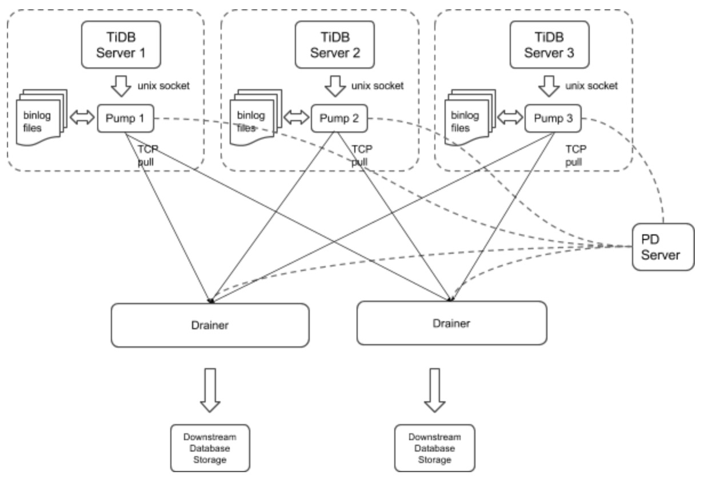

# TiDB-Binlog User Guide

## About TiDB-Binlog

TiDB-Binlog is a tool for enterprise users to collect binlog files for TiDB and provide real-time backup and replication.

TiDB-Binlog supports the following scenarios:  

- **Data replication**: to replicate TiDB cluster data to other databases  
- **Real-time backup and recovery**: to back up TiDB cluster data, and recover in case of cluster outages
  
## TiDB-Binlog architecture

The TiDB-Binlog architecture is as follows:  

 

The TiDB-Binlog cluster mainly consists of two components:  

### Pump

Pump is a daemon that runs on the background of each TiDB host. Its main function is to record the binlog files generated by TiDB in real time and write to the file in the disk sequentially.

### Drainer

Drainer collects binlog files from each Pump node, converts them into specified database-compatible SQL statements in the commit order of the transactions in TiDB, and replicates to the target database or writes to the file sequentially.

## Install TiDB-Binlog

### Download Binary for the CentOS 7.3+ platform

```bash
# Download the tool package.
wget http://download.pingcap.org/tidb-binlog-latest-linux-amd64.tar.gz
wget http://download.pingcap.org/tidb-binlog-latest-linux-amd64.sha256

# Check the file integrity. If the result is OK, the file is correct. 
sha256sum -c tidb-binlog-latest-linux-amd64.sha256

# Extract the package.
tar -xzf tidb-binlog-latest-linux-amd64.tar.gz
cd tidb-binlog-latest-linux-amd64
```

### Deploy TiDB-Binlog

- It is recommended to deploy Pump using Ansible.
- Build a new TiDB cluster with a startup order of pd-server -> tikv-server -> pump -> tidb-server -> drainer.  
    - Edit the `tidb-ansible inventory.ini` file:
        
        ```ini
        enable_binlog = True
        ```
    
    - Run `ansible-playbook deploy.yml` 
    - Run `ansible-playbook start.yml`
      
- Deploy Binlog for an existing TiDB cluster.
    - Edit the `tidb-ansible inventory.ini` file:
    
        ```ini
        enable_binlog = True
        ```
    
    - Run `ansible-playbook rolling_update.yml`

### Note

- You need to deploy a Pump for each TiDB server in a TiDB cluster. Currently, the TiDB server only supports the binlog in UNIX socket.  
  
  We set the startup parameter `binlog-socket` as the specified unix socket file path of the corresponding parameter `socket` in Pump. The final deployment architecture is as follows:  
  
    
   
- Currently, you need to deploy Drainer manually.

- Drainer does not support renaming DDL on the table of the ignored schemas (schemas in the filter list).

- To start Drainer in the existing TiDB cluster, usually you need to do a full backup, get the savepoint, import the full backup, and start Drainer and replicate from the savepoint.
  
- To guarantee the integrity of data, perform the following operations 10 minutes after Pump is started:  

    - Run Drainer at the `gen-savepoint` model and generate the Drainer savepoint file:  
      
        ```bash
        bin/drainer -gen-savepoint --data-dir= ${drainer_savepoint_dir} --pd-urls=${pd_urls}
        ```
       
    - Do a full backup. For example, back up TiDB using mydumper.
    - Import the full backup to the target system.
    - Set the file path of the savepoint and start Drainer:
      
        ```bash
        bin/drainer --config=conf/drainer.toml --data-dir=${drainer_savepoint_dir}
        ```

- The drainer outputs `pb` and you need to set the following parameters in the configuration file.  
  
    ```toml
    [syncer]
    db-type = "pb"
    disable-dispatch = true

    [syncer.to]
    dir = "/path/pb-dir"
    ```

### Examples and parameters explanation

#### Pump

Example

```bash
./bin/pump -config pump.toml
```

Parameters Explanation

```
Usage of Pump:
-L string
    log level: debug, info, warn, error, fatal (default "info")
-V
    print Pump version info
-addr string
    addr(i.e. 'host:port') to listen on for client traffic (default "127.0.0.1:8250").
-advertise-addr string
    addr(i.e. 'host:port') to advertise to the public
-config string
    path to the Pump configuration file
-data-dir string
    path to store binlog data
-gc int
    recycle binlog files older than gc days, zero means never recycle (default 7)
-heartbeat-interval int
    number of seconds between heartbeat ticks (default 2)
-log-file string
    log file path
-log-rotate string
    log file rotate type, hour/day
-metrics-addr string
    Prometheus Pushgateway address; leaving it empty will disable Prometheus push
-metrics-interval int
    Prometheus client push interval in second, set "0" to disable Prometheus push (default 15)
-pd-urls string
    a comma separated list of the PD endpoints (default "http://127.0.0.1:2379")
-socket string
    unix socket addr to listen on for client traffic
```

Configuration file

```
# Pump Configuration.

# addr(i.e. 'host:port') to listen on for client traffic
addr = "127.0.0.1:8250"

# addr(i.e. 'host:port') to advertise to the public
advertise-addr = ""

# a integer value to control expiry date of the binlog data, indicates for how long (in days) the binlog data would be stored.

# (default value is 0, means binlog data would never be removed)
gc = 7

# path to the data directory of Pump's data
data-dir = "data.pump"

# number of seconds between heartbeat ticks (in 2 seconds)
heartbeat-interval = 2

# a comma separated list of PD endpoints
pd-urls = "http://127.0.0.1:2379"

# unix socket addr to listen on for client traffic
socket = "unix:///tmp/pump.sock"
```

#### Drainer

Example

```bash
./bin/drainer -config drainer.toml
```

Parameters Explanation

```
Usage of Drainer:
-L string
    log level: debug, info, warn, error, fatal (default "info")
-V
    print version info
-addr string
    addr (i.e. 'host:port') to listen on for Drainer connections (default "127.0.0.1:8249")
-c int
    parallel worker count (default 1)
-config string
    path to the configuration file
-data-dir string
    Drainer data directory path (default data.drainer) (default "data.drainer")
-dest-db-type string
    target db type: mysql or pb; see syncer section in conf/drainer.toml (default "mysql")
-detect-interval int
    the interval time (in seconds) of detecting Pumps' status (default 10)
-disable-dispatch
    disable dispatching sqls that in one same binlog; if set true, work-count and txn-batch would be useless
-gen-savepoint
    generate the savepoint from cluster 
-ignore-schemas string
    disable replicating those schemas (default "INFORMATION_SCHEMA,PERFORMANCE_SCHEMA,mysql")
-log-file string
    log file path
-log-rotate string
    log file rotate type, hour/day
-metrics-addr string
    Prometheus pushgateway address; leaving it empty will disable Prometheus push
-metrics-interval int
    Prometheus client push interval in second, set "0" to disable Prometheus push (default 15)
-pd-urls string
    a comma separated list of PD endpoints (default "http://127.0.0.1:2379")
-txn-batch int
    number of binlog events in a transaction batch (default 1) 
```

Configuration file

```toml
# Drainer Configuration

# addr (i.e. 'host:port') to listen on for Drainer connections
addr = "127.0.0.1:8249"

# the interval time (in seconds) of detect Pumps' status 
detect-interval = 10

# Drainer meta data directory path
data-dir = "data.drainer"

# a comma separated list of PD endpoints
pd-urls = "http://127.0.0.1:2379"

# The file path of log
log-file = "drainer.log"

# syncer Configuration
[syncer]

# disable replicating these schemas
ignore-schemas = "INFORMATION_SCHEMA,PERFORMANCE_SCHEMA,mysql"

# number of binlog events in a transaction batc
txn-batch = 1

# worker count to execute binlogs
worker-count = 1

disable-dispatch = false

# downstream storage, equal to --dest-db-type
# valid values are "mysql", "pb"
db-type = "mysql"

# The replicate-do-db prioritizes over replicate-do-table if having the same db name. 
# Regular expressions are supported, and starting with '~' declares the use of regular expressions.
# replicate-do-db = ["~^b.*","s1"]
# [[syncer.replicate-do-table]]
# db-name ="test"
# tbl-name = "log"

# [[syncer.replicate-do-table]]
# db-name ="test"
# tbl-name = "~^a.*"

# the downstream mysql protocol database
[syncer.to]
host = "127.0.0.1"
user = "root"
password = ""
port = 3306

# uncomment this if you want to use pb as db-type
# [syncer.to]
# dir = "data.drainer"
```

## Monitor TiDB-Binlog

This section introduces how to monitor TiDB-Binlog's status and performance, and display the metrics using Prometheus and Grafana.

### Configure Pump/Drainer

Use the Pump service deployed using Ansible. Set metrics in startup parameters.  

When you start Drainer, set the two parameters of `--metrics-addr` and `--metrics-interval`. Set `--metrics-addr` as the address of Push Gateway. Set `--metrics-interval` as the frequency of push (default 15 seconds).

### Configure Grafana

#### Create a Prometheus data source

1. Login the Grafana Web interface. 

    - The default address is: [http://localhost:3000](http://localhost:3000)

    - The default account name: admin

    - The password for the default account: admin

2. Click the Grafana logo to open the sidebar menu.

3. Click "Data Sources" in the sidebar.

4. Click "Add data source".

5. Specify the data source information:

    - Specify the name for the data source. 

    - For Type, select Prometheus.

    - For Url, specify the Prometheus address.

    - Specify other fields as needed.

6. Click "Add" to save the new data source.

#### Create a Grafana dashboard

1. Click the Grafana logo to open the sidebar menu.

2. On the sidebar menu, click "Dashboards" -> "Import" to open the "Import Dashboard" window.

3. Click "Upload .json File" to upload a JSON file (Download [TiDB Grafana Config](https://grafana.com/tidb)). 

4. Click "Save & Open". 

5. A Prometheus dashboard is created.