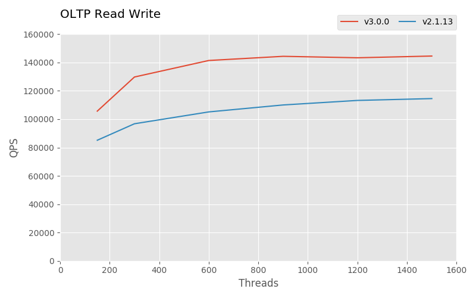

# TiDB Sysbench 性能对比测试报告 - v3.0 对比 v2.1

## 测试目的

对比 TiDB 3.0 版本和 2.1 版本在 OLTP 场景下的性能。

## 测试版本、时间、地点

TiDB 版本：v3.0.0 vs. v2.1.13

时间：2019 年 6 月

地点：北京

## 测试环境

测试在 AWS EC2 上进行，使用 CentOS-7.6.1810-Nitro (ami-028946f4cffc8b916) 镜像，各组件实例类型如下：

| 组件  |  实例类型  |
| :--- | :--------- |
|  PD   | r5d.xlarge |
| TiKV  | c5d.xlarge |
| TiDB  | c5.xlarge  |

Sysbench 版本：1.0.17

## 测试方案

使用 Sysbench 向集群导入 **16 张表，每张数据 1000 万**。起 3 个 sysbench 分别向 3 个 TiDB 发压，请求并发数逐步增加，单次测试时间 5 分钟。

准备数据命令：
```sh
sysbench oltp_common \
    --threads=16 \
    --rand-type=uniform \
    --db-driver=mysql \
    --mysql-db=sbtest \
    --mysql-host=$tidb_host \
    --mysql-port=$tidb_port \
    --mysql-user=root \
    prepare --tables=16 --table-size=10000000
```

执行测试命令：
```sh
sysbench $testname \
    --threads=$threads \
    --time=300 \
    --report-interval=15 \
    --rand-type=uniform \
    --rand-seed=$RANDOM \
    --db-driver=mysql \
    --mysql-db=sbtest \
    --mysql-host=$tidb_host \
    --mysql-port=$tidb_port \
    --mysql-user=root \
    run --tables=16 --table-size=10000000
```

### TiDB 版本信息

### v3.0.0

| 组件  |                  GitHash                   |
| :--- | :---------------------------------------- |
| TiDB  | `8efbe62313e2c1c42fd76d35c6f020087eef22c2` |
| TiKV  | `a467f410d235fa9c5b3c355e3b620f81d3ac0e0c` |
|  PD   | `70aaa5eee830e21068f1ba2d4c9bae59153e5ca3` |

### v2.1.13

| 组件  |                  GitHash                   |
| :--- | :---------------------------------------- |
| TiDB  | `6b5b1a6802f9b8f5a22d8aab24ac80729331e1bc` |
| TiKV  | `b3cf3c8d642534ea6fa93d475a46da285cc6acbf` |
|  PD   | `886362ebfb26ef0834935afc57bcee8a39c88e54` |

### TiDB 参数配置

2.1 和 3.0 中开启 prepared plan cache (出于优化考虑，2.1 的 point select 与 read write 并未开启)：

```toml
[prepared-plan-cache]
enabled = true
```
并设置全局变量：

```sql
set global tidb_hashagg_final_concurrency=1;
set global tidb_hashagg_partial_concurrency=1;
set global tidb_disable_txn_auto_retry=0;
```

此外 3.0 还做了如下配置：

```toml
[tikv-client]
max-batch-wait-time = 2000000
```

### TiKV 参数配置

2.1 和 3.0 使用如下配置：
```toml
log-level = "error"
[readpool.storage]
normal-concurrency = 10
[server]
grpc-concurrency = 6
[rocksdb.defaultcf]
block-cache-size = "14GB"
[rocksdb.writecf]
block-cache-size = "8GB"
[rocksdb.lockcf]
block-cache-size = "1GB"
```

3.0 还做了如下配置：
```toml
[raftstore]
apply-pool-size = 3
store-pool-size = 3
```

### 集群拓扑

|                 机器 IP                  |   部署实例   |
| :-------------------------------------- | :----------|
|                172.31.8.8                | 3 * Sysbench |
| 172.31.7.80, 172.31.5.163, 172.31.11.123 |      PD      |
| 172.31.4.172, 172.31.1.155, 172.31.9.210 |     TiKV     |
| 172.31.7.80, 172.31.5.163, 172.31.11.123 |     TiDB     |

## 测试结果

### Point Select 测试

**v2.1**

| Threads |   QPS    | 95% latency(ms) |
| :------- | :-------- | :------------- |
| 150     | 240304.06 |            1.61 |
| 300     | 276635.75 |            2.97 |
| 600     | 307838.06 |            5.18 |
| 900     | 323667.93 |            7.30 |
| 1200    | 330925.73 |            9.39 |
| 1500    | 336250.38 |           11.65 |

<!-- plan cache enabled
| Threads |    QPS    | 95% latency(ms) |
| :------- | :--------| :-------------- |
| 150     | 175247.08 |            2.35 |
| 300     | 189423.99 |            4.41 |
| 600     | 197425.51 |            8.43 |
| 900     | 202451.18 |           12.08 |
| 1200    | 204908.95 |           15.83 |
| 1500    | 206572.53 |           19.65 |
-->

**v3.0**

| Threads |    QPS    | 95% latency(ms) |
| :------- | :-------- | :-------------- |
| 150     | 334219.04 |            0.64 |
| 300     | 456444.86 |            1.10 |
| 600     | 512177.48 |            2.11 |
| 900     | 525945.13 |            3.13 |
| 1200    | 534577.36 |            4.18 |
| 1500    | 533944.64 |            5.28 |


### Update Non-Index 测试

**v2.1**

| threads |   qps    | 95% latency(ms) |
| ------- | -------: | --------------: |
| 150     | 21785.37 |            8.58 |
| 300     | 28979.27 |           13.70 |
| 600     | 34629.72 |           24.83 |
| 900     | 36410.06 |           43.39 |
| 1200    | 37174.15 |           62.19 |
| 1500    | 37408.88 |           87.56 |

**v3.0**

| threads |   qps    | 95% latency(ms) |
| ------- | -------: | --------------: |
| 150     | 28045.75 |            6.67 |
| 300     | 39237.77 |            9.91 |
| 600     | 49536.56 |           16.71 |
| 900     | 55963.73 |           22.69 |
| 1200    | 59904.02 |           29.72 |
| 1500    | 62247.95 |           42.61 |


### Update Index 测试

**v2.1**

| Threads |   QPS    | 95% latency(ms) |
| :------- | :------- | :-------------- |
| 150     | 14378.24 |           13.22 |
| 300     | 16916.43 |           24.38 |
| 600     | 17636.11 |           57.87 |
| 900     | 17740.92 |           95.81 |
| 1200    | 17929.24 |          130.13 |
| 1500    | 18012.80 |          161.51 |

**v3.0**

| Threads |   QPS    | 95% latency(ms) |
| :------- | :------- | :-------------|
| 150     | 19047.32 |           10.09 |
| 300     | 24467.64 |           16.71 |
| 600     | 28882.66 |           31.94 |
| 900     | 30298.41 |           57.87 |
| 1200    | 30419.40 |           92.42 |
| 1500    | 30643.55 |          125.52 |


### Read Write 测试

**v2.1**

| Threads |    QPS    | 95% latency(ms) |
| :------- | :-------- | :-------------- |
| 150     |  85140.60 |           44.98 |
| 300     |  96773.01 |           82.96 |
| 600     | 105139.81 |          153.02 |
| 900     | 110041.83 |          215.44 |
| 1200    | 113242.70 |          277.21 |
| 1500    | 114542.19 |          337.94 |

<!-- plan cache enabled
| Treads |    QPS    | 95% latency(ms) |
| :------- | :-------- | :-------------- |
| 150     |  81339.88 |           47.47 |
| 300     |  94455.29 |           86.00 |
| 600     | 103125.91 |          161.51 |
| 900     | 105984.81 |          235.74 |
| 1200    | 106639.19 |          320.17 |
| 1500    | 107312.93 |          390.30 |
-->

**v3.0**

| Threads |    QPS    | 95% latency(ms) |
| :------- | :-------- | :-------------- |
| 150     | 105692.08 |           35.59 |
| 300     | 129769.69 |           58.92 |
| 600     | 141430.86 |          114.72 |
| 900     | 144371.76 |          170.48 |
| 1200    | 143344.37 |          223.34 |
| 1500    | 144567.91 |          277.21 |


